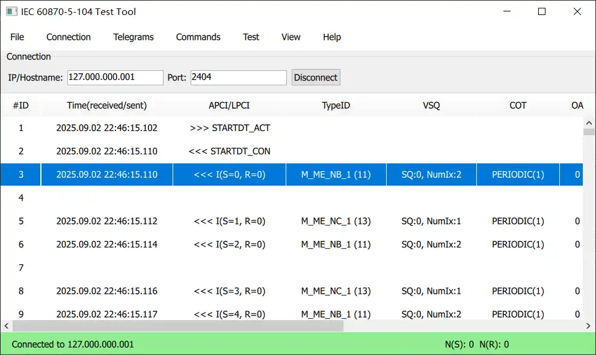

# 2025-09-01
项目：60870 Test Tool 主界面显示的问题
参考：
	TaoQuick：表格
	assistance：ScrollBar、TableView

完成状况：

感受：不好调，真的不好调！！！
在其他应用中感觉是很普通的功能，使用quick 实现起来都很费劲。虽然看起来显示控制的自由度增加了，但是没有一个完整的，接近实际应用的例子，只有简单的功能介绍。要应用起来还是很吃力。