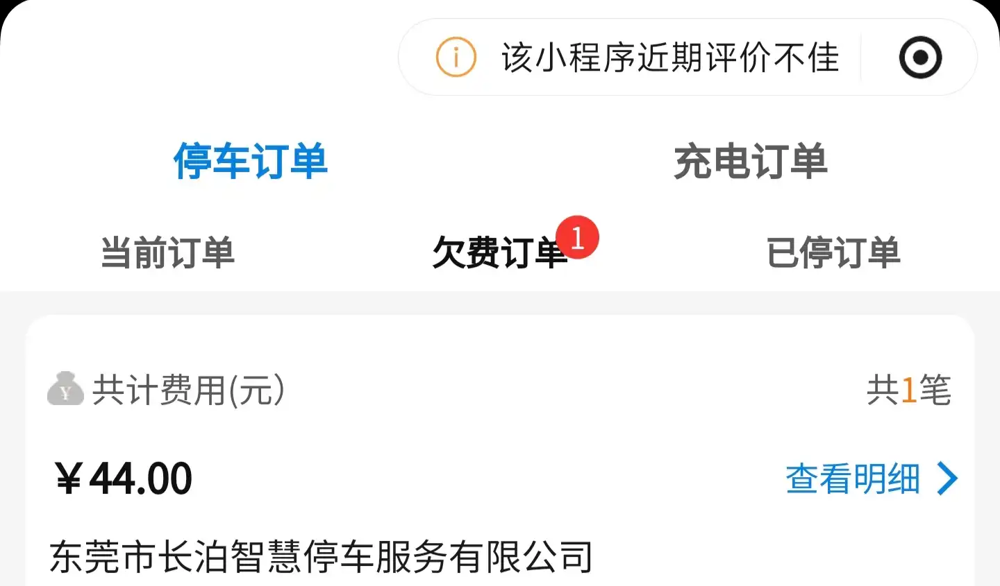

---
tags:
---

# 2026-07-31

- 本来想着开车去面试的，结果有车停在前面挡着了，应该是店里员工，打了两个电话没通，叫人过来可能来不及，只能打车了。（开始以为是送货的，但一想晚上停车的时候没有，早上看有，而且送货一般是下午开始有单，那大概率是早上过来上班的，要开走的话也很快，不过下雨🌧️加上大半年没开了，打个车20块，安慰自己算了，花钱省事，公交回来和自己开车差不了多钱💰 如果算上停车费，那可能还便宜一点）
- 我是第一个到的，和我约定的时间是上午10：00，9点50左右到了。填了个表格，就一直等。陆续又来了几个人（5、6），对应的主管都不一样。等到了差不多10：30 他们开完会开始面试。
- 让下午去盒马看看他们是怎么推销的，穿蓝色马甲
- 汇一城，如果按照提示从上电梯到地面，再进商城-》下扶手电梯，这样等电梯浪费时间，上下浪费时间。有一个地下停车场入口（似乎总共两个），下去之后右侧有一个闸口，闸口侧边还留有空间，从闸口处往前走可以直接到盒马超市
- 观察推销过程：信用卡推销人员穿着白色上衣套着一件印有盒马、中信的马甲，配黑色裤子。让人以为是盒马的工作人员。超市门口的榴莲区，zx 会帮忙挑选，借机推销。结账区会帮忙扫码录入商品，合适时机推销。
- 本来要走了，开到出口，五十几分钟，7块。主管发消息让等一下，饶了一圈又回来了，等了差不多1h。主管个子好小，面试的时候坐在凳子上没察觉。商城见面，一看矮了一大截。。。
- 不知道路边停车收不收费，转了一圈回来。挨着住宿位置前面路口，路边正好有个空位。停的时候光注意侧边距离了，没注意到后面，车屁股好像碰到了后面的车。下车检查了下，没看到痕迹，应该是轻微的碰撞（倒车本来速度就慢），然后感觉到异常我立马踩了刹车往前开，所以只是发生了一次小距离的弹性形变，又恢复了原状。边上店铺刚好有人目睹了我侧方停车的全过程。。。没问到底碰没碰到。还好后面的车不是什么好车，不是那种轻微划痕、摩擦都很明显的，还好是正面碰的，要是侧面有摩擦那肯定有痕迹。
- 21：30左右去把车开到不收费的地方。被贴了收费小票，还有张宣传单。显示停车时间 17:22:07.票据内 **温馨**提示 1. 仅提供车辆停放服务，车辆停放期间如发生损毁、车内物品遗失或损坏等情形，均由车主自行承担责任！2. 驶离泊位，请自觉缴费，不及时缴费您将面临诉讼风险，严重影响**你**个人信用！3. 此路段均已实行etc代缴扣费，感谢您配合！

嘿，就算是从17：00 算起，到22：00，一共5个小时，路边，没有保管服务，就要44，去**n**md！停商超里也要不了这么多吧？！要是十来块，我都可能交了。你搞这个 + 显示的收费单位是有限公司 =》 不可能缴

## 面试复盘
### 观察
**目标**
了解工作岗位；体会实际面试过程，缓解对找工作的抵触

**观察**
#### 发布的岗位信息
>【工作模式】
客户在中信官网和各大平台网上预约申请，根据公司提供资源分配进行信用卡的面签工作，工作内容为核实客户个人资料的真实性以及工作单位的真实性，加上一定的衍生外拓。此外目前东莞有多个项目，盒马，油站，虎门海战馆，长安滨海湾，动物园等驻点，可以就近上班，上班时间比较自由，都是银行花大量财力给员工提供最好资源，不用自己找，作业模式丰富，资源多多，只要勤奋，月入1w+很轻松，性格外向，乐观，能吃苦耐劳
【岗位要求】
1，有强烈追求赚钱的欲望
2，有较强的学习能力，愿意为自我提升不懈努力
3，善于沟通交流，语言表达畅通，有良好的团队合作能力
4，责任心强，能承受一定的工作压力
5，大专及以上学历，学信网可查

关键词：面签、核实、衍生外拓、驻点、作业模式、强烈追求赚钱的欲望

地点：粤丰大厦12楼中信银行
达到时间：
面试时间：

#### 面试过程
1. 签到填写表格
2. 等待面试：中间有人介绍了公司情况
总部深圳，这里是东莞分中心
大概又200人
愿景：世界一流信用卡银行？
已办理超过1亿张信用卡
5个科室分别是：
- 业务：大厅办公，12个组，大概一百多人
- 风险：
- 
- 车险1：车贷分期？
- 营销：线上活动

我感觉公司位置很小，事实上也不需要多大地方，平常都出去

1. 面试

#### 问我的问题
1. 自我介绍
2. 为什么会跨行业选择金融销售类岗位：
我：（心里话：实际单从岗位描述上没看出是销售，或者内容完全就是销售性质岗位）因为环境不好都是外包（画外音：找不到好工作）
3. 之前是否做过销售性质的工作：
没有，主要就是和客户沟通，处理客户的问题
4. 推销演示-现场随便找个东西推销给面试官：
推销产品：桌子上的印泥盒
拿起盒子观察了下，看到盒子背面印有“快干”。我看着产品：（这款产品的主要特点是）快干、印记清晰。。。。然后我不知道说啥了
面试官：你这是典型的理工男思想，你都没有看着我，和我打招呼。先称呼先生或女士，然后再。。。
- 推销产品要有切入点，盒马超市、加油站客人结账的时候帮忙，然后顺带着介绍活动：满150减100；办卡送会员。不能直接 办卡吗，太突兀
5. 住在哪里
根据居住地址分配工作地点
目前大都在城区，资源有限，人多，难以分配 后续可能会对周边区域进行开发，需要在相应区域居住

#### 薪资介绍
底薪：2080 + 餐补：1000 + 话费补贴 100
销售提成

| 35~45 |     |
| ----- | --- |
| 45~55 |     |
|       |     |

具体多少忘了

新人入职三个月保护期：
第一个月：无考核
第二个月：25？
第三个月：35？

#### 工作内容介绍
根据信用卡资源来源确定工作内容

| 办卡途径/地点 | 新用户权益       | 工作内容                                            | 说明                 |
| ------- | ----------- | ----------------------------------------------- | ------------------ |
| 用户线上申请  | ？           | 去用户家里核实？                                        | 行程费用需要自理？没有报销。。。。？ |
| 盒马      | 盒马黄金会员？打88折 | 付款结账区：帮顾客扫码，切入 有可以打88折的活动-》扫码办卡 榴莲区：帮助顾客挑选榴莲 |                    |
| 加油站     | 满150减100    |                                                 |                    |
| 其它地点    | 送礼物：行李箱、。。。 |                                                 |                    |

人员的分配：由主管分配

入职前需要办理的手续、资料：

工作时间、地点：除了周二、周五需要开会（表彰、批评大会？）其余时间都是在驻点/场景下进行推销
拍照打卡上班
### 反思
**分析**
自我介绍环节：不自主的摆头，昨天有写自我介绍内容，面试前也简单的练习了两边。但是在介绍的时候还是太过紧张？我没感觉心跳的厉害，或者什么冒汗、喘不过气等过激反应，但是脑袋抖动很明显。
销售展示环节：应该先观察有哪些可以用来推销的物品，环视一圈，我还带了包，这个包我也比较喜欢，包内有个小口袋，功能特点相对多一点，描述也会更容易。选择印泥没有太多可以展示的东西。其次，面试官的评价一语中的，推销最重要的不是产品而是服务，那同样的或者差不多的东西为什么要买你家的？除了一些独特的优点，更重要的是给客户提供的情绪价值。

**总结**

## 中信信用卡推销观察与思考
### 什么样的人会办理信用卡？-推销的目标人群

办理了信用卡的人：
榴莲区：
- 刚毕业、上班的-年轻人 
- 带着十几岁的孩子的
收款区：
- 出来买菜的中年妇女、带小孩

刻画办卡人画像
1. 年您
2. 职业
3. 婚姻状况
4. 爱好：购买的产品
5. 性格：
6. 穿着：衣服、首饰

### 如何推销？
现在的推销都不是直来直去的，来，兄弟办个卡。都是要有“切入点”
“切入点”：在你要进行消费的时候 提供减免优惠。
盒马：结账时，办个卡可以88折，减多少多少
其它场景也是类似的
在我看来，送礼物也是一样的道理，只不过其它场景下，消费的需求是商场里的商品、游乐场提供的娱乐设施、加油站里的油。而送礼物是主动刺激消费心里，看到行李箱，可能家里的行李箱坏了、旧了、不好看，那就会想要一个新的。产生一个消费需求，才会去消费，办卡也是消费，只不过是一种不明显的消费。开通新卡反倒看起来是省掉了💴

### 应该掌握哪些知识
1. 针对场景提供服务
榴莲区：识别榴莲生熟程度。。。
付款区：付款流程
其它的一些知识：商场结构布局、停车出口、停车费、厕所、盒马会员权益、冰块

应该熟悉不同场景所能提供的服务内容、范围

2. 专业性
了解信用卡办理的条件、审批的流程、逾期的后果及补救措施，权益领取、退卡、升级。。。所有过程
为什么不想办理信用卡？大部人应该还是顾虑：
- 对信用的影响
- 年费
- 其它隐藏费用：是否存在自动扣费
- 个人信息：被拿去网贷

暂时这样