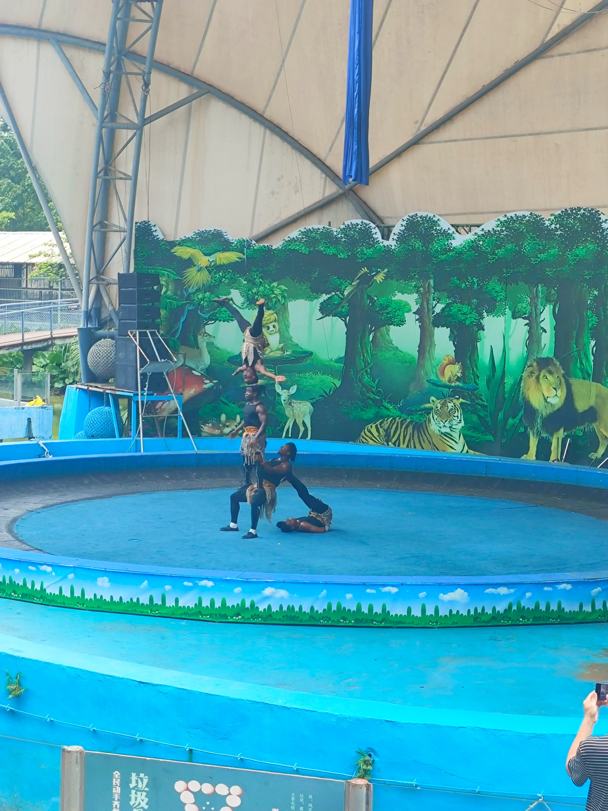
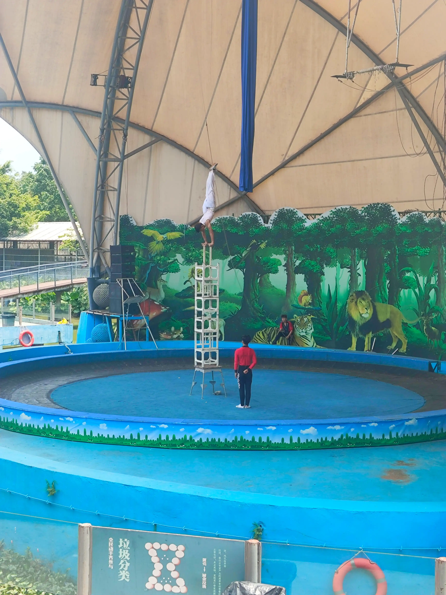
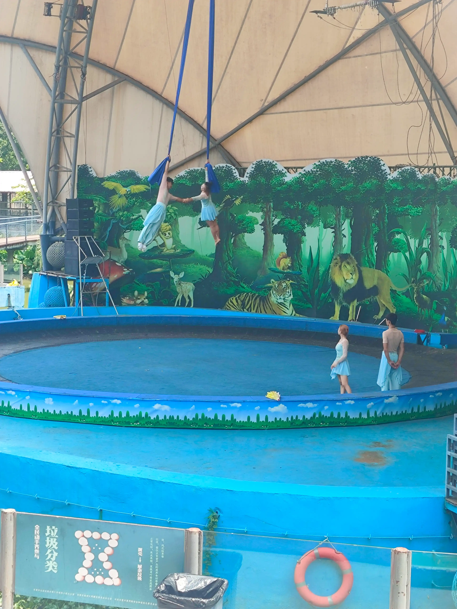
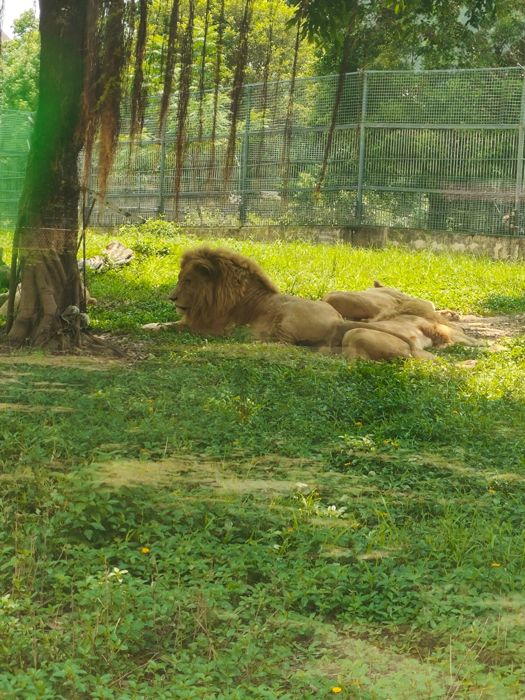
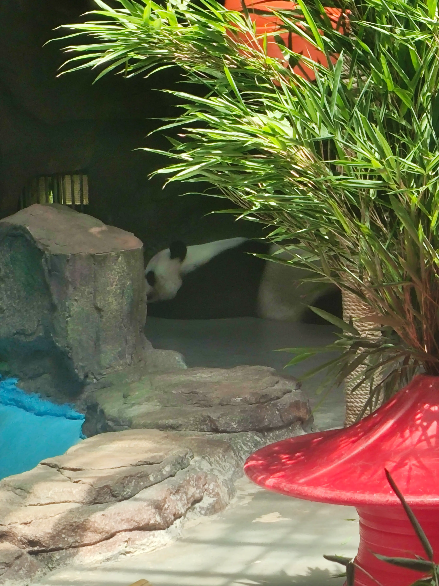

# 2026-08-08
- 368就两个人，我上车时有1个人，中途下车，我到站前没有其他人上车。所以60分钟发一趟车也可以理解，但是对于刚好错过上一趟车的人要等接近一小时也太久了，尤其是夏天。关键是没得选，就这一辆车直达目的地，如果说有多条线路可达，他们错开时间发车，那还可以尝试坐其他的，不用等那么长时间，公交也不用增加发车频次。另外一条线路要走1.几公里，这么辣的太阳不是要人命。  

- 这边公交路上开的速度不快，但是进站的速度快，起步貌似要等人入座后才可以起步每一站都要停，只要车上有人，或者站点有人。我一个人在上，站点没人司机每个站点都停下来开前门。。。  

- 到了香市动物园，在门口看了下地图，摆摊的位置是熊猫馆，差不多在入口/出口的对面，也就是无论从右边过去还是从左边过去，距离差不多。因为没来过，不知道动物园有多大，看到有摆渡车，成人20，儿童10，进来没花门票钱，花20游玩一下，省一点力气也说的过去。  

- 准备走的时候差不多是12：35，来都来了逛一下。走到综合表演馆附近，听到音乐声，过去一看，一个环形看台，包围着一个圆形场地。几个黑哥们正在表演。  

- 好热啊，这是真的快化了，晒得我睁不开眼睛  

- ob是闭源的，那它会不会使用好用的开源插件的代码来完善自身功能？这样在本体有了插件的功能后，开源插件就被抛弃了。插件作者失去了关注，同时ob不会将使用了相应的代码开源出来。  
	- 来源：ob 1.13版本 图片相关功能 对应 Image Toolkit 插件

看演出

不得不说 黑哥的身体素质 是真的 没得说 😂
配上富有节奏感的音乐，挺带劲

在天上飞
两个组合的动作各有特色，现场看这种专业的杂技表演还是很震撼的
有一个动作是女生头套了绳子，在空中转体，没拍到

看动物

🦁
室外的动物基本上都在睡觉、乘凉，除了猴子靠在窗户边等吃的。

熊猫
进去之后找了一圈，没看到熊猫的影子。以为熊猫进宿舍了，问现场的保安，回答他也不知道。。。然后顺着其它游客的目光看到了panda。其实一开始进场馆我就看到了它的屁股，一动不动，以为是块石头。这次看到了它的头，确认这就是真的熊猫

- 牙疼：把之前坐火车买的泡面吃了，开始牙疼。因为疼痛的刺激，不停分泌口水。期间刷了两次牙，没有缓解。准备到附近医院看看，已经约满了。如果持续疼下去只能先拔了。拔了之后原来的牙床肯定不能空在哪里，要种植一棵新牙，查了下价格差不多是3000.。。拔牙可能要花接近1000，边上一颗牙要补，一起差不多是5000了
- 如果昨天买的彩票能中个万把块就好了，只希望能把钱还了，把牙看了😵
- 早上去医院看看吧，后续是否治疗另说，起码搞清楚当前状况，还能不能拖，能拖多久。

