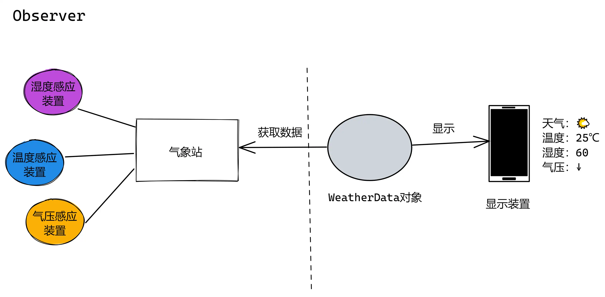
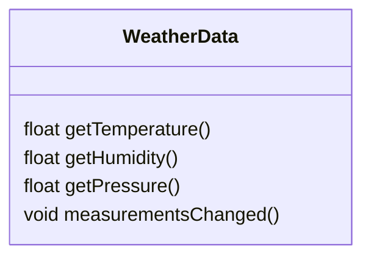
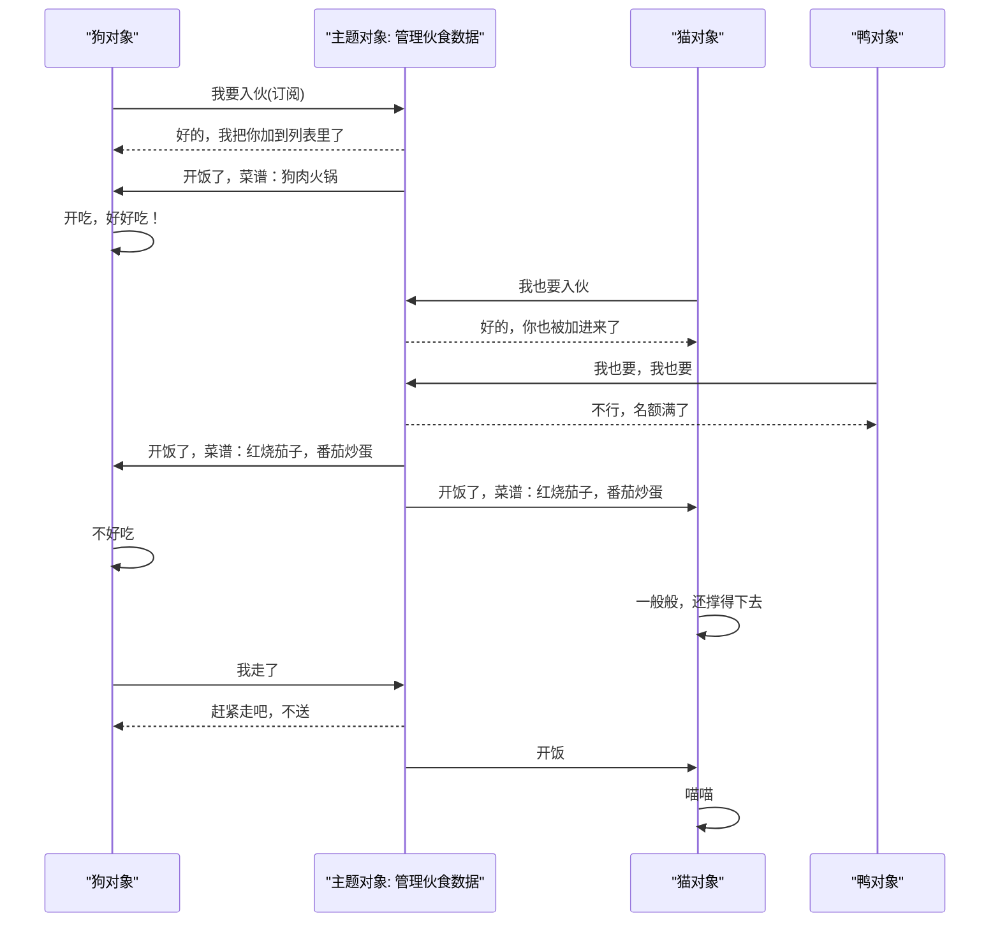
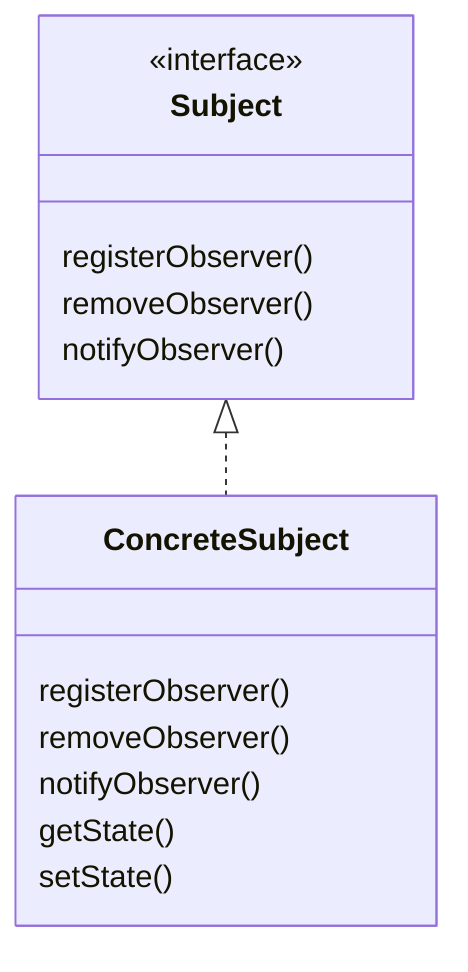
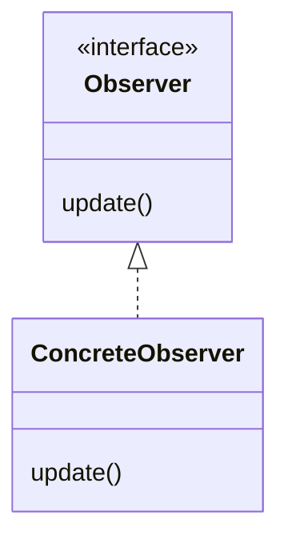
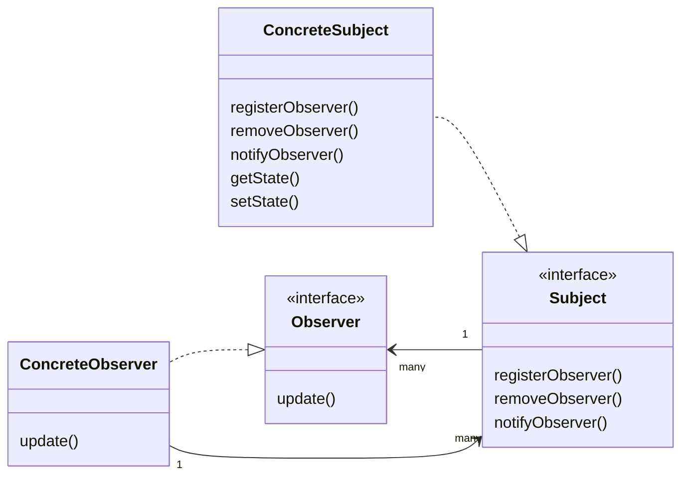
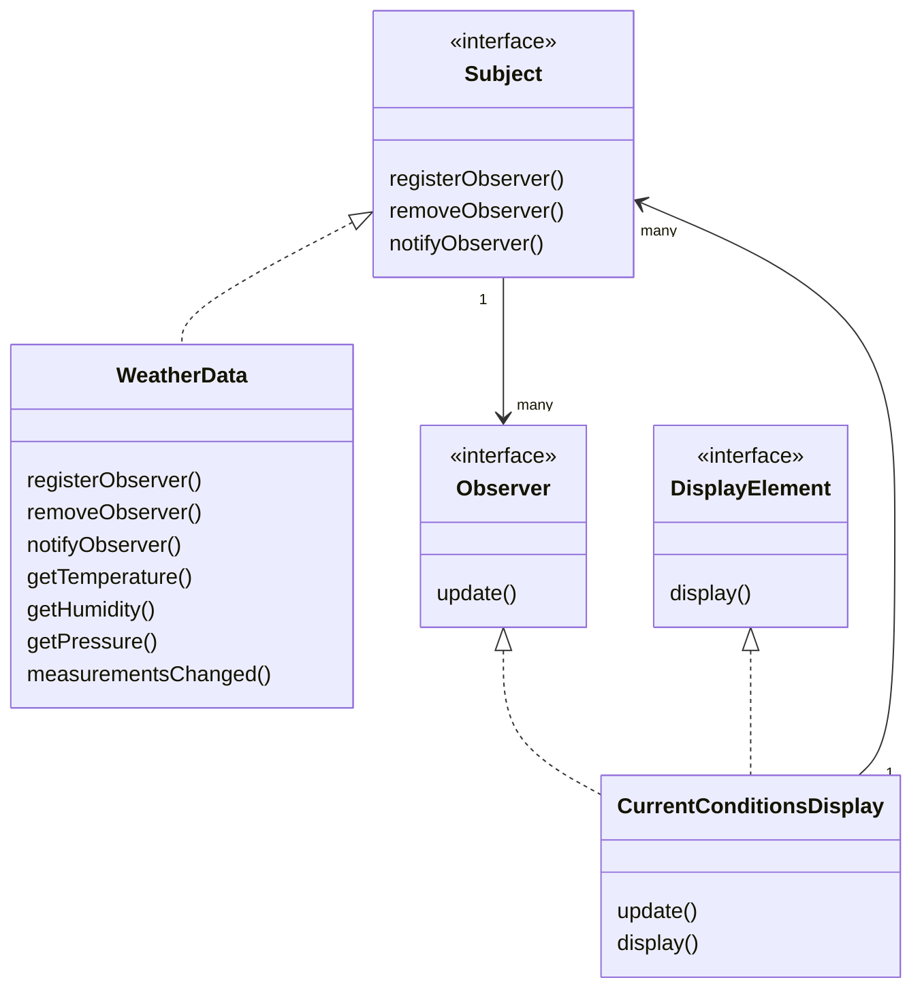

# Observer


## 气象监测应用

气象站：采集、存储气象数据
weatherData：追踪气象站数据并更新显示
显示装置：显示目前天气状况
天气状况显示可以分为多个栏目（布告板）：
- 当前天气状况
- 天气统计
- 天气预报
- 。。。


通过WeatherData 的get（）方法可以获取气象站的测量数据。监测数据发生变化时会通知WeatherData（调用measurementsChanged）。

### 错误示范
在WeaterData 中更新布告板
``` cpp 
void measurementsChanged()
{
	float temp = getTemperature();
	//...
	currentConditionDisplay.update(temp, ...);
	//...
}
```

| 行号  | 功能          | 说明         |
| --- | ----------- | ---------- |
| 3   | 获取最新的温度值    |            |
| 5   | 更新当前天气状况的显示 | 传递天气数据给布告板 |

| 问题现象                                      | 描述                                                         |
| ----------------------------------------- | ---------------------------------------------------------- |
| 针对具体实现编程，而非针对接口                           | 更新布告板是通过具体的布告板进行的，而不是针对布告板的抽象                              |
| 增加或删除布告板时需要修改程序，无法在运行时动态地增加（或删除）要更新显示的布告板 | 针对实现的代码不支持运行时动态需改。如果是针对接口，增加新增、删除布告板接口，那么可以根据实际的布告板数量进行更新。 |
| 没有封装改变的部分                                 | 获取气象站数据是固定的，布告板是可变化的部分。                                    |

所有的布告板都实现了统一接口update
Wea
WeatherData针对接口更新布告板的前提：
- WeatherData 需要知道有哪些布告板要更新显示：维护一个布告板列表
- WeatherData 能够对布告板列表进行修改：新增、删除
- 所有的布告板更新数据需要一个统一的接口，以便气象数据更新时能够通过统一接口更新显示（针对接口、封装变化）

## 认识观察者模式


## 定义
>[!quote]
>定义了对象之间的一对多依赖，这样一来，当一个队形改变状态时，它的所有依赖者都会收到通知并更新。

- 一对多关系：Subject 只有一个，Observer 可以有多个。
- Subject 状态改变
- 通知依赖者
- 依赖者收到通知后更新

### 类图
Subject

Subject接口定义Observer 和 Subject 的交互：订阅、取消订阅，接收通知
Subject 对state（数据）进行管理

Observer

主题依赖于Observer 接口，该接口定义了Subcet 如何 通知 Observer Subject 状态发生了变化以及状态值

Observer 保留它订阅的 Subject，以便它自己可以通过Subject 取消订阅。一个Observer 可以订阅多个 Subject

整合


## 应用到气象监测应用
### 气象站的类图



### 实现
有省略，完整代码见对应代码仓库

``` cpp title="subject.h"
class Observer;
class Subject
{
public:
    ~Subject() = default;
    void registerObserver(Observer *o)
    {
        m_observers.push_back(o);
    }
    void removeObserver(Observer *o)
    {
        m_observers.remove(o);
    }
    virtual void notifyObservers() = 0;

protected:
    std::list<Observer*> m_observers;
};

```

| 行号   | 功能          | 说明                                          |
| ---- | ----------- | ------------------------------------------- |
| 6-13 | 添加、删除       |                                             |
| 14   | 通知observers | 定义为纯虚函数是因为没有在Subject 中存储数据，并且需要Subject 为抽象类 |

WeaterData的实现：(被我一起放到了subject里)
``` cpp title="subject.h"
class WeaterData : public Subject {
public:
    float getTemperature() { return m_temperature; }
    float getHumidity() { return m_humidity; }
    float getPressure() { return m_pressure; }

    void setMeasurements(float temperature, float humidity, float pressure)
    {
        m_temperature = temperature;
        m_humidity = humidity;
        m_pressure = pressure;

        measurementsChanged();
    }

    void measurementsChanged()
    {
        notifyObservers();
    }
    void notifyObservers() override;

private:
    float m_temperature = 0;
    float m_humidity = 0;
    float m_pressure = 0;
};
```


``` cpp title="subject.cpp"
void WeaterData::notifyObservers()
{
    for(auto o : m_observers)
        o->update(m_temperature, m_humidity, m_pressure);
}
```


``` cpp title="observer.h"

class Subject;

class Observer {
public:
    virtual void update(float temperature, float humidity, float pressure) = 0;
};

class DisplayElement {
public:
    virtual void display() = 0;
};

class CurrentConditionsPlay : public Observer, public DisplayElement {
public:
    explicit CurrentConditionsPlay(Subject *subject);
	~CurrentConditionsPlay();
    void update(float temperature, float humidity, float pressure) override
    {
        m_temperature = temperature;
        m_humidity = humidity;
        display();
    }
    void display() override
    {
        std::cout << "current temperature:" << m_temperature
                  << " humidity:" << m_humidity << std::endl;
    }
private:
    float m_temperature = 0;
    float m_humidity = 0;
    Subject *m_subject = nullptr;
};
```


``` cpp title="observer.cpp"
CurrentConditionsPlay::CurrentConditionsPlay(Subject *subject)
    : m_subject(subject)
{
    m_subject->registerObserver(this);
}

CurrentConditionsPlay::~CurrentConditionsPlay()
{
    m_subject->removeObserver(this);
}
```

| 行号  | 功能         | 说明  |
| --- | ---------- | --- |
| 4   | 创建对象时就进行订阅 |     |
| 9   | 对象销毁时取消订阅  |     |

#### 测试
``` cpp title="main.cpp"
    WeaterData *weaterData = new WeaterData();
    auto *current = new CurrentConditionsPlay(weaterData);
    auto *statistics = new StatisticsDisplay(weaterData);

    weaterData->setMeasurements(3.14, 1.24, 11.77);
    weaterData->setMeasurements(4.58, 0.12, 8.93);

    cout << endl;
    delete current;
    weaterData->setMeasurements(1.0, 1.1, 1.2);

    delete statistics;
    delete weaterData;
```

效果：
``` 
current temperature:3.14 humidity:1.24
Avg temperature: 3.14
current temperature:4.58 humidity:0.12
Avg temperature: 3.86

Avg temperature: 2.90667
```

