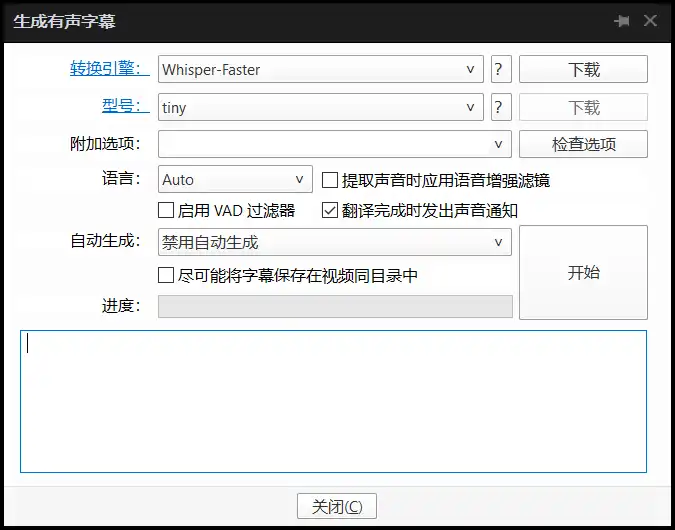
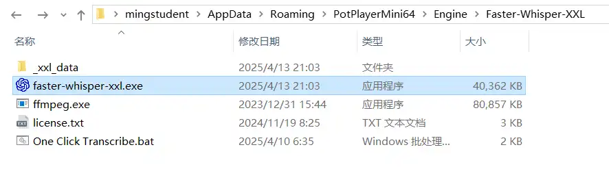
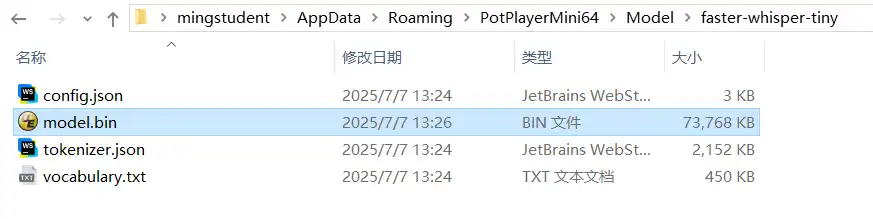
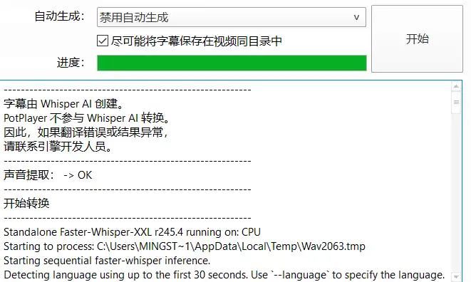
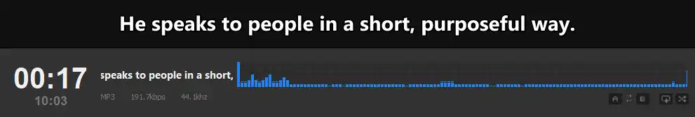

---
tags:
  - 工具
---
# PotPlayer

## 语音字幕
根据语音生成字幕
[语音转字幕功能 中文参考](http://www.potplayercn.com/course/potplayer-generate-subtitles-from-voice.html)

### 下载
1. 更新PotPlayer：新版本有附加选项
2. 下载：主界面视频区域右键-》字幕-》生成有声字幕-》生成有声字幕
进入到设置界面

	1. 选择引擎（engine）及模型（model）：只需要英文字幕，选Whisper-faster引擎 和 tiny 模型即可
	2. 下载：我的路径是：C:\Users\mingstudent\AppData\Roaming\PotPlayerMini64\Model
由于在PotPlay 内进行下载报错：无法下载上述列表文件；校验错误。所以只能手动下载
[Faster-Whisper](https://github.com/Purfview/whisper-standalone-win/releases/tag/Faster-Whisper-XXL)（下载路径设置为Engine），文件大小：1.39G。下载完成后解压缩到当前目录。把和exe同级路径下的所有文件拷贝到Engine/Faster-Whisper-XXL

	
对于model进行类似操作。

	engine 和 model 放置好后，在设置里选择对应的engine 和 model。如果下载按钮不可用（灰色）说明PotPlay 检测到该 engine 和 model
	
3. 勾选尽可能将字幕保存在视频同目录中，这样不用每次打开后重新生成字幕；默认生成的字幕保存在临时文件夹下

### 生成
1. 转换：在设置界面点击开始按钮 


``` 
[10:00.970 --> 10:02.210] And I'm John Russell.
Transcription speed: 15.17 audio seconds/s
Subtitles are written to 'C:\Users\MINGST~1\AppData\Local\Temp' directory.
Operation finished in: 0:00:44.629 
----------------------------------------------------------
转换完成
----------------------------------------------------------
```
问题：
- 会根据音频的前30s 检测语言：如果明确语言可以设置好；
-  虽然设置了将字幕保存到视频同目录，但是这里还是输出到了Temp下

2. 打开字幕：

3. 保存字幕：字幕-》保存字幕-》按影片名称保存，在影片路径下生成同名的srt类型字幕文件。下次打开时会自动加载字幕。

### 其他说明
旧版本的PotPlay 存放 engine 的路径是：C:\Program Files\DAUM\PotPlayer\Module。更新后之前下载的model 没有被删除，还在该路径下。只是因为新版本的路径更改为：C:\Users\mingstudent\AppData\Roaming\PotPlayerMini64\Model。导致检测不到engine。 可以直接把原来的engine 拷贝过来使用。


