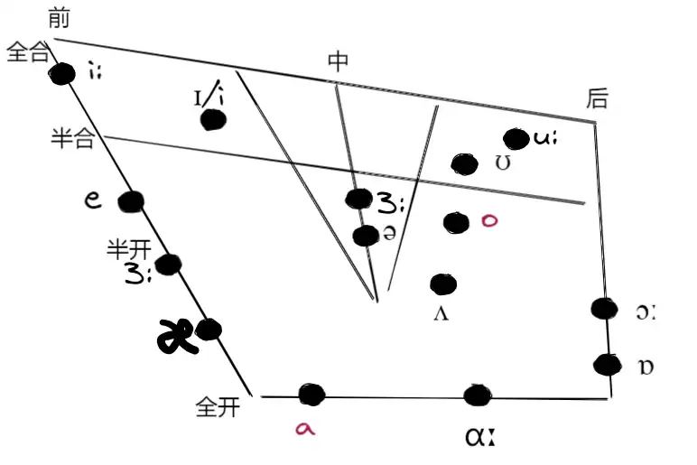
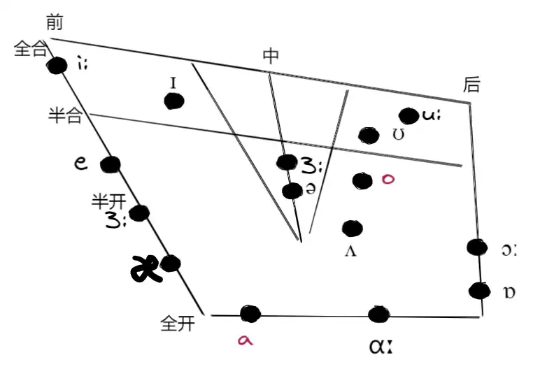

# Pronunciation
[IPA 音标表](https://www.cambridge.org/features/IPAchart/)
[Vowel diagram - Wikipedia](https://en.wikipedia.org/wiki/Vowel_diagram)

[英语兔 音标合集](https://www.bilibili.com/video/BV1iV411z7Nj?spm_id_from=333.788.videopod.episodes&vd_source=6d8ce529a71ce9e817753804f6e733cc)

---

## 基本概念
**语音 Speech Sounds**
>凡是人说出来用以交流思想或表达感情的声音都叫做语音

**音素 Phoneme**
>语音的最小单位

- 最小单位：音素表示的声音不可进一步划分为其他语音（但是双元音是有单元音组成的）
- 音素具有区分意义的作用：不同音素组合成的语音具有不同的含义，dark 和 duck 有一个音素不同，发音不同，单词表示的含义不同

**音标 Phonetic Symbols**
>音素的书面符号

<table>  
    <caption>        Underhill 音标表  元音
    </caption>  
    <tbody>       
	     <tr>           
		    <td>i:</td>  
            <td>ɪ</td>  
            <td>ʊ</td>  
            <td>u:</td>  
            <td>ɪə</td>  
            <td>eɪ</td>  
            <td>-</td> 
        </tr>        
        <tr>           
	        <td>e</td>  
            <td>ə</td>  
            <td>3:</td>  
            <td>ɔː</td>  
            <td>ʊə</td>  
            <td>ɔɪ</td>  
            <td>əʊ</td>  
        </tr>        
        <tr>            
	        <td>æ</td>  
            <td>ʌ</td>  
            <td>ɑː</td>  
            <td>ɒ</td>            
            <td>eə</td>  
            <td>ɔɪ</td>  
            <td>əʊ</td>  
        </tr>        
	</tbody>  
</table>

左侧为单元音，右侧为双元音
<table>
	<caption>辅音</caption>
	<tbody>
		<tr>
			<th>爆破音</th>           
	         <td>p</td>  
            <td>b</td>  
            <td>t</td>  
            <td>d</td>             
            <td>tʃ</td>  
            <td>dʒ</td>  
            <td>k</td>  
			 <td>ɡ</td>  
        </tr>        
		<tr>           
			<th>摩擦音</th>     
	        <td>f</td>  
            <td>v</td>  
            <td>θ</td>  
            <td>ð</td>              
            <td>s</td>  
            <td>z</td> 
            <td>ʃ</td>  
            <td>ʒ</td>  
        </tr>       
         <tr>            
	         <th>鼻音</th>     
	        <td>m</td>  
            <td>n</td>  
            <td>ŋ</td>  
            <td>h</td>              
            <td>l</td>  
            <td>r</td>  
            <td>w</td>  
            <td>j</td> 
        </tr>
	</tbody>
</table>

---

舌位图
:::tabs
@tab Modern English

@tab wiki

:::

- 圆点表示发音时舌头的最高点

## 发音的过程
[十分钟语言学 | 语音学 人是怎么发音的？](https://www.bilibili.com/video/BV15b411w7WG?spm_id_from=333.788.player.switch&vd_source=6d8ce529a71ce9e817753804f6e733cc&trackid=web_related_0.router-related-2479604-dplt2.1770877451212.59)

### 发音器官
**肺**
声音是通过气流的振动产生的，通过肺的扩张吸入气流，肺的压缩排出气流。

**气管**
运输气流的通道

**喉头 larynx**
位于舌根 和 气管 顶部之间

**声带 Vocal cords - 发音体**
两片肌肉

**声门**
声带中间的开口

**口腔、鼻腔、咽腔 - 共鸣腔**

### 发音机制
**气流过程 - airstream process**
通过肺下方的横膈膜控制气流的吸入及排出

**发声过程 - phonation process**
呼、吸时声带张开，气流通过。憋气时声带闭合。
说话时调节声带的张力控制声门的大小，进一步控制通过声门的气流，从而产生振动。

根据声带是否振动，声音可以分为：
- 振动-浊辅音：元音、部分辅音
- 不振动-清辅音：大部分辅音

声带不振动时可以通过其他器官产生振动。如：向外呼气（吐气）时声带没有振动，但是嘴唇撅起，气流受到阻碍产生振动，也能发出声音。试着张大嘴呼气，无法发出声音。

**口鼻过程 - oro-nasal process**
气流的流向：
- 鼻腔：鼻音
- 口腔：非鼻音

**调音过程 - articulatory process**
舌、唇、上颚、咽部 之间的配合
## ɪ 、i:
