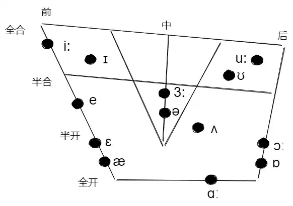
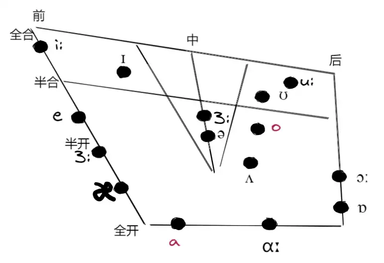
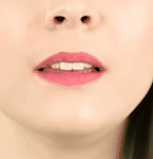
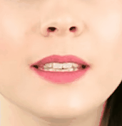

# Pronunciation
- [IPA 音标表](https://www.cambridge.org/features/IPAchart/)
- [Vowel diagram - Wikipedia](https://en.wikipedia.org/wiki/Vowel_diagram)
- [英语兔 音标合集](https://www.bilibili.com/video/BV1iV411z7Nj?spm_id_from=333.788.videopod.episodes&vd_source=6d8ce529a71ce9e817753804f6e733cc)
- [孙志立简明英语发音教程 - 美音](https://www.bilibili.com/video/BV1mtR3YREiM/?spm_id_from=333.337.search-card.all.click&vd_source=6d8ce529a71ce9e817753804f6e733cc)
- [在线音标输入](https://ipa.typeit.org/)
---

## 基本概念
**语音 Speech Sounds**
>凡是人说出来用以交流思想或表达感情的声音都叫做语音

**音素 Phoneme**
>语音的最小单位

- 最小单位：音素表示的声音不可进一步划分为其他语音（但是双元音是有单元音组成的）
- 音素具有区分意义的作用：不同音素组合成的语音具有不同的含义，dark 和 duck 有一个音素不同，发音不同，单词表示的含义不同

**音标 Phonetic Symbols**
>音素的书面符号

<table>  
    <caption>        Underhill 音标表  元音
    </caption>  
    <tbody>       
	     <tr>           
		    <td>iː</td>  
            <td>ɪ</td>  
            <td>ʊ</td>  
            <td>uː</td>  
            <td>ɪə</td>  
            <td>eɪ</td>  
            <td>-</td> 
        </tr>        
        <tr>           
	        <td>e</td>  
            <td>ə</td>  
            <td>3:</td>  
            <td>ɔː</td>  
            <td>ʊə</td>  
            <td>ɔɪ</td>  
            <td>əʊ</td>  
        </tr>        
        <tr>            
	        <td>æ</td>  
            <td>ʌ</td>  
            <td>ɑː</td>  
            <td>ɒ</td>            
            <td>eə</td>  
            <td>ɔɪ</td>  
            <td>əʊ</td>  
        </tr>        
	</tbody>  
</table>

 共有21个元音
 12个单元音（Monophthongs）
	 5个长元音（Long Vowels）：iː,  ɜː, uː, ɔː, ɑː
	 7个短元音（Short Vowels）： ɪ, ə, u, ɒ, ʌ, e, æ
 长音符号实际是
 
	 顶点相对的两个三角形
 
 9个双元音（Diphthongs）：
	  合口双元音（Falling Diphthongs）：ei, eɪ, əʊ, aɪ, aʊ, ɔɪ
	  集中双元音（Rising Diphthongs）：ɪə, eə, ɔə, ʊə

<table>
	<caption>辅音</caption>
	<tbody>
		<tr>
			<th>爆破音</th>           
	         <td>p</td>  
            <td>b</td>  
            <td>t</td>  
            <td>d</td>             
            <td>tʃ</td>  
            <td>dʒ</td>  
            <td>k</td>  
			 <td>ɡ</td>  
        </tr>        
		<tr>           
			<th>摩擦音</th>     
	        <td>f</td>  
            <td>v</td>  
            <td>θ</td>  
            <td>ð</td>              
            <td>s</td>  
            <td>z</td> 
            <td>ʃ</td>  
            <td>ʒ</td>  
        </tr>       
         <tr>            
	         <th>鼻音</th>     
	        <td>m</td>  
            <td>n</td>  
            <td>ŋ</td>  
            <td>h</td>              
            <td>l</td>  
            <td>r</td>  
            <td>w</td>  
            <td>j</td> 
        </tr>
	</tbody>
</table>

共有28个辅音

| 清   | p   | t   | k   | f   | s   | θ   | ʃ   | tʃ  | tr  | ts  | h   |     |     |     |     |     |     |     |
| --- | --- | --- | --- | --- | --- | --- | --- | --- | --- | --- | --- | --- | --- | --- | --- | --- | --- | --- |
| 示例  |     |     |     |     |     |     |     |     |     |     |     |     |     |     |     |     |     |     |
| 浊   | b   | d   | g   | v   | z   | ð   | ʒ   | dʒ  | dr  | dz  |     | m   | n   | ŋ   | r   | l   | w   | j   |
| 示例  |     |     |     |     |     |     |     |     |     |     |     |     |     |     |     |     |     |     |

>成对的(清浊)辅音发音在发音部位和方法上基本相同，差别只在于发音时声带振动与否

---

舌位图
:::tabs
@tab Modern English

@tab wiki

:::

- 圆点表示发音时舌头的最高点

## 发音的过程
[十分钟语言学 | 语音学 人是怎么发音的？](https://www.bilibili.com/video/BV15b411w7WG?spm_id_from=333.788.player.switch&vd_source=6d8ce529a71ce9e817753804f6e733cc&trackid=web_related_0.router-related-2479604-dplt2.1770877451212.59)

### 发音器官
**肺**
声音是通过气流的振动产生的，通过肺的扩张吸入气流，肺的压缩排出气流。

**气管**
运输气流的通道

**喉头 larynx**
位于舌根 和 气管 顶部之间

**声带 Vocal cords - 发音体**
两片肌肉

**声门**
声带中间的开口

**口腔、鼻腔、咽腔 - 共鸣腔**

### 发音机制
**气流过程 - airstream process**
通过肺下方的横膈膜控制气流的吸入及排出

**发声过程 - phonation process**
呼、吸时声带张开，气流通过。憋气时声带闭合。
说话时调节声带的张力控制声门的大小，进一步控制通过声门的气流，从而产生振动。

根据声带是否振动，声音可以分为：
- 振动-浊辅音：元音、部分辅音
- 不振动-清辅音：大部分辅音

声带不振动时可以通过其他器官产生振动。如：向外呼气（吐气）时声带没有振动，但是嘴唇撅起，气流受到阻碍产生振动，也能发出声音。试着张大嘴呼气，无法发出声音。

**口鼻过程 - oro-nasal process**
气流的流向：
- 鼻腔：鼻音
- 口腔：非鼻音

**调音过程 - articulatory process**
舌、唇、上颚、咽部 之间的配合
## iː, ɪ

### 前置

>[!info]
>要领 和 特点
>- 要领：主要内容、基本要求
>- 特点：所具有的特殊之处
>要领是核心，特点是外在表现。要领可能只有一个，特点有多个。

**中英不同音**
- 不要用中文的音来发英文的音
- 练习发音时可能会有不适应的地方，用夸张来让身体熟悉、适应不同的发音方式

### 理解长、短音
长音 iː

>核心
>咧开嘴角，牵动脖子

可以看到，示例发音嘴型鼻子边上的脸颊明显凹了下去，脖子上的（应该是静脉）浮现。
（我没有脖子，但是用手摸着脖子，发音的时候可以感受到脖子被牵动）

短音 ɪ

>核心
>嘴角放松，轻轻弹出

示例的嘴型是嘴巴自然张开，嘴角微咧，上下齿之间空隙很小
实际我发这个音的时候，不咧嘴角，上下齿之间的间隙比示例图稍大

**轻轻**
没有发 iː 时用力

**弹出**
声音比较干脆
用手摸着喉结处，对比长音
- i: 有一个过程
- ɪ 开始后马上结束

#### 长、短音的区分
>一般情况下的发音方式决定长、短

一般情况：陈述语气，不带感情。
发音方式：参与发音的器官，发音的过程
	而不是发音的时长：短元音也可延长发音时间。但不改变其长、短性质

通过对 iː 和 ɪ 的学习，可以知道他们一个长音、一个短音 之间没有联系，发音方式、特点 等均不相同。=》没有配对的长、短元音，它们是独立的个体

暂时的理解：长音有一个发音过程，和其发音方式有关。如咧开嘴，这个咧的动作就需要一定的时间，所以自然而然的其发音时间就要长于不需要过程的音。也是这个元音导致气流持续动过-》持续振动产生声音。

## uː 
**兔**
>传统英音中的这个音，舌位后，高。开口很小。需圆唇。和普通话中“姑”的韵母u基本一致，只是拼音u更加圆唇。
>现代英音中的这个（音标）舌位前移，朝着普通话Ü （绿）的舌位方向靠拢。这一舌位前移导致圆唇度的进一步丧失，即嘴型略扁。

示例：
- too
- food
- loose
- music
- news
- student

**孙**
- 音标替换，对比感受发音的差异
- 借助 ”吁“（勒紧马套）的口型发uː 
- 通过观察脸部肌肉是否发生变化，体会发音时力度的大小
### 圆唇度 与 舌位的前后

## ʊ

## 资源
- [phonchart2008.pdf](/resources/English/Pronunciation/phonchart2008.pdf)

