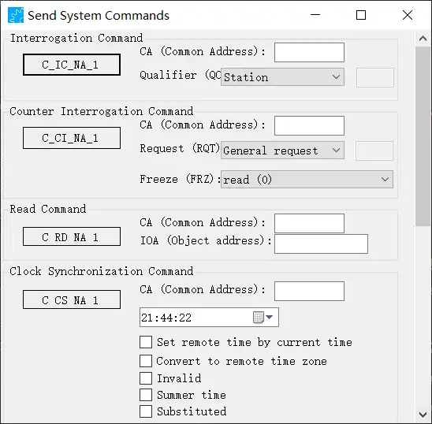
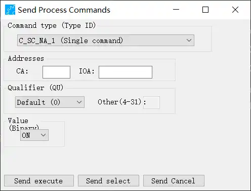
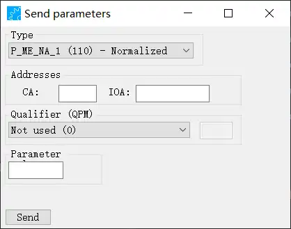
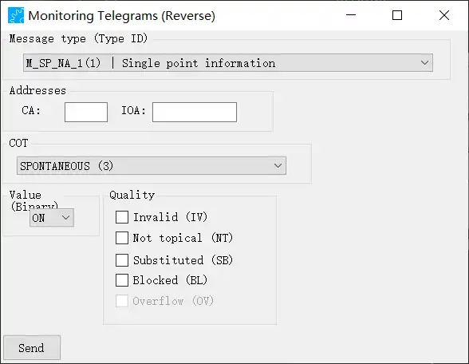
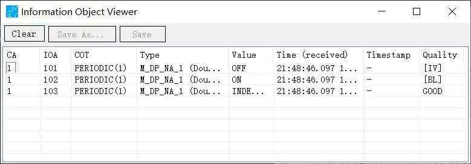
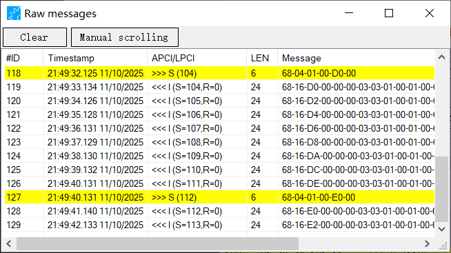
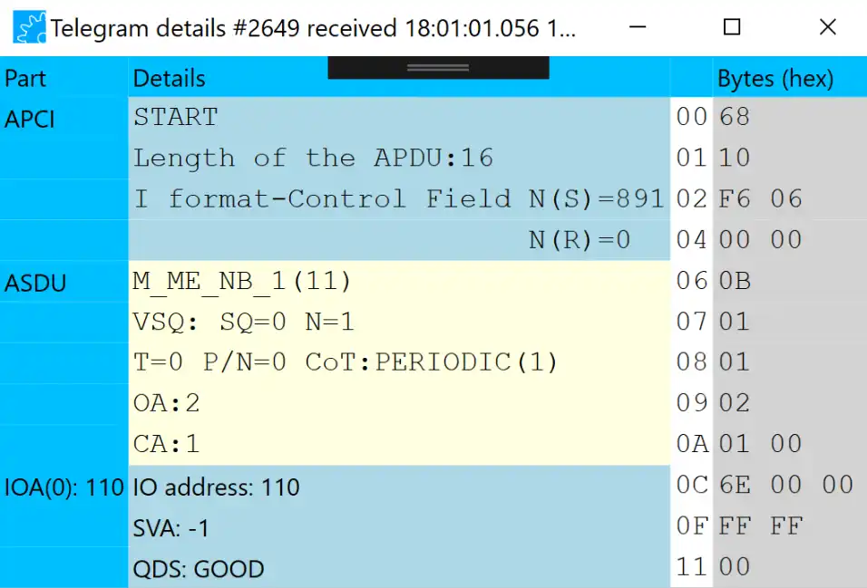

# IEC 60870-5-104 
[标准文档下载]([GitCode - 全球开发者的开源社区,开源代码托管平台](https://gitcode.com/open-source-toolkit/fc96f))

## File
| 序号  | 功能                  | 说明  | 进度  |
| --- | ------------------- | --- | --- |
| 1   | Load settings ...   |     |     |
| 2   | Save settings ...   |     |     |
| 3   | Save setting as ... |     |     |
| 4   | Exit                |     |     |

## Connection
| 序号  | 功能                   | 说明  | 进度  |
| --- | -------------------- | --- | --- |
| 1   | Connect / Disconnect |     |     |
| 2   | Parameters ...       |     |     |
| 3   | Automatic START DT   |     |     |
| 4   | Send START DT        |     |     |
| 5   | Send STOP DT         |     |     |
| 7   | Automatic Reconnect  |     |     |
| 8   | Download File ...    |     |     |
| 9   | Upload File ...      |     |     |

## Telegrams
| 序号  | 功能                  | 说明  | 进度  |
| --- | ------------------- | --- | --- |
| 1   | Clear list          |     |     |
| 2   | Pause recording     |     |     |
| 3   | Save telegrams ...  |     |     |
| 4   | Load telegrams ...  |     |     |
| 5   | Show send telegrams |     |     |
| 6   | Filter ...          |     |     |
| 7   | Automatic Scrolling |     |     |
| 8   | Settings ...        |     |     |

## Commands
>[!quote]
>The Command menu contains options to send any kind of command or process data to the device.

| 类型                   | 说明                                                                                             |
| -------------------- | ---------------------------------------------------------------------------------------------- |
| System Command       |                                                                                                |
| Process              | Send a command `that` influences the process                                                   |
| Parameters           | Send parameter in control direction                                                            |
| Monitoring (Reverse) | This can be used to send a monitoring message in reverse direction.                            |
| New Type             | This can be used to create a user defined type description.                                    |
| Send Message         | This can be used to send standard message and commands as well as user defined types.          |
| Manual Message       | This can be used to enter hexadecimal information, set parameters and see the message details. |

### System Commands
参考界面：

| 序号  | 类型                            | 说明  | 进度  |
| --- | ----------------------------- | --- | --- |
| 1   | Interrogation Command         | 总召唤 |     |
| 2   | Counter Interrogation Command |     |     |
| 3   | Read Command                  |     |     |
| 4   | Clock Synchronization Command |     |     |
| 5   | Test Command                  |     |     |
| 6   | Test Command wit CP56Time2a   |     |     |
| 7   | Delay acquisition command     |     |     |
| 8   | Reset Process Command         |     |     |

### Process Commands
参考界面：

| 序号  | 类型        | 值   | 说明                             | 进度  |
| --- | --------- | --- | ------------------------------ | --- |
| 1   | C_SC_NA_1 |     | Single command                 |     |
| 2   | C_DC_NA_1 |     | Double command                 |     |
| 3   | C_RC_NA_1 |     | Step command                   |     |
| 4   | C_SE_NA_1 |     | Setpoint Normalized            |     |
| 5   | C_SE_NB_1 |     | Setpoint Scaled                |     |
| 6   | C_SE_NC_1 |     | Setpoint Short                 |     |
| 7   | C_BO_NA_1 |     | Setpoint Bitstring             |     |
| 8   | C_SC_TA_1 |     | Single command w/CPTime2a      |     |
| 9   | C_DC_TA_1 |     | Double command w/CPTime2a      |     |
| 10  | C_RC_TA_1 |     | Step command w/CPTime2a        |     |
| 11  | C_SE_TA_1 |     | Setpoint Normalized w/CPTime2a |     |
| 12  | C_SE_TB_1 |     | Setpoint Scaled w/CPTime2a     |     |
|     | C_SE_TC_1 |     | Setpoint Short w/CPTime2a      |     |
|     | C_BO_TA_1 |     | Setpoint Bitstring w/CPTime2a  |     |

### Parameters
参考界面：

| 序号  | 类型        | 值   | 说明          | 进度  |
| --- | --------- | --- | ----------- | --- |
| 1   | P_ME_NA_1 | 110 | Normalized  |     |
| 2   | P_ME_NB_1 | 111 | Scaled      |     |
| 3   | P_ME_NC_1 | 112 | Short Float |     |
| 4   | P_AC_NA_1 | 113 | Activation  |     |

### Monitoring (Reverse)
参考界面：

## View

### The Information Object Viewer
> [!quote]
> Show the latest state (with value, timestamp, and quality) of all received information object in a table

参考界面：

### The Raw Message Window
>[quote]
>The raw message window shows the original message bytes together with some meta information.

参考界面：

### The Telegram Detail Window
参考界面：
:::tabs
@tab MZ

:::

>ps:
按照说明文档中的介绍，双击Raw Message Window 中的一条消息可以查看Detail Window，但是可能是我用的free 版本不能使用该功能。。。

## Test
| 序号  | 功能                  | 说明  | 进度  |
| --- | ------------------- | --- | --- |
| 1   | APCI commands       |     |     |
| 2   | Flow control        |     |     |

## Help
| 序号  | 功能         | 说明  | 进度  |
| --- | ---------- | --- | --- |
| 1   | User Guide |     |     |
| 2   | About      |     |     |