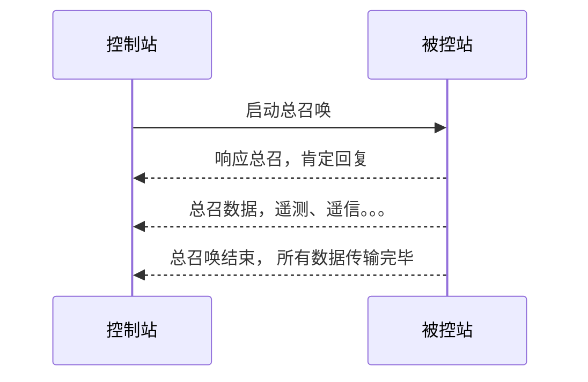
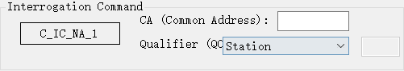
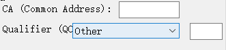

# 总召
获取被控站的所有信息

## 过程
在建立连接，子站初始化完毕后，由主站发起总召唤


### 问题：结束前再次发送总召
如果在子站响应总召唤，回复数据的过程中，再次收到总召命令，该如何处理？
可能的处理结果：
1. 忽略：<mark style="background: #FFB8EBA6;">进行肯定回复</mark>，继续发送数据直到结束；
2. 重新开始：进行肯定回复，然后再次从第一个数据开始传输；
3. 。。。

>[!note]
不管是忽略还是重新开始，子站都要对主站的命令进行答复。

## 结构

| ASDU   | 值                                                                                                                                                                                                                                                           | 含义                                            |
| ------ | ----------------------------------------------------------------------------------------------------------------------------------------------------------------------------------------------------------------------------------------------------------- | --------------------------------------------- |
| TypeId | C_IC_NA_1(100)                                                                                                                                                                                                                                              | 总召唤命令                                         |
| VSQ    | 1                                                                                                                                                                                                                                                           | SQ：false，只有一个 Information Element<br>NumIx: 1 |
| COT    | 控制站：activation(6), deactivation(8) <br>被控站：activation confirmation(7), deactivation confirmation(9), activation termination(10)                                                                                                                             |                                               |
| OA     | 0                                                                                                                                                                                                                                                           | 源发地址                                          |
| Addr   |                                                                                                                                                                                                                                                             | 公共地址                                          |
| IOA    | 0                                                                                                                                                                                                                                                           |                                               |
| QOI    | <0> := not used<br><1..19> := reserved for standard definitions of this companion standard<br><20> := Station interrogation (global)<br><21> := Interrogation of group 1<br><21> := Interrogation of group 2 <br><22...26> := Interrogation of group 3...16 | 子站可以对信息进行分组，主站可以选择性地获取指定group的数据              |
|        |                                                                                                                                                                                                                                                             |                                               |

## 界面

可配置内容：
- CA
- QOI
下拉列表中包含other，可手动设置QOI的值

 这里手动设置的编辑控件和 下拉列表是分开的，可以将其放在一起。

## 实现

``` cpp title="cs104_connection.c/"
bool
CS104_Connection_sendInterrogationCommand(CS104_Connection self, CS101_CauseOfTransmission cot, int ca, QualifierOfInterrogation qoi);
```


