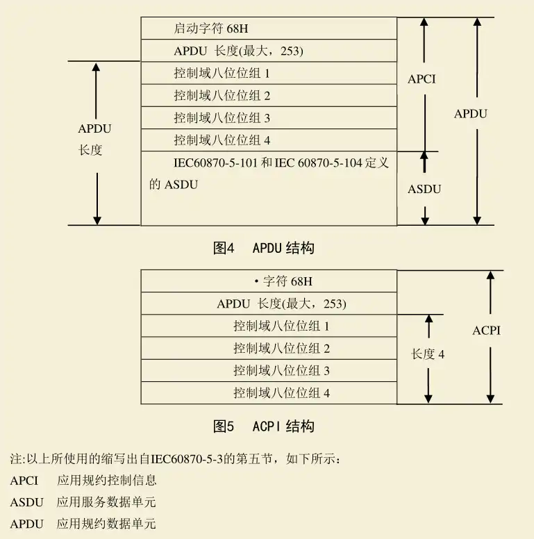
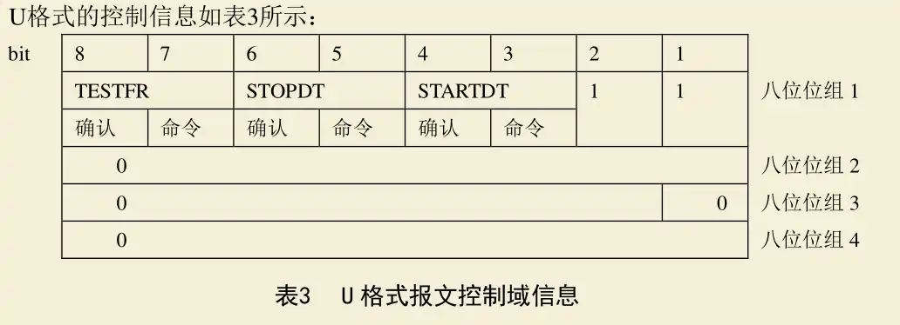
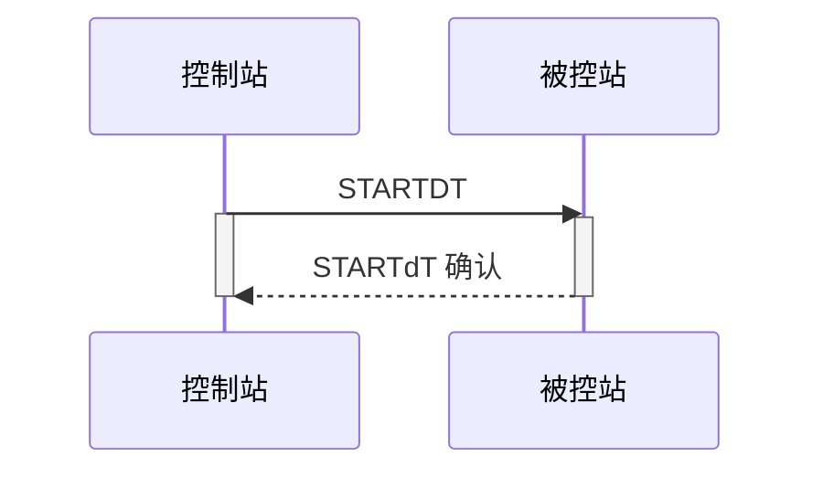
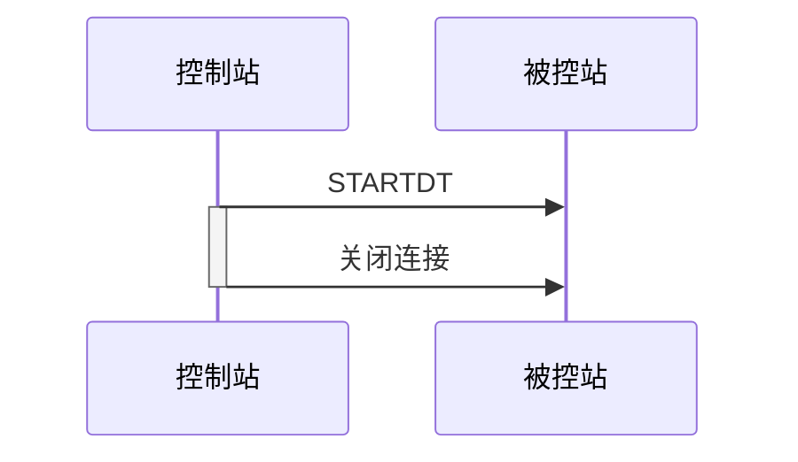
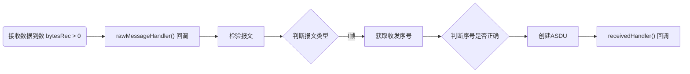
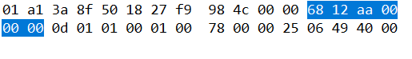
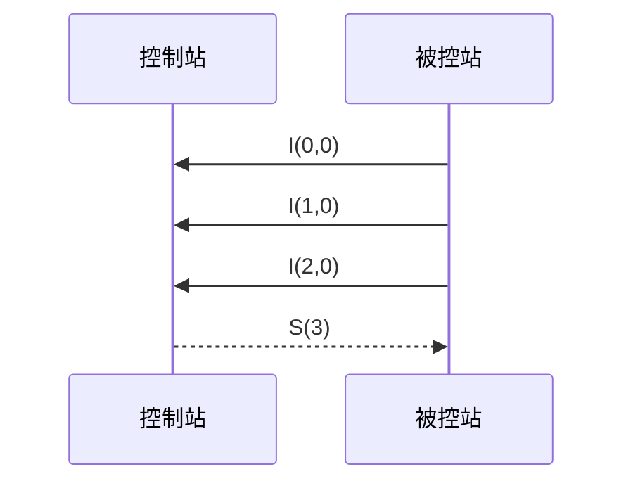

# 短帧报文
> 只传输APCI 的报文
<!-- more -->

分类：
- Information Transmit Format: I格式，信息传输功能
- Numbered supervisory functions: S格式，带编号的监视功能
- Unnumbered control function: U格式，未编号的控制功能
## 报文结构


## U帧-未编号的控制功能
连接建立后控制站和被控站都处于STOPPED状态。
>[!quote]
>在这种状态下，除了未编号的控制功能 和 对这些功能的确认，被控站不通过这个连接发送任何数据。控制站应通过这个连接发送STARTDT激活指令激活这个连接中的用户数据传输。被控站用STARTDT确认响应这个命令。

U帧报文有三种功能：
- 启动/确认数据传输
- 停止/确认数据传输
- 防止假在线的测试/确认

### 报文格式

控制站发送命令，被控站发送确认。对应的bit 为1表示有效。同一时刻，3种功能只有一个可以生效。


### 启动数据传输-STARTDT
连接连接后
:::tabs
@tab 正常的启动流程


@tab 异常-超时

控制站发送STARTDT后启动计时器t1，在t1时间内未收到STARTDT确认判定为超时。超时后控制站主动断开连接。
:::

#### 实现
报文定义：
``` cpp
static uint8_t STARTDT_ACT_MSG[] = { 0x68, 0x04, 0x07, 0x00, 0x00, 0x00 };
#define STARTDT_ACT_MSG_SIZE 6
```
发送：
``` cpp
void
CS104_Connection_sendStartDT(CS104_Connection self);
```


## S帧-带编号的监视功能
### 报文格式
| bit | 8   | 7   | 6   | 5         | 4   | 3   | 2   | 1   |
| --- | --- | --- | --- | --------- | --- | --- | --- | --- |
| 位组1 | 0   | 0   | 0   | 0         | 0   | 0   | 0   | 1   |
| 位组2 | -   | -   | -   | -         | 0   | -   | -   | -   |
| 位组3 | -   | -   | -   | 接收序列号 LSB | -   | -   | -   | 0   |
| 位组4 | -   | -   | -   | 接收序列号 MSB | -   | -   | -   | -   |
>[!note]
>"应用技术中3.3.1 节说明的S帧包含了接收序列号、发送序列号“ 是错误的，S格式

### 实现
简单的看了下库中源代码，没办法直接获取获取到序列号。
接收数据后的处理流程：


问题：
1. 处理raw 时报文还没有通过检测，可能不是有效数据。
2. asdu 结构只包含了asdu部分，不涉及apci，没办法直接获取到序列号

创建asdu：
``` cpp title="cs104_connection.c / checkMessage()"
        CS101_ASDU asdu = CS101_ASDU_createFromBuffer((CS101_AppLayerParameters)&(self->alParameters), buffer + 6, msgSize - 6);

```

buffer：接收报文
apci 的长度固定为6直接，跳过apci，剩余的部分就是asdu

``` cpp title="CS101_ASDU_createFromBuffer"
CS101_ASDU
CS101_ASDU_createFromBuffer(CS101_AppLayerParameters parameters, uint8_t* msg, int msgLength)
{
    int asduHeaderLength = 2 + parameters->sizeOfCOT + parameters->sizeOfCA;

    if (msgLength < asduHeaderLength)
        return NULL;

    CS101_ASDU self = (CS101_ASDU) GLOBAL_MALLOC(sizeof(struct sCS101_ASDU));

    if (self != NULL) {
        self->parameters = parameters;

        self->asdu = msg;
        self->asduHeaderLength = asduHeaderLength;

        self->payload = msg + asduHeaderLength;
        self->payloadSize = msgLength - asduHeaderLength;
    }

    return self;
}
```


| 行号    | 功能                      | 说明                          |
| ----- | ----------------------- | --------------------------- |
| 4     | 计算asdu中第一个信息元素前的直接长度    | 包含TypeId（1），VSQ（1），COT 和 CA |
| 14、15 | 存储asdu报文位置 和 head长度     |                             |
| 17、18 | payload 指的是asdu中的所有信息元素 |                             |

收到报文后报文数据是存储在循环数组中，asdu中又存储了它在原始报文中位置，所以可以根据将self->asdu向前移动获取到实际接收到报文的数据。

库提供的接口：
``` cpp title="iec60870_common.h"
uint8_t*
CS101_ASDU_getPayload(CS101_ASDU self);
```
只提供了获取payload的方法

获取ASDU head 配置参数
``` cpp title="cs104_connection.h"
CS101_AppLayerParameters
CS104_Connection_getAppLayerParameters(CS104_Connection self);
```

结合以上信息，可以在asduReceivedHandler（）中解析处序号
获取到报文：将asdu 中的payload 向前移动 headLength + 6
结合wireshark 抓包，查看报文是否一致，验证是否正确获取到原始报文数据。
wireShark捕获：

程序打印：
``` txt title="output"
68 12 aa 00 00 00 0d 01 01 00
```
两者相符，获取到的原始报文数据正确。


解析：
``` cpp
      int seqNo = (buffer[4] + buffer[5] * 0x100) / 2;
```
	

但是这里S帧属于短帧报文，不包含asdu，不能在asduReceivedHandler中处理。
直接在raw中处理S帧的接收序号。
``` cpp
static void
rawMessageHandler (void* parameter, uint8_t* msg, int msgSize, bool sent)
{
    if(sent && (msgSize == 6)
        && (msg[0] == 0x68)
        && (msg[1] == 0x04)
        && (msg[2] == 0x01) )
    {
        int seqNo = (msg[4] + msg[5] * 0x100) / 2;
        qDebug() << "seqNo:" << seqNo;
    }
}
```
### 功能
>[!quote]
>如只在一个方向进行较长（时间）的数据传输，应在另一个方向发送S格式认可这些APDU

当控制站持续接收被控站的数据时，如果期间没有控制站没有发送I格式报文（通常是命令），那么需要发送S格式，用来告知被控站已经成功接收了哪些数据。

特点：控制站发送、只包含接收序号
已启动传输条件下：
:::tabs
@tab 未受干扰

	被控站发送3帧I，控制站回复一针s

@tab 收到干扰（异常）

:::
## I帧-信息传输
### 报文格式
| bit | 8   | 7   | 6   | 5         | 4   | 3   | 2   | 1   |
| --- | --- | --- | --- | --------- | --- | --- | --- | --- |
| 位组1 | -   | -   | -   | 发送序列号 LSB | -   | -   | -   | 0   |
| 位组2 | -   | -   | -   | 发送序列号 MSB | -   | -   | -   | -   |
| 位组3 | -   | -   | -   | 接收序列号 LSB | -   | -   | -   | 0   |
| 位组4 | -   | -   | -   | 接收序列号 MSB | -   | -   | -   | -   |
### 实现
``` cpp title="cs104_connection.c/checkMessage()"
        int frameSendSequenceNumber = ((buffer [3] * 0x100) + (buffer [2] & 0xfe)) / 2;
        int frameRecvSequenceNumber = ((buffer [5] * 0x100) + (buffer [4] & 0xfe)) / 2;

```

