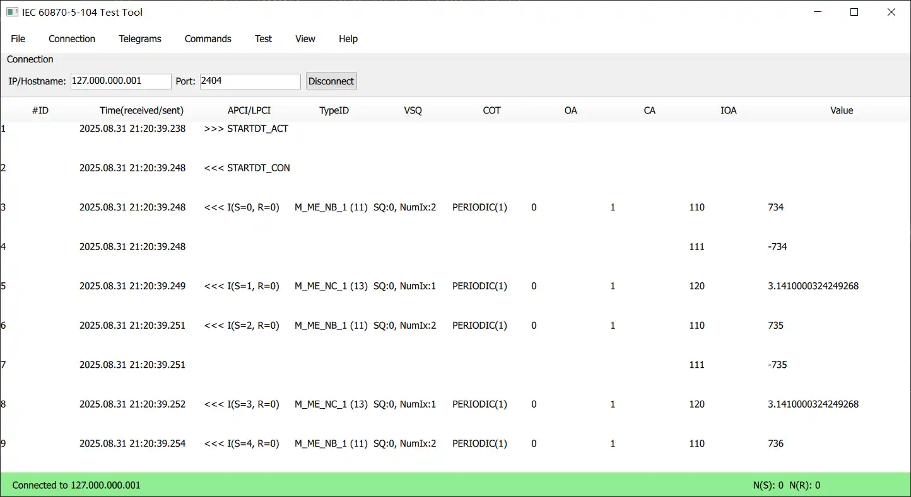
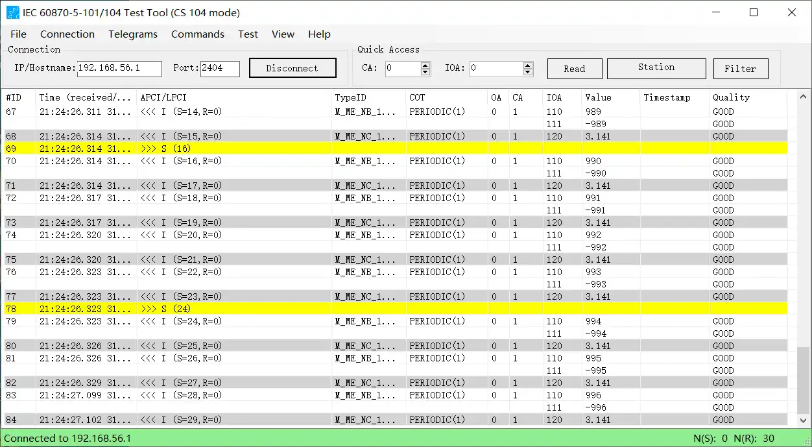
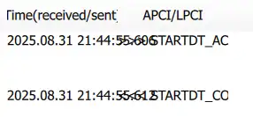
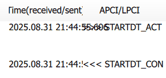

---
tags:
  - IEC60870
---
实现IEC 60870-5-104协议通讯的客户端的计划清单
（完全仿照IEC 60870-5-101/104 Test Client https://www.mz-automation.de）
<!-- more -->
# 计划清单
 软件实现分为界面 和 功能两大部分

[网络抓包示例下载](https://wiki.wireshark.org/samplecaptures#iec-60870-5-104)

## 界面

单个界面的实现分为：
1. 静态显示（内部）；
2. 动态交互（外部）；
静态显示包含以下几种情况：
- 显示内容不变；
- 显示的内容由状态决定：如连接状态
- 显示的内容由数据决定：如接收到的报文
状态和数据的区别是状态是数量、类型确定的，而数据是数量、类型不确定的。

动态交互包括：
- 用户操作改变界面显示：如界面的展开、隐藏；点击后按钮的状态等
- 组件之间的通讯：如接收报文后主界面中的表格更新报文数据

界面实现从主界面开始，按照重要程度、实现难度 从高到低进行排列。
- [x] 菜单栏
- [x] 连接配置
	- [x] GroupBox：包含IP、Port 和 Connect 的connection框（visual frame）
	- [x] TextInput：ip、port 输入
	- [x] Layout：排列控件
- [ ] 主界面底部状态栏
	- [x] States：将状态栏的背景颜色、连接状态绑定到一起
	- [ ] 收发序号
		- [ ] 短帧报文中带有接收序号的I格式 和 S格式类型帧
- [x] 连接配置控件的接口
	- [x] qml 之间的交互：Signal and Handler Event System

## 功能
以下是一个完整的IEC 60870客户端功能：
- Support for sending all standard message types
- Define and send /receive custom message types
- Sending commands
- Analyze message details
- File upload and download to the device
- Save recorded telegrams for later analysis
- Support TLS encryption
- Save latest values in an Excel or CSV file
- 。。。

以上Fetures 主要分为几个部分：
- Send/Receive message 
	- standard message types 
	- custom 
- Analyze message
- Save
- TLS

每个部分可以分为基础部分和扩展部分，比如receive 基础部分是standart message types，扩展是custom；
功能从Receive-》Send -》 Analyze-》Save

功能的实现可以独立进行，但是需要保留和连接的通讯（从界面获取配置，或发送信息给界面显示）


- [x] 在qt 中使用lib60870 动态连接库 建立连接
	

## 关于界面与实现的想法
界面应该完全独立于具体实现，也就是它不包含具体实现对象。同样地，实现也应该独立于界面。它们只通过接口进行交互。
比如连接配置
实现：
``` cpp
class ConnectionParameters{
	Q_OBJECT
	Q_ElELMENT
	Q_PROPERTY(int port ...)
public:
	
};
```
界面：
``` js
Connection {
	validator: IntValidator { bottom: 0; top: 65535; }
	//ConnectionParamerters { id: parameters }
}
```
如果在界面中包含了实现的对象，就是将界面和实现绑定了。修改其中一方，对另一方有影响。
实际应该按照谁需要谁包含。对于不需要界面的，可以只包含实现。对于需要界面的就同时包含界面和实现。然后连接两者的信号和槽。


## 进度
### 主界面
时间：2025-08-31
当前实现效果：

已完成：
- APCI 的显示：根据实际帧类型显示对应的内容
- I帧中的M_ME_NB_1 和 M_ME_NC_1 的 ioa 及 value 的显示

最终效果：


欠缺的内容：
- Quick Access:  read、station 命令 和 filter
- 右下角的本地存储的 接收、发送计数 （应该增加一个ACK计数值）
- 表格显示：
	- 单元格边框：包含表格内容 及 表头
	- 每行的背景颜色：区分发送、接收；不同的APDU（相邻的APDU 采用不同的颜色）；选中行
	- 滚动轴
	- 表头宽度
	- 文本位置
存在的问题：
- 文本重叠：当相邻的单元格宽度不足，文本过长时 文本会重叠

- 值显示跳变：宽度不足时，显示的内容会变换（实际值没有变换，拉长后正常）


