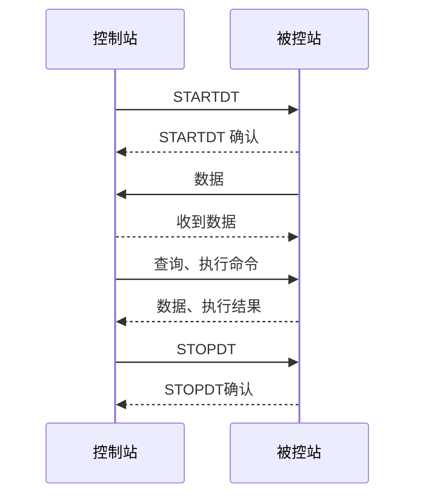
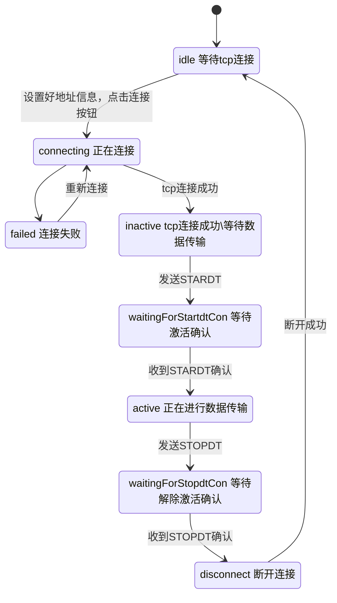

# 连接状态


## 界面
参考：
初始：

连接成功：

构成元素：
1. 当前连接状态提示：Ready-初始完毕，准备连接
2. 背景颜色
3. 接收、发送 序号


| 状态   | 提示                           | 背景颜色 |
| ---- | ---------------------------- | ---- |
| 等待连接 | Ready                        |      |
| 正在连接 | Connecting to ServerIP       |      |
| 连接成功 | Connected to ServerIP        |      |
| 连接失败 | Connected to ServerIP failed |      |

## 状态
>[!note]
>以下内容并非完整的状态转换，不包含收到其他类型帧 以及 异常（超时）后的状态转换

协议采用TCP/IP 进行数据通讯，但是在此基础上还有额外的机制控制数据传输。
以下是一些定义：
控制站：向被控站发送命令、请求数据，控制数据传输的启动、停止。在网络应用中相当于client。
被控站：数据采集，上报。接收命令，进行相应的动作。在网络应用中相当于server
STARTDT：由控制站发送的启动数据传输命令
STARTDT确认：由被控站回复的接收到STARDT的确认消息
STOPDT：由控制站发送的停止数据传输命令
STOPDT确认：由被控站回复的接收到STOPDT的确认消息

在已经建立TCP连接的基础上：

控制站在收到STOPDT确认后可以直接关闭TCP连接，也可以保持TCP连接。

状态可以分为两个部分：
1. TCP 网络连接状态：等待连接、正在连接、连接成功
2. 数据传输状态：等待数据传输、正在数据传输

控制站的状态转换：



## 实现
参考simple_client.c 
1. 设置回调函数
``` cpp
    CS104_Connection_setConnectionHandler(con, connectionHandler, NULL);
    static void
connectionHandler (void* parameter, CS104_Connection connection, CS104_ConnectionEvent event);
```
event的定义：
``` cpp
typedef enum {
    CS104_CONNECTION_OPENED = 0,
    CS104_CONNECTION_CLOSED = 1,
    CS104_CONNECTION_STARTDT_CON_RECEIVED = 2,
    CS104_CONNECTION_STOPDT_CON_RECEIVED = 3
} CS104_ConnectionEvent;
```

2. 回调处理


