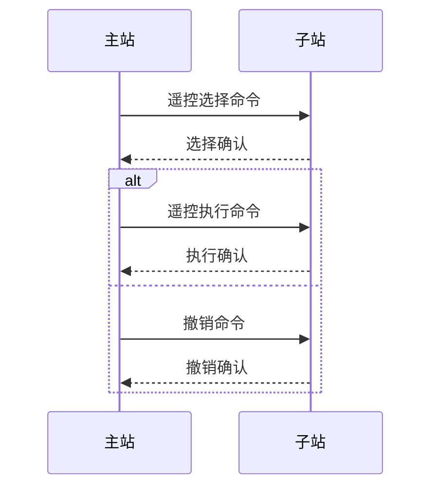

# 遥控
Process information in control direction - 控制方向的过程信息 


| TypeID 值 | 简称        | 全称                                             | 说明          |
| -------- | --------- | ---------------------------------------------- | ----------- |
| 45       | C_SC_NA_1 | single commad                                  | 单点命令        |
| 46       | C_DC_NA_1 | double command                                 | 双点命令        |
| 47       | C_RC_NA_1 | regulating step command                        | 步调调节命令      |
| 48       | C_SE_NA_1 | set point command, normalized value            | 设点命令，归一化值   |
| 49       | C_SE_NB_1 | set point command, scaled value                | 设点命令， 标度化值  |
| 50       | C_SE_NC_1 | set point command, short floating point number | 设点命令，短浮点数   |
| 。。。      |           |                                                |             |
| 58       | C_SC_TA_1 | single command with time tag CP56Time2a        | 带56 时标的单点命令 |
| 。。。      |           |                                                |             |

## s/e 过程
对于C_SC(包含C_SC_NA_1 和 C_SC_TA_1)、C_DC、C_RC 它们包含了select 和 execute 两个过程。



## 单点遥控

### SCO single command
| bit | 8                         | 7   | 6   | 5                           | 4   | 3   | 2       | 1                    |
| --- | ------------------------- | --- | --- | --------------------------- | --- | --- | ------- | -------------------- |
| 含义  | -                         | -   | -   | QOC<br>qualifier of command | -   | -   | RES     | SCS                  |
| 名称  | S/E                       | -   | -   | QU                          | -   | -   | RESERVE | single command state |
| 说明  | 1 := select; 0 := execute |     |     |                             |     |     |         | 0 := OFF； 1 := ON    |

| QU     | 含义                                                                                                  |
| ------ | --------------------------------------------------------------------------------------------------- |
| 0      | no additional definition                                                                            |
| 1      | short pulse duration (circuit-breaker), duration determined by a system parameter in the outstation |
| 2      | long pulse duration                                                                                 |
| 3      | persistent output，持续输出，直到接收执行相反状态命令                                                                 |
| 4...31 |                                                                                                     |

short pulse 和 long pulse 的区别：持续时间。

### 实现
创建
``` cpp title="cs_101_information_objects.c"
SingleCommand
SingleCommand_create(SingleCommand self, int ioa, bool command, bool selectCommand, int qu)
{
    if (self == NULL)
		self = (SingleCommand) GLOBAL_MALLOC(sizeof(struct sSingleCommand));

    if (self) {
        SingleCommand_initialize(self);

        self->objectAddress = ioa;

        uint8_t sco = ((qu & 0x1f) * 4);

        if (command) sco |= 0x01;

        if (selectCommand) sco |= 0x80;

        self->sco = sco;
    }

    return self;
}
```

发送选择/执行：
``` cpp
    SingleCommand sc;
    sc = SingleCommand_create(NULL, ioa, command, selectCommand, qu);
    auto parameters = CS104_Connection_getAppLayerParameters(m_con);
    CS101_ASDU asdu = CS101_ASDU_create(parameters, false, CS101_COT_ACTIVATION, 0, 1, false, false);
    CS101_ASDU_addInformationObject(asdu, (InformationObject) sc);
    CS104_Connection_sendASDU(m_con, asdu);

    SingleCommand_destroy(sc);
    CS101_ASDU_destroy(asdu);
```


| 行号  | 功能                         | 说明              |
| --- | -------------------------- | --------------- |
| 1、2 | 创建单点遥信命令对象                 |                 |
| 3   | 获取连接参数                     |                 |
| 4   | 根据应用参数创建asdu               | COT 为ACTIVATION |
| 5   | asdu中添加信息元素-single command |                 |
| 6   | 发送命令                       |                 |

发送撤销：
``` cpp
    CS101_ASDU asdu = CS101_ASDU_create(parameters, false, CS101_COT_DEACTIVATION, 0, 1, false, false);
```
asdu 的COT 为 DEACTIVATION

问题：<mark style="background: #FFF3A3A6;">撤销选择时SCO 有作用吗？</mark>
在我看来选择时的参数SCO 对撤销没有影响（即接收到撤销命令后忽略SCO参数），只要撤销的对象确定了，那么该对象都恢复为初始状态。

### 界面


