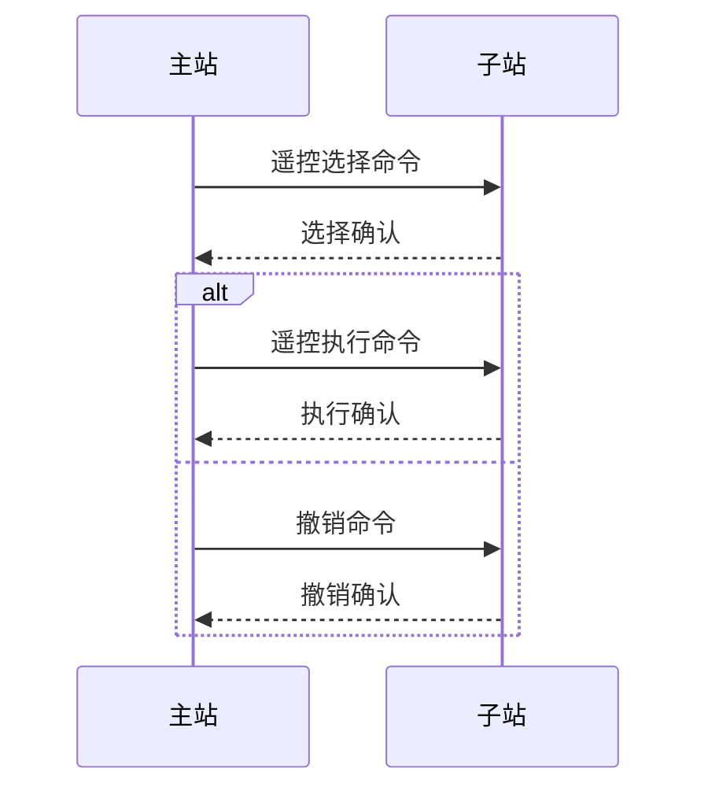
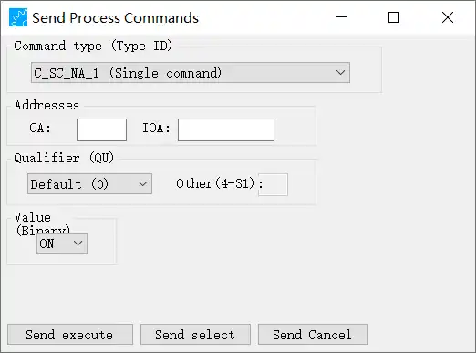
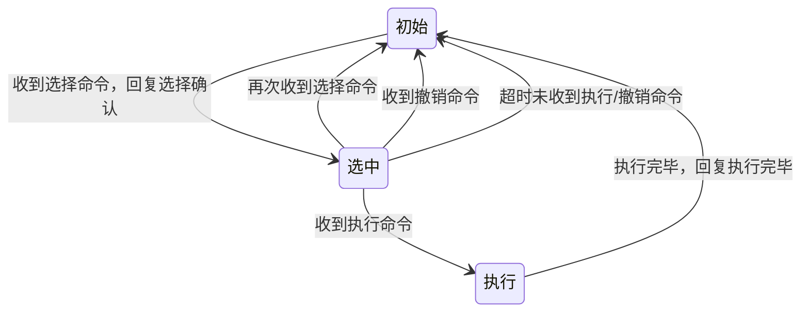
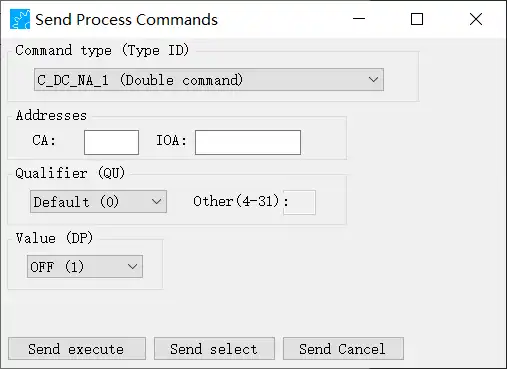

# 遥控
Process information in control direction - 控制方向的过程信息 

| TypeID 值 | 简称        | 全称                                      | 说明          |
| -------- | --------- | --------------------------------------- | ----------- |
| 45       | C_SC_NA_1 | single commad                           | 单点命令        |
| 46       | C_DC_NA_1 | double command                          | 双点命令        |
| 58       | C_SC_TA_1 | single command with time tag CP56Time2a | 带56 时标的单点命令 |
| 。。。      |           |                                         |             |

## s/e 过程
对于C_SC(包含C_SC_NA_1 和 C_SC_TA_1)、C_DC、C_RC 它们包含了select 和 execute 两个过程。



## 单点遥控

### SCO single command
| bit | 8                         | 7   | 6   | 5                           | 4   | 3   | 2       | 1                    |
| --- | ------------------------- | --- | --- | --------------------------- | --- | --- | ------- | -------------------- |
| 含义  | -                         | -   | -   | QOC<br>qualifier of command | -   | -   | RES     | SCS                  |
| 名称  | S/E                       | -   | -   | QU                          | -   | -   | RESERVE | single command state |
| 说明  | 1 := select; 0 := execute |     |     |                             |     |     |         | 0 := OFF； 1 := ON    |

| QU     | 含义                                                                                                  |
| ------ | --------------------------------------------------------------------------------------------------- |
| 0      | no additional definition                                                                            |
| 1      | short pulse duration (circuit-breaker), duration determined by a system parameter in the outstation |
| 2      | long pulse duration                                                                                 |
| 3      | persistent output，持续输出，直到接收执行相反状态命令                                                                 |
| 4...31 |                                                                                                     |

short pulse 和 long pulse 的持续时间有远方终端系统参数决定

### 实现
创建
``` cpp title="cs101_information_objects.c"
SingleCommand
SingleCommand_create(SingleCommand self, int ioa, bool command, bool selectCommand, int qu)
{
    if (self == NULL)
		self = (SingleCommand) GLOBAL_MALLOC(sizeof(struct sSingleCommand));

    if (self) {
        SingleCommand_initialize(self);

        self->objectAddress = ioa;

        uint8_t sco = ((qu & 0x1f) * 4);

        if (command) sco |= 0x01;

        if (selectCommand) sco |= 0x80;

        self->sco = sco;
    }

    return self;
}
```

发送选择/执行：
``` cpp
    SingleCommand sc;
    sc = SingleCommand_create(NULL, ioa, command, selectCommand, qu);
    auto parameters = CS104_Connection_getAppLayerParameters(m_con);
    CS101_ASDU asdu = CS101_ASDU_create(parameters, false, CS101_COT_ACTIVATION, 0, 1, false, false);
    CS101_ASDU_addInformationObject(asdu, (InformationObject) sc);
    CS104_Connection_sendASDU(m_con, asdu);

    SingleCommand_destroy(sc);
    CS101_ASDU_destroy(asdu);
```


| 行号  | 功能                         | 说明              |
| --- | -------------------------- | --------------- |
| 1、2 | 创建单点遥信命令对象                 |                 |
| 3   | 获取连接参数                     |                 |
| 4   | 根据应用参数创建asdu               | COT 为ACTIVATION |
| 5   | asdu中添加信息元素-single command |                 |
| 6   | 发送命令                       |                 |

发送撤销：
``` cpp
    SingleCommand sc;
    sc = SingleCommand_create(NULL, ioa, false, false, 0);
    auto parameters = CS104_Connection_getAppLayerParameters(m_con);
    CS101_ASDU asdu = CS101_ASDU_create(parameters, false, CS101_COT_DEACTIVATION, 0, 1, false, false);
```
asdu 的COT 为 DEACTIVATION

问题：<mark style="background: #FFF3A3A6;">撤销选择时SCO 有作用吗？</mark>
在我看来选择时的参数SCO 对撤销没有影响（即接收到撤销命令后忽略SCO参数），只要撤销的对象确定了，那么该对象都恢复为初始状态。
所有命令中的SE 及 command 都设置成了false，没有取select 相同值
### 界面



## 状态


>[!quote]
>同一遥控点号只允许一个主站进行操作
>严格按照选择-》执行/撤销的过程执行，且只允许被选择一次，选择之后再次接收到选择命令应当认为指令错误并恢复到未选择之前的初始状态
>选择之后应该在规定时间内接收执行或撤销命令，超时未收到恢复到选择之前初始状态

只允许一个主站进行操作：接收到一个主站的命令后忽略其他主站的命令

问：<mark style="background: #FFF3A3A6;">执行 和 选择的参数是否要求相同？</mark>
我认为除了S/E 标志外其余参数应该完全一致，执行参数和选择参数不一致的应该拒绝执行（保持选中状态 或 恢复到初始状态 应该是可选的）

## 双点遥控

### DCO Double command

| bit | 8                             | 7   | 6   | 5   | 4   | 3   | 2                                                    | 1   |
| --- | ----------------------------- | --- | --- | --- | --- | --- | ---------------------------------------------------- | --- |
| 含义  | QOC =<br>qualifier of command | -   | -   | -   | -   | -   | DCS                                                  | -   |
| 名称  | S/E                           | QU  | -   | -   | -   | -   | double command state                                 |     |
| 说明  | 1 := select; 0 := execute     |     |     |     |     |     | 0:= not permitted; 1:= OFF; 2:=ON; 3:= not permitted |     |

### 实现
创建
``` cpp title="cs101_information_objects"
DoubleCommand
DoubleCommand_create(DoubleCommand self, int ioa, int command, bool selectCommand, int qu)
{
    if (self == NULL)
		self = (DoubleCommand) GLOBAL_MALLOC(sizeof(struct sDoubleCommand));

    if (self) {
        DoubleCommand_initialize(self);

        self->objectAddress = ioa;

        uint8_t dcq = ((qu & 0x1f) * 4);

        dcq += (uint8_t) (command & 0x03);

        if (selectCommand) dcq |= 0x80;

        self->dcq = dcq;
    }

    return self;
}
```

发送选择/执行
``` cpp
void CS104Connection::sendDoubleCommand(int ioa, int command, bool selectCommand, int qu)
{
    qDebug() << __FUNCTION__ << " ioa:" << ioa << " command:" << command
             << " selectCommand:" << selectCommand << " qu:" << qu;
    DoubleCommand sc;
    sc = DoubleCommand_create(NULL, ioa, command, selectCommand, qu);
    auto parameters = CS104_Connection_getAppLayerParameters(m_con);
    CS101_ASDU asdu = CS101_ASDU_create(parameters, false, CS101_COT_ACTIVATION, 0, 1, false, false);
    CS101_ASDU_addInformationObject(asdu, (InformationObject) sc);
    CS104_Connection_sendASDU(m_con, asdu);

    DoubleCommand_destroy(sc);
    CS101_ASDU_destroy(asdu);
}
```
注意：command 的类型为int
发送撤销：略
### 界面

和single command 的差别：Value 值不同

问题：<mark style="background: #FFF3A3A6;">是根据类型修改single command 使用的控件，还是单独创建另一个界面，在界面之间进行切换？</mark>


