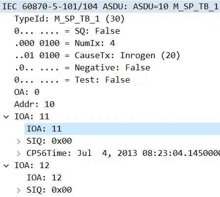
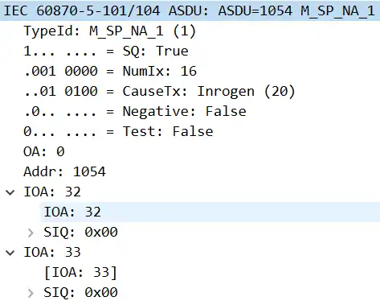

# 遥测
遥测量的分类：
>[!quote]
>归一化值、标度化值需在主站乘以响应的系数，主站端将变电站的上送的码值乘以相应的系数才是该遥测量的实际值；其中归一化值按照满码值计算系数、标度化值按倍数计算系数、短浮点数不需要乘以系数。

| TypeID 值 | 简称        | 全称                                                           | 说明                  |
| -------- | --------- | ------------------------------------------------------------ | ------------------- |
| 9        | M_ME_NA_1 | measured value, normalized value                             | 归一化值                |
| 10       | M_ME_TA_1 | normalized value with time tag                               | 带时标的归一化值            |
| 11       | M_ME_NB_1 | scaled value                                                 | 标度化值                |
| 12       | M_ME_TB_1 | scaled value with time tag                                   | 带时标的标度化值            |
| 13       | M_ME_NC_1 | short floating point number                                  | 短浮点数                |
| 14       | M_ME_TC_1 | short floating point number with time tag                    | 带时标的短浮点数            |
| 21       | M_ME_ND_1 | normalized value without quality descriptor                  | 不带品质描述的归一化值         |
| 34       | M_ME_TD_1 | measured value, normalized value with<br>time tag CP56Time2a | 带CP56Time2a 时标的归一化值 |
| 35       | M_ME_TE_1 | scaled value with time tag CP56Time2a                        | 带CP56Time2a 时标的标度化值 |
| 36       | M_ME_TF_1 | short floating point number with time tag CP56Time2a         | 带CP56Time2a 时标的短浮点数 |

除了21 外都带有品质描述
10、12、14 中的时标类型是CP24Time2a
用来表示遥测量（具体数值）的类型有三种：normalized value，scaled value 和 short floating number
根据遥测量的类型、是否带有额外信息（quality descriptor、time tag。。。）以及额外信息的类型区分遥测的类型。

### ASDU的结构

## VSQ 可变结构限定词
variable structure qualifier

| bit | 8   | 7   | 6   | 5   | 4   | 3   | 2   | 1   |
| --- | --- | --- | --- | --- | --- | --- | --- | --- |
| 含义  | SQ  |     |     |     |     |     |     |     |

SQ表示ASDU中的信息元素（每个有含义的值）的地址获取方式
剩下的bit1-bit7是信息元素的数量

SQ:0
>[!quote]
>”表示由信息对象地址寻址的单个信息元素或综合信息元素，应用服务数据单元可以由一个或多个同类的信息对象组成“

每个元素的地址由元素自身给定。地址可以不连续，也可以连续。

SQ:1 
>[!quote]
>"表示同类的信息元素序列（即同一种格式的测量值），由信息对象地址来寻址，信息对象地址是顺序信息元素的第一个信息元素地址，后续信息元素的地址是从这个地址起顺序加1，在顺序信息元素的情况下每个应用服务数据单元仅安排一种信息对象"

给定第一个元素的地址，后续元素的地址根据序号在第一个元素的地址上累加。

:::tabs 
@tab SQ 为0的示例
来源：iec104.pcap

共包含4个元素。

| 元素序号 | IOA | 报文       |
| ---- | --- | -------- |
| 0    | 11  | 0b 00 00 |
| 1    | 12  | 0c 00 00 |
| 2    | 13  | 0d 00 00 |
| 3    | 14  | 0e 00 00 |

@tab SQ:1 的示例
来源：IEC104_SQ.pcapng


| 元素序号 | IOA | 报文       |
| ---- | --- | -------- |
| 0    | 32  | 20 00 00 |
| 1    | 33  | NULL     |
:::

### 实现
判断是否连续：可变结构限定词字节的最高位是否为1
``` cpp
bool
CS101_ASDU_isSequence(CS101_ASDU self)
{
    if ((self->asdu[1] & 0x80) != 0)
        return true;
    else
        return false;
}
```

获取信息元素数量：取剩余7位表示的值
``` cpp
int
CS101_ASDU_getNumberOfElements(CS101_ASDU self)
{
    return (self->asdu[1] & 0x7f);
}
```


## COT 传输原因
cause of transimission

| bit | 8    | 7              | 6   | 5   | 4       | 3   | 2   | 1   |
| --- | ---- | -------------- | --- | --- | ------- | --- | --- | --- |
| 含义  | Test | Negative/(P/N) | -   | -   | CauseTx | -   | -   | -   |
| 含义  | -    | -              | -   | -   | OA      | -   | -   | -   |

Test: 是否为测试状态
Negative：是否响应命令（positive confirm or negative confirm），用在被控站响应遥控命令的回复中
CauseTx：传输原因
OA：源发地址，用来标识控制站中发起该命令的客户端（调度员）。

COT 可配置为1字节-不包含OA，或2字节-包含OA

### CauseTx
只关心下表中的原因：

| 值   | 名称       | 含义     | 对应库中的枚举定义                         |
| --- | -------- | ------ | --------------------------------- |
| 1   | per/cyc  | 周期/循环  | CS101_COT_PERIODIC                |
| 3   | spont    | 突发     | CS101_COT_SPONTANEOUS             |
| 4   | init     | 初始化    | CS101_COT_INITIALIZED             |
| 5   | req      | 请求/被请求 | CS101_COT_REQUEST                 |
| 6   | act      | 激活     | CS101_COT_ACTIVATION              |
| 7   | actcon   | 激活确认   | CS101_COT_ACTIVATION_CON          |
| 8   | deact    | 停止激活   | CS101_COT_DEACTIVATION            |
| 9   | deactcon | 停止激活确认 | CS101_COT_DEACTIVATION_CON        |
| 10  | actterm  | 激活终止   | CS101_COT_ACTIVATION_TERMINATION  |
| 20  | introgen | 响应站总召  | CS101_COT_INTERROGATED_BY_STATION |

### 实现
获取Test的接口：
``` cpp
bool
CS101_ASDU_isTest(CS101_ASDU self)
{
    if ((self->asdu[2] & 0x80) == 0x80)
        return true;
    else
        return false;
}
```
获取Negative的接口：
``` cpp
bool
CS101_ASDU_isNegative(CS101_ASDU self)
{
    if ((self->asdu[2] & 0x40) == 0x40)
        return true;
    else
        return false;
}
```

获取CauseTx的接口：
``` cpp
CS101_CauseOfTransmission
CS101_ASDU_getCOT(CS101_ASDU self)
{
    return (CS101_CauseOfTransmission) (self->asdu[2] & 0x3f);
}
```

## CA ASDU 公共地址
common address of asdu
也叫站地址，用于标识被控站点。
可配置为1或2字节。标准要求为2字节
### 实现
``` cpp
int
CS101_ASDU_getCA(CS101_ASDU self)
{
    int caIndex = 2 + self->parameters->sizeOfCOT;

    int ca = self->asdu[caIndex];

    if (self->parameters->sizeOfCA > 1)
        ca += (self->asdu[caIndex + 1] * 0x100);

    return ca;
}
```
1. 确定addr的字节序号 TypeId（1） + VSQ(1) + COT（1 或 2）
2. 如果addr 配置为2字节，取第二个字节左移8位（乘以2的8次方）后与第一个字节相加，得到最终addr
## IOA 信息体对象地址
information object address
可配置为1~3字节，标准要求为3字节

| 类型   | 说明                                  |
| ---- | ----------------------------------- |
| 结构化  | 地址信息按预先规定的结构划分，可能的结构：【功能】【装置地址】【信号】 |
| 非结构化 | 地址仅代表对象编号，具体对应的设备需要配合外部点表           |
### 实现
解析：
``` cpp title="cs101_information_objects.c"
int
InformationObject_ParseObjectAddress(CS101_AppLayerParameters parameters, const uint8_t* msg, int startIndex)
{
    /* parse information object address */
    int ioa = msg [startIndex];

    if (parameters->sizeOfIOA > 1)
        ioa += (msg [startIndex + 1] * 0x100);

    if (parameters->sizeOfIOA > 2)
        ioa += (msg [startIndex + 2] * 0x10000);

    return ioa;
}
```

startIndex: IOA起始下标
如果ioa长度是1字节，那么ioa 就是 报文中startIndex 处的值。
大于1字节就将多的字节拼接到高位。
获取：
``` cpp title="cs101_information_objects.c"
int
InformationObject_getObjectAddress(InformationObject self)
{
    return self->objectAddress;
}
```

## QDS 品质描述词
| bit | 8                    | 7                         | 6                          | 5       | 4   | 3   | 2   | 1           |
| --- | -------------------- | ------------------------- | -------------------------- | ------- | --- | --- | --- | ----------- |
| 含义  | IV                   | NT                        | SB                         | BL      | -   | RES | -   | OV          |
| 名称  | Invalid              | Not Topical               | Substituted                | Blocked |     |     |     | overflow    |
| 说明  | 数据无效（未正确采集到数据，数据不可用） | 非当前值（指定时间内刷新，超时未刷新则为非当前值） | 取代（数据是自动采集的真实数据还是手动输入或预设值） | 闭锁      |     | 保留  |     | 溢出（超出预定义范围） |

值为1表示肯定，0表示否定。正常情况下值为0

### 实现
``` cpp title="cs101_information_objects.h"
QualityDescriptor
SinglePointInformation_getQuality(SinglePointInformation self);

QualityDescriptor
DoublePointInformation_getQuality(DoublePointInformation self);

QualityDescriptor
StepPositionInformation_getQuality(StepPositionInformation self);
//...

```
有的类型元素带有品质，有的不带，所以在每种类型的实现中获取

## 浮点数

| bit | 31  | 30~24 | 23~0 |
| --- | --- | ----- | ---- |
| 含义  | 符号位 | 指数    | 小数   |


## 示例 处理测量值，短浮点数
1. ASDU回调处理函数：
``` cpp
static bool
asduReceivedHandler (void* parameter, int address, CS101_ASDU asdu);

CS104_Connection_setASDUReceivedHandler(m_con, asduReceivedHandler, this);
```
2. 解析：
``` cpp
    if (CS101_ASDU_getTypeID(asdu) == M_ME_NC_1) {
        int i;
        for (i = 0; i < CS101_ASDU_getNumberOfElements(asdu); i++) {
            MeasuredValueShort io =
                (MeasuredValueShort) CS101_ASDU_getElement(asdu, i);
			auto value = MeasuredValueShort_getValue((MeasuredValueShort) io);
            MeasuredValueShort_destroy(io);
        }
    }
```


| 行号  | 功能        | 说明                         |
| --- | --------- | -------------------------- |
| 1   | 判断asdu 类型 |                            |
| 3-5 | 获取信息元素    |                            |
| 6   | 获取遥测值     |                            |
| 7   | 释放内存      | 会使用malloc 创建对象，解析完毕后需要释放内存 |


## 归一化值
| bit | 15  | 14  | 13  | ...   | 1   | 0   |
| --- | --- | --- | --- | ----- | --- | --- |
| 含义  | S   | -   | -   | Vaule | -   | -   |
S: 符号位。0：= 正数； 1：= 负数
Value：数据值

### get
``` cpp title="cs101_information_objects.c"
static int
getScaledValue(const uint8_t* encodedValue)
{
    int value;

    value = encodedValue[0];
    value += (encodedValue[1] * 0x100);

    if (value > 32767)
        value = value - 65536;

    return value;
}

float
MeasuredValueNormalized_getValue(MeasuredValueNormalized self)
{
    float nv = (float) (getScaledValue(self->encodedValue)) / 32767.f;

    return nv;
}
```

| 行号  | 功能               | 说明                                                                        |
| --- | ---------------- | ------------------------------------------------------------------------- |
| 6   | 获取LSB            |                                                                           |
| 7   | 获取MSB，并将其左移8位    |                                                                           |
| 9   | 判断符号位            | 所有数据位全部为1时的值为2的15次方-1，即32767，如果符号位为0，则拼接后的值一定小于等于32767。如果符号位为1，则一定大于32767 |
| 10  | 符号为为1时，获取实际的负数值  | 正数的实际值 = 正数本身；负数的实际值 = 值 - 模                                              |
| 18  | 将值近似映射到【-1，+1】区间 | 有符号16位整数能够表示的范围是-32768~+32767，要求最大值对应+1，所以除数是32767.f，这样最小值对应的是-1.000030   |

### set
``` cpp title="cs101_information_objects.c"
static void
setScaledValue(uint8_t* encodedValue, int value)
{
    int valueToEncode;

    if (value < 0)
        valueToEncode = value + 65536;
    else
        valueToEncode = value;

    encodedValue[0] = (uint8_t) (valueToEncode % 256);
    encodedValue[1] = (uint8_t) (valueToEncode / 256);
}

void
MeasuredValueNormalized_setValue(MeasuredValueNormalized self, float value)
{
    if (value > 1.0f)
        value = 1.0f;
    else if (value < -1.0f)
        value = -1.0f;

    int scaledValue = (int)(value * 32767.f);

    setScaledValue(self->encodedValue, scaledValue);
}
```

| 行号    | 功能             | 说明  |
| ----- | -------------- | --- |
| 6-9   | 计算带符号位的表示值     |     |
| 18-21 | 将范围限制在-1，+1    |     |
| 23    | 获取对应的有符号16位整数值 |     |

## 标度化值
和归一化值得区别在于其不需要映射到-1，+1. 

## 短浮点数
R32-IEEE STD 754