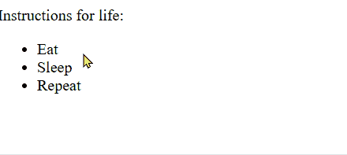
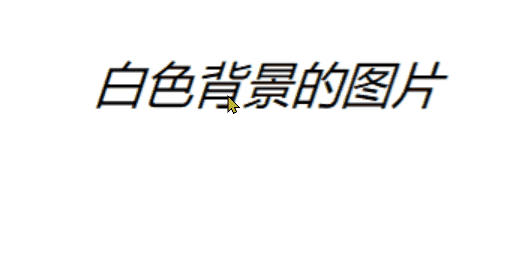
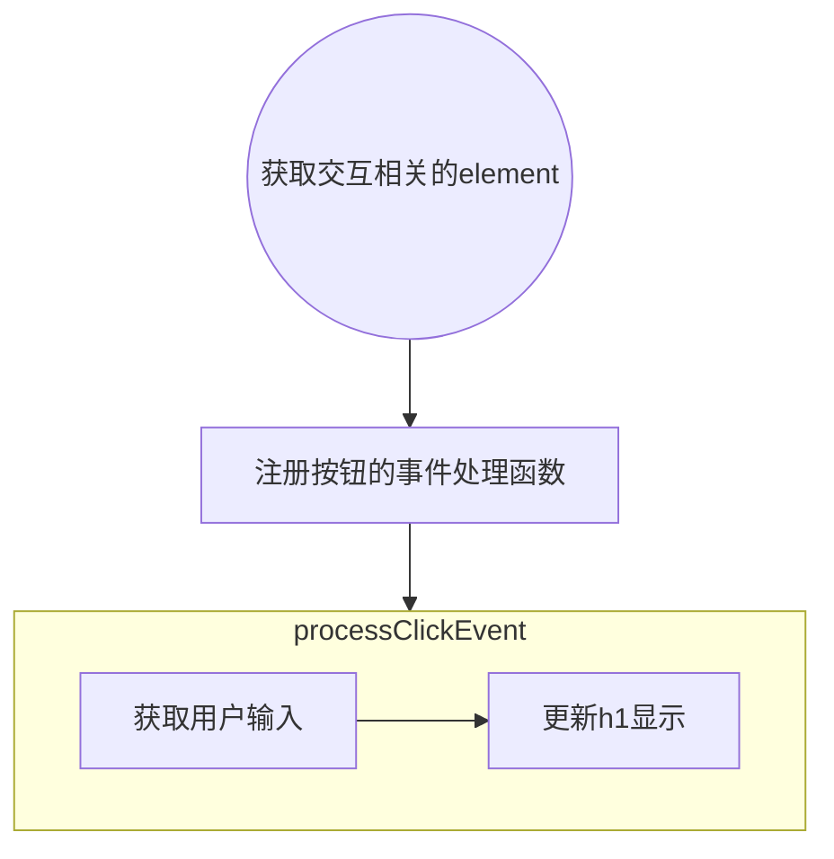
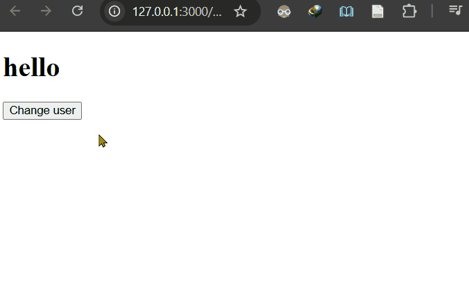

# Adding interactivity
使用Javascript 更改list items的样式


## What is the Javascript
>Javascript is a programming language that adds interactivity to websites. You can use it to control just about anything - form data validation, button functionality, dynamic styling, animation updates ...

Javascript 为网站添加交互性体验
交互的过程：
1. 用户输入：鼠标、键盘。。。
2. 处理用户输入
3. 反馈结果

对应的Javascript需要的功能
1. 获取用户输入
2. 获取界面元素
3. 能够处理数据：programming features， loops，variables， functions
4. 修改界面元素

更改list items 的Javascript代码：
```js title="scripts/main.js"
const listItems = document.querySelectorAll("li");

function toggleDone(e) {
  if (!e.target.className) {
    e.target.className = "done";
  } else {
    e.target.className = "";
  }
}

listItems.forEach((item) => {
  item.addEventListener("click", toggleDone);
});
```


| 行号    | 功能             | 说明                                                      |
| ----- | -------------- | ------------------------------------------------------- |
| 1     | 获取页面中所有的li 元素  |                                                         |
| 3-9   | 修改元素所属的类       | 如果元素没有className，将其添加到done中；有className，则将其从所在clas中移除（置空） |
| 11-13 | 对所有li 元素添加事件监听 | 设置元素的鼠标事件处理函数为前面的toggleDone(e)                          |

设置项目完成后的样式：
```css
.done {
  color: darkseagreen;
  text-decoration: line-through solid black 2px;
}
```

| 行号  | 功能    | 说明                               |
| --- | ----- | -------------------------------- |
| 1   | 类选择器  | rule应用到className 为done的elements上 |
| 2   | 颜色    |                                  |
| 3   | 设置删除线 |                                  |

关联js 和 html
在index.html内添加：
```html
<head>
    <script async src="scripts/main.js"></script>
</head>
```

>This does the same job as the \<link> element for CSS - it applies the Javascript to the page so it can affect the HTML (along with the CSS and anything else on the page)

<span style="background:#fff88f">问：</span>这里是不是说js 可以 控制 css，css 指的是样式还是文件？《=》js是直接能够修改元素的样式 还是修改css文件从而间接修改样式？


## A "Hello world!" walkthrough
修改\<h1> 的文本
```js
// Store a reference to the <h1> in a variable
const myHeading = document.querySelector("h1");
// Update the text content of the <h1>
myHeading.textContent = "Hello world!";
```

| 行号  | 功能                                       | 说明                                           |
| --- | ---------------------------------------- | -------------------------------------------- |
| 2   | 获取h1元素并将其存储在js变量中（或者说 在js中创建一个变量指向h1元素？） | first select the elements you want to affect |
| 4   | 修改标签的content                             |                                              |

<span style="background:#fff88f">问：</span>如果Selector("h2") 或者 说query的element 有多个，结果如何？
```html
  <body>
    <h1>Instructions for life</h1>
    <h1>第二个h1</h1>
  </body>
```
效果：

	返回首个h1 element

## Adding an image changer
功能：点击切换图片
实现：
```js
const myImage = document.querySelector("img");

myImage.addEventListener("click", () => {
  const mySrc = myImage.getAttribute("src");
  if (mySrc === "images/Snipaste_2026-04-11_12-15-01.png") {
    myImage.setAttribute("src", "images/番茄钟.jpg");
  } else {
    myImage.setAttribute("src", "images/Snipaste_2026-04-11_12-15-01.png");
  }
});

```

| 行号  | 功能                  | 说明                                                              |
| --- | ------------------- | --------------------------------------------------------------- |
| 1   | 获取img               |                                                                 |
| 3   | 为img注册clik事件处理函数    |                                                                 |
| 4   | 获取img的src attribute |                                                                 |
| 5-9 | 根据img的src，调整为另一张图片  | 修改attrbute的两种方式:<br>1. setAttribute();<br>2. attribute = value; |

- 这里比较src的路径-字符串使用的是三个“=”
- 对比：
```js
item.addEventListener("click", toggleDone);

myImage.addEventListener("click", () => { });
```
	这里()=>{} 相当于Cpp 里的lambda ？
	
效果：



## Adding a personalized welcome message
功能：
- 标题显示用户输入的名称
- 点击按钮能够重新输入用户名

**html**
```html
<body>
	<h1>Hello </h1>
	<button>Change user</button>
</body>
```

**js**




实现：
```js
let myButton = document.querySelector("button");
let myHeading = document.querySelector("h1");

myButton.addEventListener("click", () => {
  setUserName();
});

function setUserName() {
  const myName = prompt("Please enter your name.");
  localStorage.setItem("name", myName);
  myHeading.textContent = `hello, ${myName}`;
}
```

| 行号  | 功能                        | 说明                                                                                |
| --- | ------------------------- | --------------------------------------------------------------------------------- |
| 9   | 获取用户输入的用户名                | <span style="background:#fff88f">问：</span>之前定义 variables 时都是使用const，这里使用let，两者区别？ |
| 10  | store data in the browser | 使用 Web Storage API 创建名为name的item，并将用户输入的myName存入其内                                |
| 11  | 更新h1                      | 设置名称时使用 `${myName}` 来获取myName存储的变量值（字符串？）                                         |


效果：


初始h1显示为hello，点击鼠标弹窗提示输入name.输入111后h1更新显示为 hello，111

### Adding initialization code
虽然将用户输入的名称保存在了 `localStorage` 中，但是关闭页面后再次打开，初始显示的仍然为 hello， 而不是 hello, 用户名
如果要在进入页面的时候显示之前输入过的用户名，需要在加载页面前获取 `localStorage` 中存储的名称，并更新到h1

```js
let myButton = ...;
//....
if (!localStorage.getItem("name")) {
  setUserName();
} else {
  const storedName = localStorage.getItem("name");
  myHeading.textContent = `hello, ${storedName}`;
}
```

| 行号  | 功能                                             | 说明  |
| --- | ---------------------------------------------- | --- |
| 3   | 判断用户之前是否输入过name（localStorage中是否存在名称为name的item） |     |
| 4   | 不存在：提示用户输入名称                                   |     |
| 5-8 | 存在：获取名称-》更新显示                                  |     |

这里代码不是定义在函数中
> it runs when the page first loads to start the program off

start something <-> off: to begin doing something
在加载页面前执行该逻辑

效果：
输入名称后，重新打开页面会显示之前输入的name

#### A user name of null？
在name输入dialog中如果点击 cancel，显示内容如下

myName的值是 null

>In Javascript, null is a special value that represents the absence of a value.

null 表示值不存在，这里的含义是没有输入

如果不输入name，点击ok，结果：

myName的值是 empty string
有输入，输入的内容为空

让用户输入名称
```js
function setUserName() {
  const myName = prompt("Please enter your name.");
  if (!myName) {
    setUserName();
  } else {
    localStorage.setItem("name", myName);
    myHeading.textContent = `hello, ${myName}`;
  }
}
```

null 和 empty string 都是 no value, !myName 的结果都是 true。会再次弹窗，直到myName 不为空

