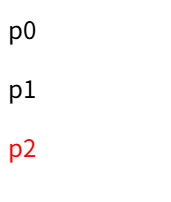
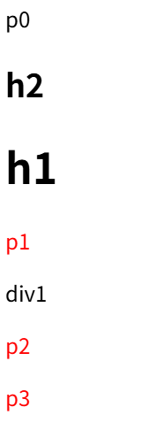

# Combinators
>Combinators are used to combine other selectors in a way that allows us to select elements based on their location in the DOM relative to other elements (for example, child or sibling).

1. Descendant combinator: first selector 是 second selector 的祖先;两个selector之间空格
```html
<div class="box"><p>Text in .box</p></div>
<p>Text not in .box</p>
```

```css
.box p {
	color: red;
}
```

效果：


2. Child combinator: second selector 是 first selector的direct children
```html
    <div class="box">
      <p>Text in .box<em>em in p</em></p>
    </div>
```

:::tabs
@tab indirect children
```css
      div > em {
        color: red;
      }
```
效果：

@tab direct children
```css
      p > em {
        color: red;
      }
```
效果：

:::
div > p > em
`>` 看作是产生

3. Next-sibling combinator: the second selector that come right after the element matched by the first selector.
```html
    <p class="p0">p0</p>
    <p class="p1">p1</p>
    <p class="p2">p2</p>
```

:::tabs
@tab right
```css
      .p1 + .p2 {
        color: red;
      }
```
效果：


@tab left
```css
      .p2 + .p1 {
        color: red;
      }
```
无效果
:::

4. Subsequent-sibling combinator: select siblings of an element if they are not directly adjacent
非直接相邻的兄弟节点
```html
    <p>p0</p>
    <h2>h2</h2>
    <h1>h1</h1>
    <p>p1</p>
    <div>div1</div>
    <p>p2</p>
    <p>p3</p>
```

```css
      h1 ~ p {
        color: red;
      }
```

效果：

- p0未选中：选中come right after the first selector
- p1被选中：相邻的仍然会被选中
- p2, p3被选中：可以选择多个


| selector<br>（关系-second selector 是 first selecotr的） | 表示符号           | 可选择的element数量 |
| -------------------------------------------------- | -------------- | ------------- |
| Descendant                                         | a single space | 任意            |
| Child                                              | >              | 任意            |
| Next-sibling（最大的弟弟或妹妹）                             | +              | 1             |
| Subsequent-sibling（弟弟、妹妹们）                         | ~              | 任意            |


