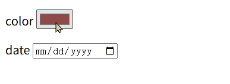
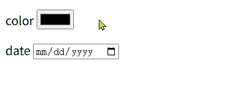

# Forms and buttons

## Buttons
<button>Press me</button>
```js
<script>
  const btn = document.querySelector("button");
  btn.addEventListener("click", () => {
	btn.textContent = "YOU CLICKED ME!! ❤️";
	setTimeout(() => {
	  btn.textContent = "Press me";
	}, 1000);
  });
</script>
```
## The anatomy of a form

- Subscribe to our newsletter: 表单的标题
- Name (required): 表单中的内容
- Sign me up: 提交表单信息的按钮

```html
<form action="./submit_page" method="get">
  <h2>Subscribe to our newsletter</h2>
  <p>
	<label for="name">Name (required):</label>
	<input type="text" name="name" id="name" required />
  </p>
  <p>
	<label for="email">Email (required):</label>
	<input type="email" name="email" id="email" required />
  </p>
  <p>
	<button>Sign me up!</button>
  </p>
</form>
```


### The \<form> element
>A \<form> element, which wraps all of the other form content. Any form controls inside the \<form\> \</form\> tags are part of the same form, and their data is included when the form is submitted.

问：
1. 什么时候form 会被submit？
点击按钮时会submit
问：如果有多个按钮呢？如何确定/指定提交信息的按钮？

2. form controls 包含哪些？
3. 数据会被submit 到哪里？
4. 如何传递data？

- action: Contains a path to the page that we want to send the submitted form data to, to be processed.
填写的内容：
Name：123
Eamil：123@qq.com
点击按钮后跳转到的url：
```
http://127.0.0.1:3000/submit_page?name=123&email=123%40qq.com
```
- method: Specifies the data transmission method you want to use for sending the form data to the server.
get: the data to be sent as parameters attached to the end of the URL. 
- ?name=123:
- &email=123%20qq.com:

#### Structuring forms
>You can include HTML elements you like inside a \<form> element to structure the form elements themselves and provide containers to target with CSS for styling.


### \<label> elements
>provide identifying labels associated with form controls that describe the data that should be entered into them.

```html
	<label for="name">Name (required):</label>
```
- for: 用来关联label对应的form control，name 为对应的 formcontrol的id

**Explicit and implicit form labels**
分别定义label 以及 form controls，然后通过设置label的for 属性 以及 form controls 的id 属性为同一值 来确定关联，这种style被称为 explicit form label
还可以在label 内定义 form control
```html
<label>
	Name (required):
	<input type="text" name="name" required />
</label>
```
此时关联关系是默认存在的，无需指定for。这种style被称为 implicit form label
### \<input> elements
>The \<input> elements represent the different data items entered into the form.

```html
<input type="text" name="name" id="name" required />
```
- type: Specifies the type of form control to create.
```html
    <form>
      <p>
        button
        <input type="button" />
      </p>
      <p>
        checkbox
        <input type="checkbox" />
      </p>
      <p>
        color
        <input type="color" />
      </p>
      <p>
        date
        <input type="date" />
      </p>
    </form>
```
效果：


点击 color 可以选择颜色：


**label 可以扩大controls的选择范围**
默认情况下只有点击 control 本身才能进入编辑模式，但是如果control 关联了label，那么点击label也能进入control的编辑模式（相当于点击了control本身）
:::tabs
@tab 

@tab 关联label

:::

- name: Specifies a name for the data item. When the form is submitted, the data is sent in name/value pairs.

按照键值对的形式发送control 中输入的数据

| type     | input | outpur（url）            | 说明                        |
| -------- | ----- | ---------------------- | ------------------------- |
| checkbox | 选中    | submit_page?name=on    |                           |
|          | 未选中   | submit_page?           |                           |
| button   |       | submit_page?           |                           |
| text     | 1 2 3 | submit_page?name=1+2+3 | 空格会被+替代？后续省略 submit_page? |
|          | 1+2+3 | 1%2B2%2B3              |                           |


- id: Specifies an ID that can be used to identify the element.
- required: Specifies that a value has to be entered into the form element before the form can be submitted.
声明了required后 input 必须输入内容（有值），才可以submit，否则无法submit。
text声明了required但是没有输入值时进行submit时的错误提示：


有些type 的input具有默认值
对于没有默认值的input，可以通过 value attribute设置初始值

#### Specialized text field inputs
有几种用于特定内容输入类型
- number：只能输入数字
- password：用* 或 • 代替输入内容
- tel：电话号码，需要指定号码格式
- email：电子邮箱

### The \<button> element
>When a \<button> element is included inside a \<form> element, its default behavior is that it will submit the form.

- 如果form下包含了多个button，那么每个按钮都可以submit
- 可以通过如下设置，显式声明具有submit 功能的button是哪一个
```html
<buttom type="subit">
```
额，基本上没用。首先，一个form应该只定义一个button，如果需要多个按钮，那么应该使用 input type="button"?

- 设置 type = "button" creates a button with the same behavior as buttons specified outside of \<form> elements

<font color="#ffff00">问：</font>对于 \<button type="button"> 和 \<input type="button"> 它们有什么区别？

>input: type="submit" reset button, they have many disadvantages compared to their \<button> counterparts. You should use \<button> instead.


### An aside on accessibility
>using the correct semantic elements to create forms

浏览器已经为semantic elements 实现了很多功能，不要因为外观上的美观创造表象相同的elements替代 semantic elements
一些默认提供的功能：
- tab/shift+tab（tabbing）: 可以在form controls之间切换（前进/后退）
- focus outline: causes the focused element to be highlighted using a blue outline.


## Other control types
### Radio buttons
```html
<div>
  <input
	type="radio"
	id="hotelChoice1"
	name="hotel"
	value="economy"
	checked
  />
  <label for="hotelChoice1">Economy (+$0)</label>
  <input type="radio" id="hotelChoice2" name="hotel" value="superior" />
  <label for="hotelChoice2">Superior (+$50)</label>
  <input
	type="radio"
	id="hotelChoice3"
	name="hotel"
	value="penthouse"
	disabled
  />
  <label for="hotelChoice3">Penthouse (+$150)</label>
</div>
```
效果：


>These render as a set of push button controls where only one of the set can be selected at any one time - you can't select more than one at once.

radio的功能：同一时间，最多只能有一个radio button被选中.
同一组radio buttons 中可以没有选中项

<span style="background:#d2cbff">问：</span>如果有多组radio buttons，如何确定一组radio buttons？

- name:同一组的radio buttons 需要具有相同的name
- value: 在value中设定radio button对应的值
- checked:具有两个功能
	1. 设置默认选中项
	2. 无法取消选中
- disabled: 无法选中，在选项不可用（如缺货）的情况下设置为disabled

#### fieldset
>The \<fieldset> element is used to group several controls as well as labels within a web form.

为了更明显地描述/区分 选项的功能，使用 fileset 进行分组
对比使用fieldset 和 label进行分组
:::tabs
@tab fieldset
```html
    <fieldset>
      <legend>Choose hotel room type:</legend>
      <div>...</div>
    </fieldset>
```

@tab label
```html
<label>
      Choose hotel room type:
	<div>...</div>
</label>
```


:::

fieldset 会显示一个边框，包围controls。
fieldset内 legend的文本会显示在框线上

### Checkboxes
实现：
```html
<fieldset>
  <legend>Choose classes to attend:</legend>
  <div>
	<input type="checkbox" id="yoga" name="yoga" checked/>
	<label for="yoga">Yoga (+$10)</label>

	<input type="checkbox" id="coffee" name="coffee" />
	<label for="coffee">Coffee roasting (+$20)</label>

	<input type="checkbox" id="ballon" name="balloon" disabled />
	<label for="ballon">Ballon animal art (+$5)</label>
  </div>
</fieldset>
```
效果：


>[!note]
>It is possible to change the value submitted for a checkbox by giving it a value attribute.

默认选中的checkbox 的value是on，设置value attribute后选中的checkbox的value就是对应的值
```html
<input type="checkbox" id="yoga" name="yoga" checked value="yes" />
```
结果：
/submit_page?yoga=yes

### Drop-down menus
实现：
```html
  <label for="transport">How are you getting here:</label>
  <select name="transport" id="transport">
	<option>--Please choose an option--</option>
	<option value="plane">Plane</option>
	<option value="bike">Bike</option>
	<option value="walk" selected>Walk</option>
  </select>
```
效果：


- select：指定name
- option：可选项，指定value
>If you don't specify a value, the text inside the \<option\>\ \</option> tags is used as the value

选中第一项时提交的值：transport=--Please+choose+an+option--
- selected：设置默认选中项
可以使用optgroup 对option进行分组

实现：
```html
	。。。
	<select name="transport" id="transport">
	  <optgroup label="分组1">
		<option>--Please choose an option--</option>
		<option value="plane">Plane</option>
	  </optgroup>
	  <optgroup label="分组2">
		<option value="bike">Bike</option>
		<option value="walk" selected>Walk</option>
	  </optgroup>
	</select>
```
效果：


### Multi-line text input fields
实现：
```html
        <label for="comments">Any other comments:</label>
        <textarea id="comments" name="comments"></textarea>
```
效果：


可以指定文本输入区域的大小
```html
<textarea id="comments" name="comments" rows="5" cols="3"></textarea>
```
效果：


>If they are not specified, the value used are cols="20" and row="2"

问：通过开发者工具查看element的 properties cols确实为20

但为什么一行输入的字符（数字）的数量却是22个？

如果全是中文，那么可输入字符数量是11个

那这里row=20，20后面的单位是什么？

可以通过鼠标拖动右下角的按钮修改 textarea 的大小
```html
<textarea id="comments" name="comments" style="width: 190px; height: 73px;"></textarea>
```
	指定width、height

## Form validation
validation的意义：
- 确保输入/传递正确的数据
- 保护隐私以及数据安全

two types of form validation:
- Client-side validation: 通过指定 form validation attributes (like `required`) and Js
可以给予用户输入提示，但是不能防范 malicious data from getting through.
- Server-side validation: 
