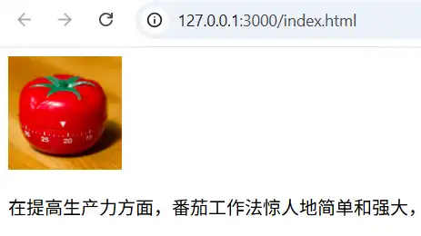
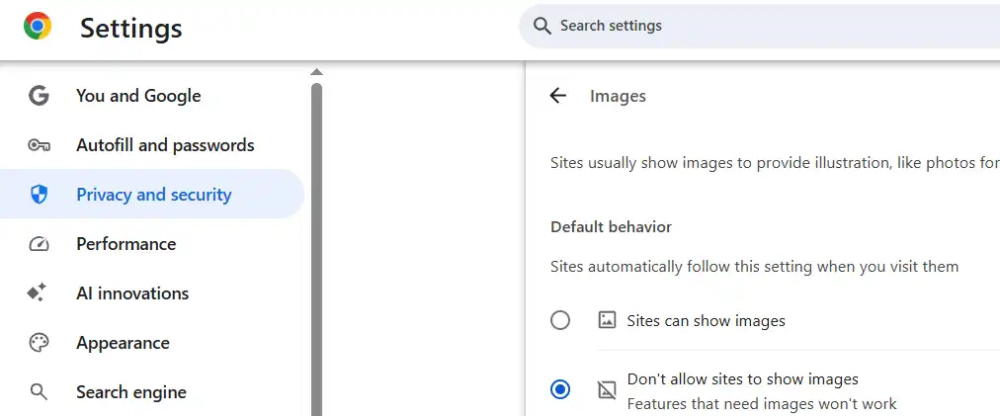
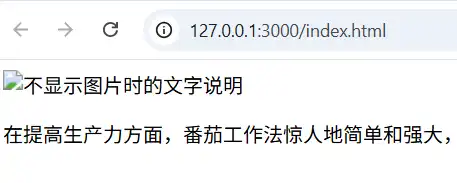
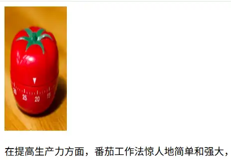
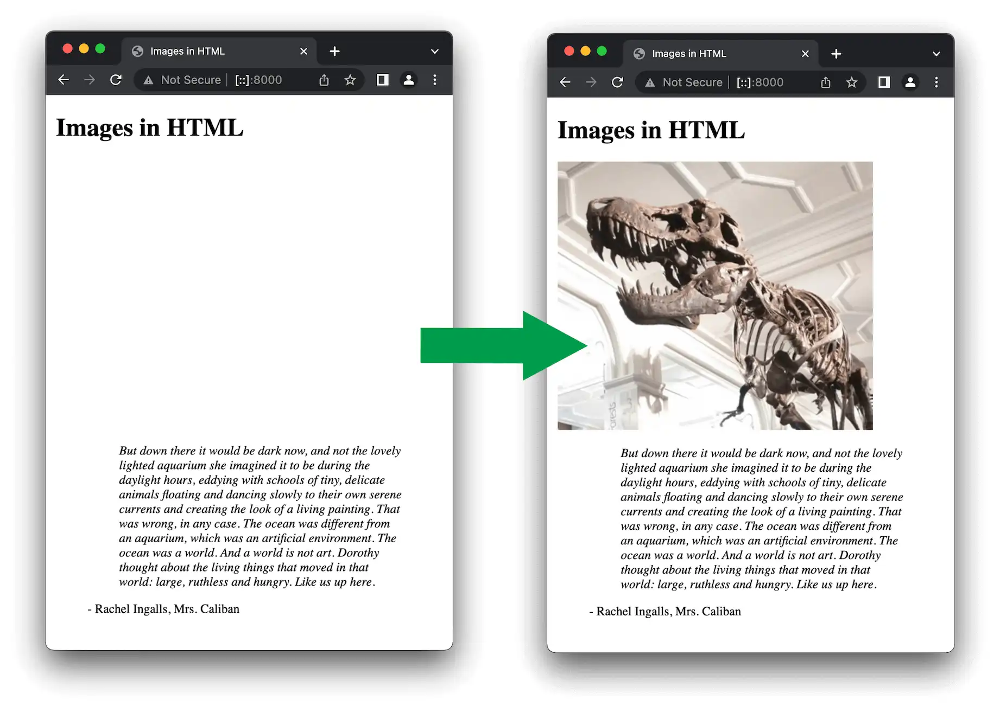
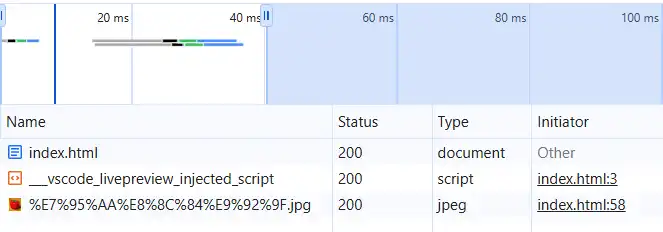
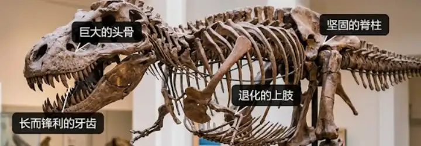
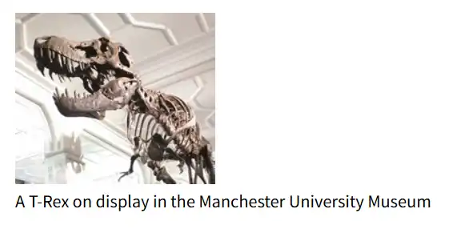
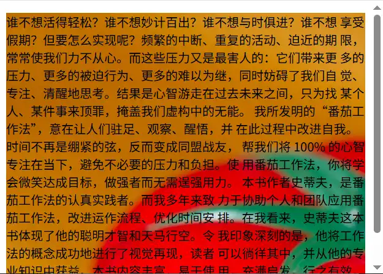
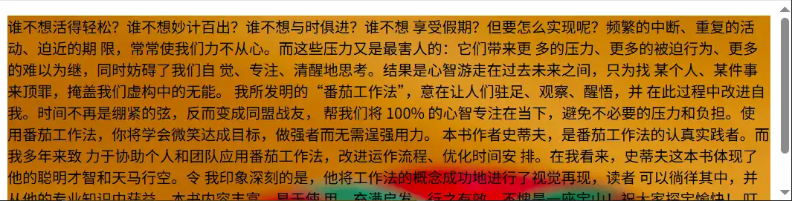

# Images
```html
    
    <p>
      在提高生产力方面，番茄工作法惊人地简单和强大，本书是离线的番茄工作法入门书。
    </p>
```
效果：



### Alternative text
> a textual description of the image

在chrome中设置不显示image
路径：
Setting -> Privacy and security -> Content -> Images -> Default behavior -> Don't allow sites to show images 


再次查看页面，效果：


### Width and height
原始图片大小：1024\*1024
设置width后图片大小为 100\*100
- represent the image's width and height in pixels
- 如果只设置了其中一个值，那么另一个值按照 image's aspect ratio 进行设置（默认值为auto）。示例图片 aspect ratio 为1：1，所以在width 为100时，height的值也是100


**显式设置width and height 的好处**


情景：图片下方有大段的说明文本
> The HTML for your page and image are separate resources, fetched by the browser as separate HTTP(S) requests.

打开developer tools -》 Network 选项卡


- index.html  和 .jpg 是两个request，其中html的类型为document，jpg的类型为jpeg
- 每个request分为4个状态，分别用灰色、黑色、绿色、蓝色表示

>As soon as the browser has received the HTML, it will start to display it to the user. If the image haven't yet been received, then the browser will render only the HTML, and will update the page with the image as soon as it is received.

首先会请求html，并且在接收完html后就立即render html。如果图片比较大（大小、数据体积），接收图片的时间比较长。首先会看到说明，图片加载后，说明需要向下移动，阅读过程被打断，观感不佳。
设置图片的大小后会预留出空间，这样在等待加载image时阅读说明，加载后说明的位置不会发生变化，对当前阅读不会造成过多的影响。

## Annotating images with figures and figure captions
配合css annotating images

能够在图片上进行标注
可以使用div 放置img，但是div是没有语义的，image 和 caption 没有关联在一起。

使用figure 和 figcaption 
>provide a semantic container for figures, and to clearly link the figure to the caption.

```html
<figure>
  
  <figcaption>
    A T-Rex on display in the Manchester University Museum
  </figcaption>
</figure>
```
效果：



不懂，使用figure 如何将caption 和 image 关联了起来。。。把figure 改成 div，figcaption改成p 没看出区别。

>A figure doesn't have to be an image. could be several images, a code snippet, audio, video, a table, or something else.

**alt 和 figcaption 的区别**
alt：在不显示图片时提供图片的简要说明
figcaption：关于图片的具体说明


## CSS background image
实现：
```css
p {
  background-image: url("images/dinosaur.jpg");
}
```
效果：
:::tabs
@tab 625\*427

@tab 1025\*271

:::

<span style="background:#fff88f">问：</span>将一张图片作为背景时，图片是如何适应它所在的容器的？是不是按照容器的 aspect ratio 进行拉伸了？
- image 没有完全的充满容器 - 番茄钟图片没有填充满段落，只显示了一部分
