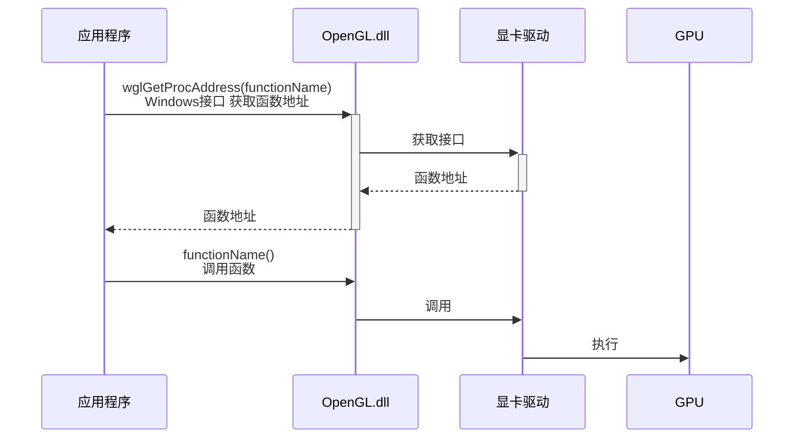

# 1.2 Creating a window

IDE：Qt Creator 14.0.2
Compiler：mingw1310_64

深入了解：
- GLAD的处理过程
## GLFW
>[!quote]
>GLFW is a library, written in C. It allows us to create an OpenGL context, define window parameters, and handle user input.

[Download | GLFW](https://www.glfw.org/download.html)

### complication
1. 下载源代码
2. 打开cmake gui 工具

	where is source code：下载的源代码中README 所在路径
	where to build the binaries：编译后相关文件（库）存放路径
3. 配置编译器：点击Configure按钮

	generator：visual studio 版本
	platform：默认windows x64
	use default native compilers：默认本地编译器
点击finish

	表格中是一些编译选项，把第一项 BUILD_SHARED_LIBS 勾选上

点击Generate后在where to build the binaries 下生成项目文件


4. 生成动态库：打开解决方案sln，运行。编译成功后在src/Debug 下生成glfw3.dll 


### 创建工程

``` cmake title="CMakeLists.txt" 
cmake_minimum_required(VERSION 3.0)

set(CMAKE_CXX_STANDARD 14)
set(CMAKE_CXX_STANDARD_REQUIRED TRUE)

project(learnOpenGL)
add_executable(learnOpenGL main.cpp)
```

### 链接
工程路径下新建lib、includes 文件夹
将源文件中includes下的GLFW 拷贝到工程的includes下。
将编程生成的glfw3.dll拷贝到工程的lib下。

修改CMakeLists.txt添加头文件路径及链接库
``` 
target_include_directories(learnOpenGL PRIVATE ${CMAKE_SOURCE_DIR}/includes)

target_link_libraries(learnOpenGL PUBLIC ${CMAKE_SOURCE_DIR}/lib/glfw3.dll)
```


## GLAD
>[!quote]
>Since there are many different versions of OpenGL drivers, the location of most of its functions is not known at compile-time and needs to be queried at run-time.

openGL接口调用过程：



opengl.dll 中只包含部分实际接口函数的地址，应用程序要调用接口需要先获取接口函数的地址，然后通过函数指针进行调用。
“opengl.dll 负责把api 调用转发给显卡驱动”

获取一个接口函数地址的实现：
``` cpp
// define the function's prototype
typedef void (*GL_GENBUFFERS) (GLsizei, GLuint*);
// find the function and assign it to a function pointer
GL_GENBUFFERS glGenBuffers  = (GL_GENBUFFERS)wglGetProcAddress("glGenBuffers");
// function can now be called as normal
unsigned int buffer;
glGenBuffers(1, &buffer);
```

| 行号  | 功能                            | 说明                |
| --- | ----------------------------- | ----------------- |
| 2   | 函数指针类型定义                      | 类型名称GL_GENBUFFERS |
| 4   | 查找驱动中的名称为glGenBuffers的接口函数的地址 |                   |
| 7   | 使用glGenBuffers                | 通过定义的函数指针对象进行函数调用 |

所有使用的OpenGL接口都要进行上面获取函数地址的过程

### Setting up GLAD

[glad.dav1d.de](http://glad.dav1d.de/)
选项配置：
- Language： C/C++
- Specification：OpenGL
- API gl：大于3.3
- Profile：Core
- Options：勾选Generate a loader

点击generate 后跳转到下载页面：

下载zip
解压后结构
``` 
include
	glad
		glad.h
	KHR
		khrplatform.h
src
	glad.c
```

将include 下的两个文件夹拷贝到工程下的includes
将glad.c 添加到工程中

### 使用
``` cpp
#include <glad/glad.h>
#include <GLFW/glfw3.h>
```

>[!note]
>glad 的头文件要在 glfw 头文件前添加


