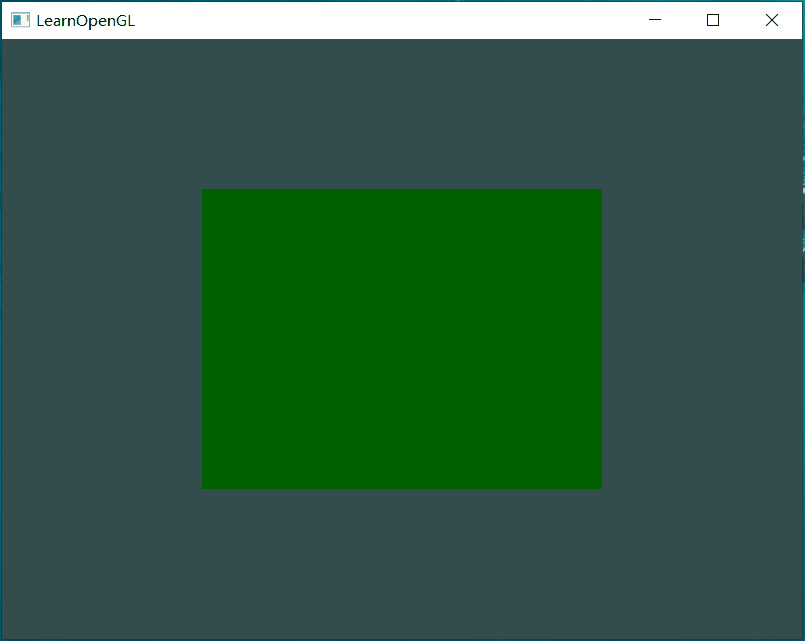
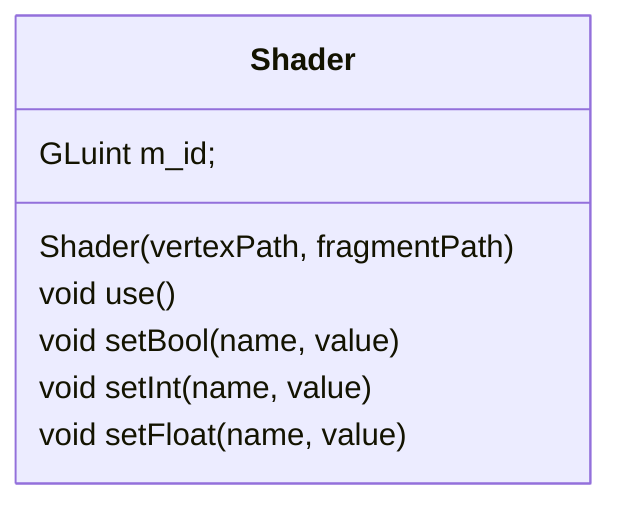

# 1.5 Shaders
@startmindmap
* Shaders
	** GLSL: typical structure
	** Types: int，float，。。。vectors and matrices
		*** Vectors
		*** Uniforms
	** Ins and Outs：如何获取输入 以及 向下输出
	** shader class：对shader进行管理的类（读取源文件、编译、链接）
@endmindmap

<!--more-->

## GLSL
>[!quote]
>Shaders are written in the C-like language GLSL. GLSL is tailored for use with graphics and contains useful features specifically targeted at vector and matrix manipulation.

- C-like language：
- targeted at vector and matrix manipulation：对vector 和 matrix 进行处理

典型的shader 程序的结构：
``` glsl
#version version_number
in type in_variable_name;
in type in_variable_name;

out type out_variable_name;

uniform type uniform_name;

void main()
{
	// process input(s) and do some weird graphics stuff
	...
	// output processed stuff to output variable
	out_variable_name = weird_stuff_we_processed;
}
```

| 行号   | 功能              | 说明                       |
| ---- | --------------- | ------------------------ |
| 1    | 版本说明            |                          |
| 2、3  | 输入变量定义          | 定义的格式：类型 + 变量名。通常会有多个输入？ |
| 5    | 输出变量定义          |                          |
| 7    |                 | 不是输入，也不是输出。              |
| 9-15 | 函数-shader 执行的内容 | 处理输入，然后给输出进行赋值           |

>[!quote]
>each input variable is also known as a vertex attribute.

可以定义的输入变量有限制，最大数量和硬件有关。通过以下查询：
``` cpp
int nrAttributes;
glGetIntegerv(GL_MAX_VERTEX_ATTRIBS, &nrAttributes);
std::cout << "Maximum nr of vertex attributes supported: " << nrAttributes << std::endl;
```
结果：
``` 
Maximum nr of vertex attributes supported: 16
```

## Types
- like C
	- int
	- float
	- double
	- uint
	- bool
- container
	- vectors
		- vecn: the default vector of n floats
		- bvecn：booleans
		- ivecn：integers
		- uvecn：unsigned integers
		- dvecn：double components
	- matrices

### Vectors
vector 属于container，可以存储C-like 的类型。vecn 存储float 类型，n可以是2，3 or 4，表示存储的float 元素的数量。bvecn 存储booleans类型的元素。

**元素的访问方式**
``` glsl
in vec3 aPos;
void main()
{
	gl_Position = vec4(aPos.x, aPos.y, aPos.z, 1.0);
}
```

成员的名称可以是x，y，z，w 也可以是 r，g，b，a（colors）或 s，t，p，q（texture coordinates）


**特性**
swizzling：可以把一个vector拆开，然后重新拼接成一个新的vector
``` glsl
vec2 someVec;
vec4 differentVec = someVec.xyxx;
vec3 anotherVec = differentVec.zyw;
vec4 otherVec = someVec.xxxx + anotherVec.yxzy;
```
- 可以重复使用某一个部分
- 可以指定摆放位置

上面的例子都是用一个vector 直接生成另一个vector，可以从多个vector中取需要的部分，然后进行拼接：
``` glsl
vec2 vect = vec2(0.5, 0.7);
vec4 result = vec4(vect, 0.0, 0.0);
vec4 otherResult = vec4(result.xyz, 1.0);

//vec3 oo = vect3(vect.y, result.xy);
```
oo 没测试

## Ins and Outs
- 通过in、out keywords 声明输入和输出
- 需要上一个shader 的输出 和 下一个shader的输入匹配（类型、名称一致），数据才能正常传递

### vertex shader
vertex shader 从 vertex data 中获取数据，将vertex shader 中定义的in 和 vertex data 中的数据关联起来的方式：
- 在shader 中声明 attribute 的位置
``` glsl
layout (location = 0) in vec3 aPos;
```
在cpp中设置对应location 的数据：
``` cpp
    glVertexAttribPointer(0, 3, GL_FLOAT, GL_FALSE, 3 * sizeof(float), (void*)0);  
    glEnableVertexAttribArray(0);
```
第一个参数就是对应的attribute 的 location 的值

- 在cpp中通过glGetAttribLocation 获取到location 的值，然后再进行设置
``` cpp
    GLint vertAttribLoc;
    vertAttribLoc = glGetAttribLocation(shaderProgram, "aPos");
    glVertexAttribPointer(vertAttribLoc, 3, GL_FLOAT, GL_FALSE, 3 * sizeof(float), (void*)0);
```
通过attribute 的名称查询它在program 中的位置


### fragment shader
fragment shader 需要输出一个 类型为 vec4 的变量 用来确定最终输出的像素颜色。如果没有指定则最终呈现 黑色 或 白色。（如果ClearColor时指定了颜色，没有设置fragment shader 的 out，效果是和背景一个颜色）

### 测试
在vertex shader中设置颜色，然后传递给fragment shader
``` glsl title="vertex shader"
#version 330 core
layout (location = 0) in vec3 aPos; // the position variable has attribute position 0
  
out vec4 vertexColor; // specify a color output to the fragment shader //[!code highlight]

void main()
{
    gl_Position = vec4(aPos, 1.0); // see how we directly give a vec3 to vec4's constructor
    vertexColor = vec4(0.5, 0.0, 0.0, 1.0); // set the output variable to a dark-red color
}
```


``` glsl title="fragment shader"
#version 330 core
out vec4 FragColor; //[!code highlight]
  
in vec4 vertexColor; // the input variable from the vertex shader (same name and same type)  

void main()
{
    FragColor = vertexColor;
}
```


## Uniforms
>[!quote]
>Uniforms are another way to pass data from our application on the CPU to the shaders on the GPU.

之前了解到的在CPU 和 GPU 之间传递数据的方法是 vertex data，uniforms 是另一种。
unifroms 变量的特点：
- global
	- a uniform variable is unique per shader program object
	- accessed from any shader at any stage in the shader program：所有的shader 都可以访问uniform 变量，不管它是不是在自身中定义的
- uniforms will keep their values until they're either reset or updated: <mark style="background: #FFF3A3A6;">只在CPU 显式更新uniforms 时 uniforms 的值才会变化？在shader中不能修改还是修改不起作用？</mark>

通过uniform 变量 获取颜色
实现：
``` glsl title="fragment shader"
out vec4 FragColor;
  
uniform vec4 ourColor; // we set this variable in the OpenGL code. //[!code highlight]

void main()
{
    FragColor = ourColor;
}
```
	在fs中定义存储颜色数据的uniform 变量
在 渲染循环中根据时间设置显示的颜色：
``` cpp
while(!glfwWindowShouldClose(window))
{
	//...
	    // be sure to activate the shader
    glUseProgram(shaderProgram);
  
    // update the uniform color
    float timeValue = glfwGetTime();
    float greenValue = sin(timeValue) / 2.0f + 0.5f;
    int vertexColorLocation = glGetUniformLocation(shaderProgram, "ourColor");
    glUniform4f(vertexColorLocation, 0.0f, greenValue, 0.0f, 1.0f);
    //...
}
```

| 行号  | 功能                   | 说明  |
| --- | -------------------- | --- |
| 8   | 获取当前时间               |     |
| 9   | 根据时间获取颜色值            |     |
| 10  | 获取uniform变量的location |     |
| 11  | 设置uniform变量的值        |     |

>[!important]
>updating a uniform does require you to first use the program

c中没有函数重载，对于相同功能但是类型不同的函数使用后缀区分：

| 后缀  | 类型                 |
| --- | ------------------ |
| f   | float              |
| i   | int                |
| ui  | unsigned int       |
| 3f  | 3 float            |
| fv  | float vector/array |

效果：



### uniform 类型的进一步说明
在c中具有全局作用域的变量只能定义一次，在其他文件中使用时需要使用extern 关键字说明该变量是定义在其他文件中的。
在glsl中 如果要使用uniform 变量那么就需要定义该变量。多个shader中只能定义相同类型、名称的uniform 变量，它们是同一个变量。如果名称相同，但是类型不同则无法编译成功。

## More attributes
在vertex data 中为顶点配置颜色值，vertex shader 读取位置 attribute 和 color attribute，并将color 传递给 fragment shader。
1. vertex 和 color 值
``` cpp
float vertices[] = {
    // positions         // colors
     0.5f, -0.5f, 0.0f,  1.0f, 0.0f, 0.0f,   // bottom right
    -0.5f, -0.5f, 0.0f,  0.0f, 1.0f, 0.0f,   // bottom left
     0.0f,  0.5f, 0.0f,  0.0f, 0.0f, 1.0f    // top 
}; 
```
2. vertex shader 定义输入 和 输出
``` glsl
#version 330 core
layout (location = 0) in vec3 aPos;   // the position variable has attribute position 0
layout (location = 1) in vec3 aColor; // the color variable has attribute position 1 [!code highlight]
  
out vec3 ourColor; // output a color to the fragment shader //[!code highlight]

void main()
{
    gl_Position = vec4(aPos, 1.0);
    ourColor = aColor; // set ourColor to the input color we got from the vertex data
} 
```
3. fragment shader 中获取vertex shader 传递的color
``` glsl
#version 330 core
out vec4 FragColor;  
in vec3 ourColor; //[!code highlight]
  
void main()
{
    FragColor = vec4(ourColor, 1.0); //[!code highlight]
}
```
	为FragColor赋值时使用到vector 的 swizzling特性
4. 向VBO传递vertex data
5. 设置attribute pointer
``` cpp
    glVertexAttribPointer(0, 3, GL_FLOAT, GL_FALSE, 6 * sizeof(float), (void*)0);
    glEnableVertexAttribArray(0);

    glVertexAttribPointer(1, 3, GL_FLOAT, GL_FALSE, 6 * sizeof(float), (void*)(3 * sizeof(float)));
    glEnableVertexAttribArray(1);
```
- color的起始位置是3\*sizeof(float)
- 每组attribute之间没有额外的间隙，所以stride 都是 6
6. 效果：

虽然只设置了3个顶点的颜色，但是最终显示的triangle 内部所有fragment 都被填充了颜色。

###  fragment interpolation
- rasterization stage usually results in a lot more fragments: 光栅化阶段会将图元分解为fragments
- determiners the positions of each of those fragments based on where they reside on the triangle shape: 根据fragment 在 shape 中的相对位置确定一个position
- 然后根据position 的值进行 interpolation

重心插值法：连接点到三角形的3个顶点，形成3个三角形，根据面积比确定取值比例。如果在边线上，那么与其相对的顶点的比值就是0.
通过Snipaste 查看像素的颜色，右下角顶点的颜色值为（254，0，0）向左3个像素点颜色依次为（254, 1, 0），（253, 1, 0），（253, 2, 0）


## Our own shader class


Shader的功能：
- 从文件中读取shader 源代码并编译链接为program
- 设置指定名称的attribute value


### Reading from file
``` cpp
    // 1. retrieve the vertex/fragment source code from filePath
    std::string vertexCode;
    std::ifstream vShaderFile;
    // ensure ifstream objects can throw exceptions:
    vShaderFile.exceptions (std::ifstream::failbit | std::ifstream::badbit);

    try
    {
        // open files
        vShaderFile.open(vertexPath);
        std::stringstream vShaderStream;
        // read file's buffer contents into streams
        vShaderStream << vShaderFile.rdbuf();
        // close file handlers
        vShaderFile.close();
        // convert stream into string
        vertexCode   = vShaderStream.str();
    }
    catch(std::ifstream::failure e)
    {
        std::cout << "ERROR::SHADER::FILE_NOT_SUCCESFULLY_READ" << std::endl;
    }
    const char* vShaderCode = vertexCode.c_str();
```

### 关于shader 源文件的路径
源文件的路径：D:\Project\QtProject\LearnOpenGL
生成的可执行文件的路径：D:\Project\QtProject\LearnOpenGL\build\Qt_6_8_0_mingw_64-Debug

shader 在源文件路径下。
如果直接使用文件名，会找不到文件
``` cpp
   Shader shader = {"shader.vs", "shader.fs"};
```
报错：
``` 
ERROR::SHADER::FILE_NOT_SUCCESFULLY_READ
```

因为工作目录是在可执行文件下，如果将shader 文件拷贝到可执行文件目录下，就可以正常执行。

在cmake 中设置拷贝shader 文件到工作目录：
``` cmake
  file(GLOB SHADERS
             "src/${chapter}/${demo}/*.vs"
             # "src/${chapter}/${demo}/*.frag"
             "src/${chapter}/${demo}/*.fs"
		# ...
    )
    foreach(SHADER ${SHADERS})
        if(WIN32)
            # configure_file(${SHADER} "test")
            add_custom_command(TARGET ${NAME} PRE_BUILD COMMAND ${CMAKE_COMMAND} -E copy ${SHADER} $<TARGET_FILE_DIR:${NAME}>)
        elseif(UNIX AND NOT APPLE)
            file(COPY ${SHADER} DESTINATION ${CMAKE_SOURCE_DIR}/bin/${chapter})
		# ...
        endif(WIN32)
    endforeach(SHADER)
```
首先查找要拷贝的资源，然后逐个拷贝到 TARGET_FILE_DIR

问：<mark style="background: #FFF3A3A6;">这种拷贝是在什么时候执行？只执行一次还是每次运行时都会进行拷贝？</mark>

