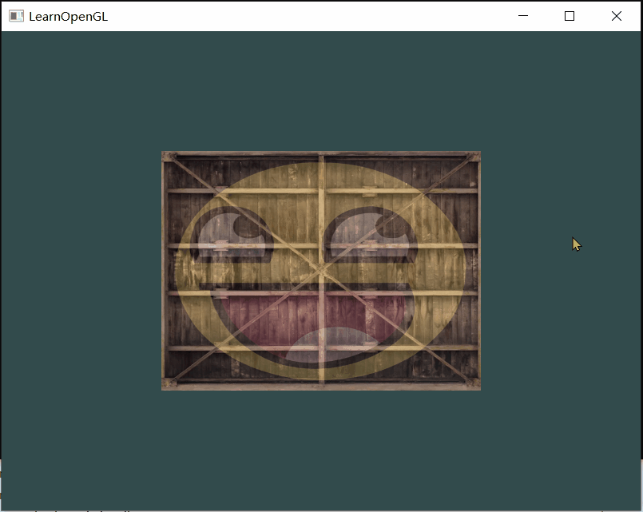

# 1.6.1 Exercises
**1**
>Make sure only the happy face looks in the other/reverse direction by changing the fragment shader:

在fs中修改，让笑脸看向左侧

**2**
>Experiment with the different texture wrapping methods by specifying texture coordinates in the range 0.0f to 2.0f instead of 0.0f to 1.0f. See if you can display 4 smiley faces on a single container image clamped at its edge. See if you can experiment with other wrapping methods as well.

最终效果：


**3**
>Try to display only the center pixels of the texture image on the rectangle in such a way that the individual pixels are getting visible by changing the texture coordinates. Try to set the texture filtering method to GL_NEAREST to see the pixels more clearly

最终效果：


**4**
>Use a uniform variable as the mix function's third parameter to vary the amount the two textures are visible. Use the up and down arrow keys to change how much the container or the smiley face is visible

最终效果：



## 2
1. 修改texture coordinate
``` cpp
    float vertices[] = {
         // positions       // colors           // texture coords
         0.5f,  0.5f, 0.0f, 2.0f, 2.0f,   // top right
         0.5f, -0.5f, 0.0f, 2.0f, 0.0f,   // bottom right
        -0.5f, -0.5f, 0.0f, 0.0f, 0.0f,   // bottom left
        -0.5f,  0.5f, 0.0f, 0.0f, 2.0f    // top left
    };
```
2. 设置wrapping 方式
``` cpp
    glTexParameteri(GL_TEXTURE_2D, GL_TEXTURE_WRAP_S, GL_MIRRORED_REPEAT);
    glTexParameteri(GL_TEXTURE_2D, GL_TEXTURE_WRAP_T, GL_MIRRORED_REPEAT);
```
只设置awesome face就行，反正后面的箱子也看不出效果：）
3. 效果
:::tabs
@tab GL_REPEAT


@tab GL_MIRRORED_REPEAT

@tab GL_CLAMP_TO_EDGE

@tab GL_CLAMP_TO_BORDER

:::

我的理解：
先按照wrapping的类型，把texture铺开，然后根据coordinate 采样，最后贴到object

参考代码中将container的wrapping 设置为 GL_CLAMP_TO_EDGE，awesome face为默认，混合后就是最终效果。

## 3
object对应很小的一部分texture，对应的coordinate取多少合适？
默认的filtering不就是 GL_NEAREST吗，怎么还要设置为NEAREST？

1. 设置texture coordinate：
``` cpp
    float d = 0.05;
    float vertices[] = {
         // positions       // colors           // texture coords
         0.5f,  0.5f, 0.0f, 0.5f + d, 0.5f + d,   // top right
         0.5f, -0.5f, 0.0f, 0.5f + d, 0.5f - d,   // bottom right
        -0.5f, -0.5f, 0.0f, 0.5f - d, 0.5f - d,   // bottom left
        -0.5f,  0.5f, 0.0f, 0.5f - d, 0.5f + d,    // top left
    };
```
2. 设置
``` cpp
    glTexParameteri(GL_TEXTURE_2D, GL_TEXTURE_MIN_FILTER, GL_NEAREST);
    glTexParameteri(GL_TEXTURE_2D, GL_TEXTURE_MAG_FILTER, GL_NEAREST);
```
3. 效果
GL_NEAREST：

GL_LINEAR：


感觉区别不大，稍微清晰了一点

## 4
1. 修改fs，定义uniform 变量接收比例参数
``` c title="fs"

```

2. 设置按键处理函数
``` cpp
static void key_callback(GLFWwindow* window, int key, int scancode, int action, int mods);

glfwSetKeyCallback(window, key_callback);
```

| 行号  | 功能            | 说明  |
| --- | ------------- | --- |
| 1   | 处理按键输入的回调函数声明 |     |
| 3   | 设置按键处理回调函数    |     |

关于回调函数
``` cpp
void function_name(GLFWwindow* window, int key, int scancode, int action, int mods)
```

| 参数       | 值                                       | 说明                                                                       |
| -------- | --------------------------------------- | ------------------------------------------------------------------------ |
| window   |                                         | 接收（处理）按键的窗口                                                              |
| key      |                                         | 按键                                                                       |
| scancode |                                         | 按键对应的编码值（platform-specific）                                              |
| action   | GLFW_PRESS, GLFW-RELEASE or GLFW_REPEAT | 表示按键的状态。初始状态release-0，按下press-1，持续按下repeat-2                             |
| mods     | GLFW_MOD_SHIFT, GLFW_MOD_CONTROL, ...   | Modifier Key flags, 表示有哪些功能键被按下（shift、ctrl、alt、。。。）有多个功能键按下时mods是其组合起来的值 |

``` c title="mods定义"
#define 	GLFW_MOD_SHIFT   0x0001
#define 	GLFW_MOD_CONTROL   0x0002
```
3. 处理按键输入，修改uniform 类型的比例参数值
按键处理函数没有带额外的参数，如何让处理函数获知到shader（在处理函数中设置uniform 或者调用shader的接口），把shader定义为全局变量？
参考：将定义比例参数为全局变量，并没有在处理函数中直接设置uniform变量，这样就不用获知shader了。
:::tabs
@tab My
``` cpp
static void key_callback(GLFWwindow* window, int key, int scancode, int action, int mods)
{
    if (key == GLFW_KEY_ESCAPE && action == GLFW_PRESS)
        glfwSetWindowShouldClose(window, GLFW_TRUE);

	if(key == GLFW_KEY_DOWN && (action == GLFW_PRESS || action == GLFW_REPEAT))
    {
        if((mixValue - 0.01) < 0)
            mixValue = 0.0f;
        else
            mixValue -= 0.01;
    }
	if(key == GLFW_KEY_UP && (action == GLFW_PRESS || action == GLFW_REPEAT))
    {
        if((mixValue + 0.01) > 1)
            mixValue = 1.0f;
        else
            mixValue += 0.01;
    }
}

//...
while()
{
	//..
	shader.use();
	shader.setFloat("mixValue", mixValue);
	//...
}

```

上下方向键在glfw中的宏定义：GLFW_KEY_DOWN、GLFW_KEY_UP

@tab 参考
``` cpp
void processInput(GLFWwindow *window)
{
    if (glfwGetKey(window, GLFW_KEY_ESCAPE) == GLFW_PRESS)
        glfwSetWindowShouldClose(window, true);

    if (glfwGetKey(window, GLFW_KEY_UP) == GLFW_PRESS)
    {
        mixValue += 0.001f; // change this value accordingly (might be too slow or too fast based on system hardware)
        if(mixValue >= 1.0f)
            mixValue = 1.0f;
    }
    if (glfwGetKey(window, GLFW_KEY_DOWN) == GLFW_PRESS)
    {
        mixValue -= 0.001f; // change this value accordingly (might be too slow or too fast based on system hardware)
        if (mixValue <= 0.0f)
            mixValue = 0.0f;
    }
}
//...
while (!glfwWindowShouldClose(window))
{
	processInput(window);
	//...
	// set the texture mix value in the shader
	ourShader.setFloat("mixValue", mixValue);
	// render container
	ourShader.use();
	//...
}
```
:::
关于mixValue 值得设置，参考中先做处理，然后判断是否超出范围，如果超出再赋值为上限。我的观点：如果一个值是异常的，那么就不应该存在这种状态。

关于按键的判断：由于参考中按键处理是在render loop中执行的，所以processInput（）调用的频率很高，对于press尽管状态存在的时间比较短，但mixValue还是增加了很多次。按一次up键，mixValue从0.2 增加到了0.262。如果是通过回调处理函数，那么按一次up键mixValue就增加了0.01（一次步进）。所以参考中持续按键图像显示有变化，而回调处理，如果不判断GLFW_REPEAT，则看不出效果。

4. 效果
略


