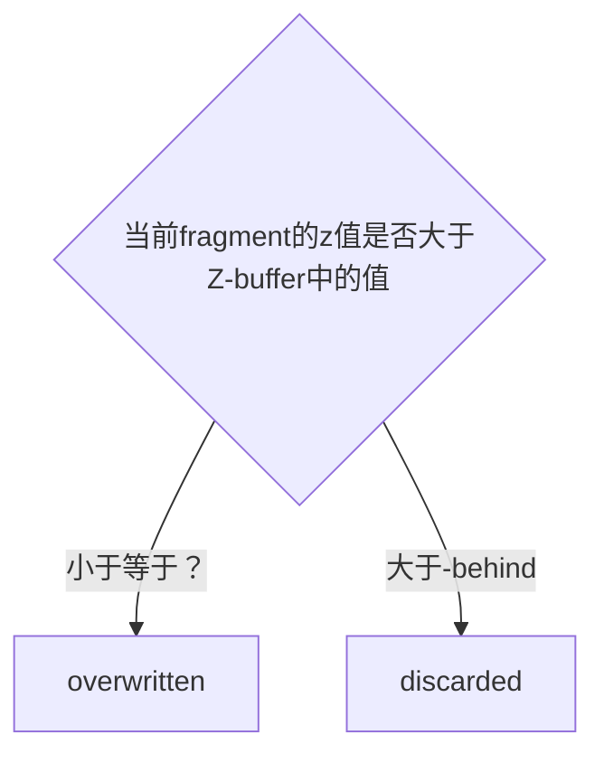

# 1.8 Coordinate Systems
>[!info]
>OpenGL expects all the vertices, that we want to become visible, to be in normalized device coordinates after each vertex shader run. ...
>What we usually do, is specify the coordinates in a range (or space) we determine ourselves and in the vertex shader transform these coordinates to normalized device coordinates (NDC). These NDC are then given to the rasterizer to transform them to 2D coordinates/pixels on your screen.

## The global picture


| Index | Space  | Description |
| ----- | ------ | ----------- |
| 1     | Local  |             |
| 2     | World  |             |
| 3     | View   |             |
| 4     | Clip   |             |
| 5     | Screen |             |

### Local Space
>[!info]
>Local space is the coordinate space that is local to your object, i.e. where your object begins in.

### World Space
>[!info]
>The model matrix is a transformation matrix that translates, scales and/or rotates your object to place it in the world at a location/orientation they belong to.


### View Space
>[!info]
>The view space is the result of transforming your world-space coordinates to coordinates that are in front of the user's view.

### Clip Space
>[!info]
>At the end of each vertex shader run, OpenGL expects the coordinates to be within a specific range and any coordinate that falls outside this rang is cliped.

- OpenGL vertex shader 传递出去的坐标（gl_Position）需要是NDC 坐标
- 可视的NDC坐标范围是 -1.0 ~ 1.0，超出范围的会被裁剪掉

>[!info]
>To transform vertex coordinates from view to clip-space we define a so called <font color="#9bbb59">**projection matrix**</font> that specifies a rang of coordinates e.g. -1000 and 1000 in each dimension.
>The viewing box a projection matrix creates is called a <font color="#9bbb59">frustum</font> and each coordinate that ends up inside this frustum will end up on the user's screen.

- 通过`projection matrix` 将view space 内的coordinates 转换为 clip-space 内的coordinates
- `projection matrix` 会创建一个可视化的box，这个box叫做 `frustum`
- `frustum` 限定的范围就是最终可视范围。
- `frustum` 的类型有两种：<font color="#9bbb59">orthographic </font>和<font color="#9bbb59"> perspective</font>

>[!info]
>Once all the vertices are transformed to clip space a final operation called <font color="#9bbb59">perspective division</font> is performed.
>perspective division is what transforms the 4D clip space coordinates to 3D normalized device coordinates.
>This step is performed automatically at the end of the vertex shader step.

- 转换为clip space 后还会自动执行 `perspective division` 
- `perspective division` 将4维的坐标转换为3维的NDC坐标

#### Orthographic projection

- width、height：平面的宽、高
- near plane：离camera更近的平面
- far plane：离camera更远的平面

**创建**
``` cpp
glm::ortho(0.0f, 800.0f, 0.0f, 600.0f, 0.1f, 100.0f);
glm::mat4 glm::ortho(float left, float right, float bottom, float top, float
zNear, float zFar);
```

| 参数     | 值    | 用途  | 说明          |
| ------ | ---- | --- | ----------- |
| left   | 0.0f |     | plane的左边的x值 |
| right  |      |     | 右边的x值       |
| bottom |      |     | 底边的y值       |
| top    |      |     | 底边的y值       |
| zNear  |      |     | 近平面的z值      |
| zFar   |      |     | 远平面的z值      |

#### Perspective projection
LearnOpenGL


**创建**
``` cpp
glm::mat4 proj = glm::perspective(glm::radians(45.0f), (float)width/(float)height, 0.1f, 100.0f);
glm::mat4 perspective(float fovy, float aspect, float zNear, float zFar);
```

Learn WebGL


| 参数     | 值                          | 用途                                                                               | 说明        |
| ------ | -------------------------- | -------------------------------------------------------------------------------- | --------- |
| fovy   | glm::radians(45.0f)        | field-of-view The angle between the upper and lower sides of the viewing frustum | 单位：弧度。    |
| aspect | (float)width/(float)height | The aspect ratio of the viewing window. (width/height).                          | view 的宽高比 |
| zNear  | 0.1f                       | Distance to the near clipping plane along the -Z axis.                           |           |
| zFar   | 100.0f                     | Distance to the far clipping plane along the -Z axis.                            |           |

问：<span style="background:#fff88f">learn opengl 和 learn web gl 两幅图中的fovy 角度值是否相同？</span>给定一个三角形，底边向着垂直于初始三角形构成的平面的方向移动，移动过程中，底边和顶点构成的三角形的顶角角度值保持不变（相等）
三角形是等腰三角形，顶角相等，那么3个角都相等，它们是相似三角形。底边保持不变，那么就是全等三角形，但是侧边不等，所以角度不相等。所以learn opengl的fovy 标记是错误的？

>[!info]
>The projection matrix maps a given frustum range to clip space, but also manipulates the `w` value of each vertex coordinate in such a way that the further away a vertex coordinate is from the viewer, the higher this `w` component becomes.

- projection matrix 会根据 viewer（camera）的距离调整w值
- 不管是 Perspective 还是  Orthographic 都会进行 perspective division，只是在Orthographic中 w 的值始终为1


### Putting it all together
组合以上变换矩阵得到一个复合矩阵：
$$
V_{clip} = M_{projection} \cdot M_{view} \cdot M_{model} \cdot V_{local}
$$
矩阵乘法的顺序是从右到左
### Viewport transform
>[!info]
>在自动执行 perspective division 得到 NDC coordinates 后。
OpenGL then uses the parameters from `glViewPort` to map the normalized-device coordinates to screen coordinates where each coordinate corresponds to a point on your screen


## Going 3D
1. create model matrix
``` cpp
glm::mat4 model = glm::mat4(1.0f);
model = glm::rotate(model, glm::radians(-55.0f), glm::vec3(1.0f, 0.0f, 0.0f));
```
绕x轴 负方向转动55°，container看起来倒向屏幕里面。

**关于转动的方向**
旋转角度正负号的定义
右手定则：大拇指指向旋转轴的正方向，四指握拳，四指弯曲方向就是正的旋转角度。
如果正对着大拇指，那么逆时针旋转就是正的；如果顺着大拇指指向看，那么顺时针旋转就是正德。
所以顺、逆是相对的，正反是绝对的。描述转动角度时一律使用正反方向表述。

2. create a view matrix

**Right-handed system**

**确定方法 （z轴方向）**
伸出右手
- thumb should point towards the positive x-axis
- the pointing finger towards the positive y-axis
- middle finger towards the positive z-axis
如果用左手做出上面的指向，那么左手middle finger 的指向和右手的 middle finger指向相反。

想象在world space 中有一个camera，位于坐标原点（0，0，0）。将camera 向着z轴正方向移动 相当于 将整个world space 向z轴负方向移动。

为了将container放到 frustum 内，需要将camera 移动到 container 前面。因为实际不存在camera这个东西，所以移动space。
实现：
``` cpp
glm::mat4 view = glm::mat4(1.0f);
// note that we're translating the scene in the reverse direction of where we want to move
view = glm::translate(view, glm::vec3(0.0f, 0.0f, -3.0f)); 
```

>[!node]
>Note that in normalized device coordinates OpenGL actually uses a left-handed system (the projection matrix switches the handedness).

NDC采用的是左手坐标系，projection matrix 会反转z轴的方向，以符合坐标系要求。

3. declare the projection matrix
``` cpp
glm::mat4 projection;
projection = glm::perspective(glm::radians(45.0f), 800.0f / 600.0f, 0.1f, 100.0f);
```

4. 在vertex shader中定义并使用矩阵变量
``` glsl title="shader.vs"
#version 330 core

layout (location = 0) in vec3 aPos;
layout (location = 1) in vec2 aTexCoord;

out vec2 TexCoord;

uniform mat4 model;
uniform mat4 view;
uniform mat4 projection;

void main()
{
    gl_Position = projection * view * model * vec4(aPos, 1.0f);
    TexCoord = aTexCoord;
}
```

5. 传递数据
``` cpp 
        unsigned int modelLoc = glGetUniformLocation(shader.ID, "model");
        glUniformMatrix4fv(modelLoc, 1, GL_FALSE, glm::value_ptr(model));
        //...
```

6. 效果


问：<span style="background:#fff88f">这里先在cpp中复合矩阵然后再传递给GPU是否更好？</span>
## More 3D
创建一个旋转的正方体
1. 定义vertices
``` cpp
    float vertices[] = {
        -0.5f, -0.5f, -0.5f,  0.0f, 0.0f,
        0.5f, -0.5f, -0.5f,  1.0f, 0.0f,
        0.5f,  0.5f, -0.5f,  1.0f, 1.0f,
        0.5f,  0.5f, -0.5f,  1.0f, 1.0f,
        -0.5f,  0.5f, -0.5f,  0.0f, 1.0f,
        -0.5f, -0.5f, -0.5f,  0.0f, 0.0f,
        
        };
```
每一面用6个顶点（两个triangle）定义
2. 随时间旋转
``` cpp
model = glm::rotate(model, (float)glfwGetTime() * glm::radians(50.0f), glm::vec3(0.5f, 1.0f, 0.0f));       
```

3. 绘制
``` cpp
glDrawArrays(GL_TRIANGLES, 0, 36);
```

4. 效果

看起来有问题：最明显的是最开始时显示的是立方体背面（离camera远）的笑脸，而不是前面的（离camera近）的笑脸

问题的原因：
1. when OpenGL draws your cube triangle-by-triangle, fragment by fragment, it will overwrite any pixel color that may have already been drawn there before.
后绘制的triangle、fragment 会覆盖前面的triangle、fragment
2. OpenGL gives no guarantee on the order of triangle rendered (within the same draw call)
在调用draw时 OpenGL不保证绘制的顺序（绘制的顺序不能被定义，和顶点的定义顺序无关）

所以如果立方体的背面在前面之后进行绘制，那么就会覆盖，导致出现“透视”效果

解决办法：`z-buffer`

### Z-buffer
>[!info]
>OpenGL stores all its depth information in a z-buffer, also known as a depth buffer. GLFW automatically creates such a buffer for you. The depth is stored within each fragment.

我的理解：
假设屏幕上有两个fragment，位置编号为0，1.Z-buffer存储当前显示的fragment 的 z值,假设为 {10， 5}。要在0处绘制新的fragment 的处理流程：


>[!info]
>This process is called <font color="#9bbb59">depth testing </font> and is done automatically by OpenGL.

**启用**
``` cpp
glEnable(GL_DEPTH_TEST); 
```
默认情况下 `depth testing` 是关闭的，需要手动开启

**关闭**
``` cpp
glDisable(GL_DEPTH_TEST);
```

**清除**
``` cpp
glClear(GL_COLOR_BUFFER_BIT | GL_DEPTH_BUFFER_BIT);
```
绘制之前需要先清理Z-buffer（重置），否则Z-buffer保存的是上一帧的Z值。

问：<span style="background:#fff88f">每绘制一帧时，Z-buffer中所有fragment对应的z值都为0 还是无穷小？，初始绘制fragment时就填充为当前fragment的z值？</span>

效果：


## More cubes
更多的cube，只是位置以及旋转的角度不同
1. 定义每个cube的position
``` cpp
glm::vec3 cubePositions[] = {
    glm::vec3( 0.0f,  0.0f,  0.0f), 
    glm::vec3( 2.0f,  5.0f, -15.0f), 
    glm::vec3(-1.5f, -2.2f, -2.5f),  
    glm::vec3(-3.8f, -2.0f, -12.3f),  
    glm::vec3( 2.4f, -0.4f, -3.5f),  
    glm::vec3(-1.7f,  3.0f, -7.5f),  
    glm::vec3( 1.3f, -2.0f, -2.5f),  
    glm::vec3( 1.5f,  2.0f, -2.5f), 
    glm::vec3( 1.5f,  0.2f, -1.5f), 
    glm::vec3(-1.3f,  1.0f, -1.5f)  
};
```

2. 绘制
``` cpp
	glBindVertexArray(VAO); 
	for(unsigned int i = 0; i < 10; i++)
	{
	glm::mat4 model = glm::mat4(1.0f);
	model = glm::translate(model, cubePositions[i]);
	float angle = 20.0f * i;
	model = glm::rotate(model, glm::radians(angle), glm::vec3(1.0f, 0.3f, 0.5f));
	
	unsigned int modelLoc = glGetUniformLocation(shader.ID, "model");
	glUniformMatrix4fv(modelLoc, 1, GL_FALSE, glm::value_ptr(model));
	
	glDrawArrays(GL_TRIANGLES, 0, 36);
	}
```

