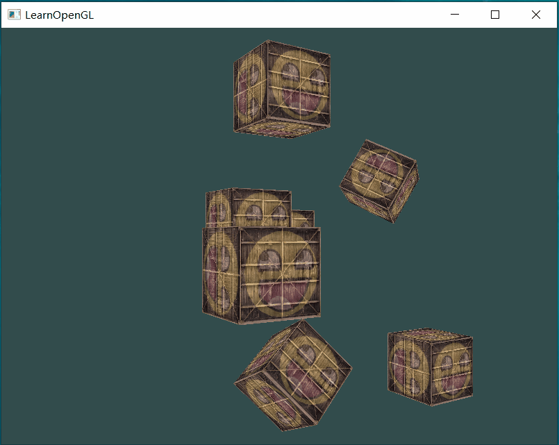

# 1.9 Camera


## Camera/View space
通过view matrix 将 world space 转换为 view space
现在尝试通过定义camera 的位置（position） 和 camera的朝向-镜头看向哪个方向（direction）来获取对应的view matrix
示例图


1. camera 的position：（0，0，2）view coordinate system的origin
2. 这里camera 看向原点？和图中camera z轴正方向相反？定义view coordinate system z轴方向
3. 利用单位向量（0，1，0），确定view coordinate system的x轴
4. 根据x、z确定y轴

### 1. Camera position
>[!info]
>The camera position is a vector in world space that points to the camera's position.

``` cpp
glm::vec3 cameraPos = glm::vec3(0.0f, 0.0f, 3.0f);
```
camera朝屏幕屏幕内移动（z轴负方向），这space 朝着屏幕外移动（z轴正方向）。
### 2. Camera direction
并没有直接给出表示camera 镜头朝向的向量，而是通过camera 观察具体的点的坐标以及camera 的position 间接确认camera direction。

示例中的代码和前面图示不一致，不好
假设camera 看向 （0，0，0），这个点也可以用一个从原点出发指向看向点的向量表示.
``` cpp
glm::vec3 cameraTarget = glm::vec3(0.0f, 0.0f, 0.0f);
```
那么camera direction 可以通过向量的减法计算得出：
``` cpp
glm::vec3 cameraDirection_0 = glm::normalize(cameraTarget - cameraPos);
```
从camera 出发，指向被减向量，并且转换为单位向量。

>[!info]
>the camera points towards the negative z-axis 

实际的camera的z轴正方向和camera 的朝向相反，所以需要反转下计算得到的direction
``` cpp
glm::vec3 cameraDirection = glm::normalize(cameraPos - cameraTarget);
```


### 3. Right axis
camera coordinate system 只要满足camera的postion 以及 direction 以及 是正交的就可以了。至于x、y的方向不影响camera 观察space，所以无关紧要。
>[!warning]
>以上仅代表我个人的理解

假设（0，1，0）在 y、z平面上，通过cross product 可以得到Right axis 
``` cpp
glm::vec3 up = glm::vec3(0.0f, 1.0f, 0.0f);
glm::vec3 cameraRight = glm::normalize(glm::cross(up, cameraDirection));
```

### 4. Up axis
已知x、z 再次通过cross product得到 Up axis
``` cpp
glm::vec3 cameraUp = glm::cross(cameraDirection, cameraRight);
```

现在通过camera 的position 以及 direction 可以创建处 camera coordinate system了

## Look at
$$
LookAt = \begin{bmatrix} \color{red}{R_x} & \color{red}{R_y} & \color{red}{R_z} & 0 \\ \color{green}{U_x} & \color{green}{U_y} & \color{green}{U_z} & 0 \\ \color{blue}{D_x} & \color{blue}{D_y} & \color{blue}{D_z} & 0 \\ 0 & 0 & 0  & 1 \end{bmatrix} * \begin{bmatrix} 1 & 0 & 0 & -\color{purple}{P_x} \\ 0 & 1 & 0 & -\color{purple}{P_y} \\ 0 & 0 & 1 & -\color{purple}{P_z} \\ 0 & 0 & 0  & 1 \end{bmatrix}
$$
$R_x \space R_y \space R_z$ ：right vector 的三个坐标分量
$U_x \space U_y \space U_z$ ：up vector 的三个坐标分量
$D_x \space D_y \space D_z$ ：direction vector 的三个坐标分量
$P_x \space P_y \space P_z$ ：camera position 的三个坐标分量

>[!info]
> We want to rotate and translate the world in the opposite direction of where we want the camera to move.

对world space 进行的变化 和 想要对camera 进行的变化相反，所以 左侧的rotation matrix 是倒置的，右侧的transform matrix 取反（因为实际移动方向相反）

>[!info]
>Using the LookAt matrix effectively transforms all the world coordinates to the view space we just defined.

**通过glm创建Look at matrix**
``` cpp
glm::mat4 view;
view = glm::lookAt(glm::vec3(0.0f, 0.0f, 3.0f), 
  		   glm::vec3(0.0f, 0.0f, 0.0f), 
  		   glm::vec3(0.0f, 1.0f, 0.0f));
  		   
glm::mat4 glm::lookAt(glm::vec3 const& eye, glm::vec3 const& center, glm::vec3
const& up);
```

| 参数     | 值   | 用途        | 说明  |
| ------ | --- | --------- | --- |
| eye    |     | position  |     |
| center |     | target    |     |
| up     |     | up vector |     |

... 参数的名称为什么和我想的不太一样，第一个参数应该叫center-camera的中心位置，第二个参数不应该叫eye吗？

分别看向4个方向 1.0的位置
:::tabs
@tab 上

@tab 下

@tab 左

@tab 右

:::


绕原点旋转
``` cpp
const float radius = 10.0f;
float camX = sin(glfwGetTime()) * radius;
float camZ = cos(glfwGetTime()) * radius;
glm::mat4 view;
view = glm::lookAt(glm::vec3(camX, 0.0, camZ), glm::vec3(0.0, 0.0, 0.0), glm::vec3(0.0, 1.0, 0.0));
```

效果：



## Walk around
**目的：** 通过按键调整camera的位置（前进、后退、左移 和 右移）
1. 定义camear的初始位置相关参数，创建LookAt matrix
``` cpp
glm::vec3 cameraPos   = glm::vec3(0.0f, 0.0f,  3.0f);
glm::vec3 cameraFront = glm::vec3(0.0f, 0.0f, -1.0f);
glm::vec3 cameraUp    = glm::vec3(0.0f, 1.0f,  0.0f);

view = glm::lookAt(cameraPos, cameraPos + cameraFront, cameraUp);
```

| 行号  | 功能             | 说明                                                                         |
| --- | -------------- | -------------------------------------------------------------------------- |
| 2   | 定义从camera出发的朝向 |                                                                            |
| 5   |                | 看向的点是在cameraPos的基础上向着cameraFront的方向，这里cameraFront 指向z轴负方向，所以camera看向z轴负方向  |

2. 按键处理，更新camera的position
``` cpp

void processInput(GLFWwindow *window)
{
    ...
    const float cameraSpeed = 0.05f; // adjust accordingly
    if (glfwGetKey(window, GLFW_KEY_W) == GLFW_PRESS)
        cameraPos += cameraSpeed * cameraFront;
    if (glfwGetKey(window, GLFW_KEY_S) == GLFW_PRESS)
        cameraPos -= cameraSpeed * cameraFront;
    if (glfwGetKey(window, GLFW_KEY_A) == GLFW_PRESS)
        cameraPos -= glm::normalize(glm::cross(cameraFront, cameraUp)) * cameraSpeed;
    if (glfwGetKey(window, GLFW_KEY_D) == GLFW_PRESS)
        cameraPos += glm::normalize(glm::cross(cameraFront, cameraUp)) * cameraSpeed;
}
```

| 行号  | 功能         | 说明                                                    |
| --- | ---------- | ----------------------------------------------------- |
| 5   | 定义移动的速度    | 在render loop 处理按键输入，处理的次数由运行程序的cpu处理性能决定。需要实时调整       |
| 7   | 向前移动camera | 朝着camera朝向移动，cameraFront-朝向，单位向量；speed-每次移动的距离        |
| 11  | 向左移动camera | 先获取camera coordinate system 的 x-axis 方向上的单位向量，然后减去移动值 |

>[!note]
>Note that we normalize the resulting _right_ vector. If we wouldn't normalize this vector, the resulting cross product may return differently sized vectors based on the variable.

对表示坐标轴的向量进行normalize，否则前后方向的cameraFront 和 左右方向的 right vector（ cross 产生）的大小不一样，导致两个方向上的移动速度不同。

效果：


### Movement speed
目前camera 的移动速度因处理器性能而异（渲染的帧数 以及 每一帧渲染的时间），为了在所有处理器上具有基本相同的移动速度，需要根据一个指标来调整移动速度。

**根据渲染一帧画面所有的时间调整移动速度**
>[!info]
>Graphics applications and games usually keep track of a <font color="#9bbb59">deltatime</font> variable that stores the time it took to render the last frame.

delta：希腊字母 $\Delta$，表示变数的变化 ，如$\Delta T$：温差

1. 计算deltatime
``` cpp
float deltaTime = 0.0f;	// Time between current frame and last frame
float lastFrame = 0.0f; // Time of last frame

int main()
{
	while(!glfwWindowShouldClose(window))
	{
		float currentFrame = glfwGetTime();
		deltaTime = currentFrame - lastFrame;
		lastFrame = currentFrame; 
		
		processInput(window);
		//...
	}
}
void processInput(GLFWwindow *window)
{
    float cameraSpeed = 2.5f * deltaTime;
    //...
}
```

| 行号  | 功能               | 说明                      |
| --- | ---------------- | ----------------------- |
| 1   | 定义存储绘制一帧所需要的时间变量 | 每一帧开始时计算                |
| 2   | 定义存储上一帧开始时的时间变量  |                         |
| 18  | 调整速度             | 绘制一帧花费的时间越长，移动的速度越快（远）； |

好的处理器帧数高（调用processInput的次数多），每一帧绘制的时间短-》移动速度慢-》移动距离短；差一点的处理器帧数低，每一帧绘制的时间长-》移动速度快-》移动距离长

$$
n1 * s1 = n2 * s2 \\
n1 > n2 \\
s2 > s1
$$

效果：


## Look Around
**目的：** 通过鼠标调整camera的朝向（direction）

### Euler angles
>[!info]
>Euler angles are 3 values that can represent any rotation in 3D. There are  3 Euler angles: pitch, yaw and roll.


三个Euler angles 的含义：
- pitch：绕x轴旋转的角度，调整纸飞机向下或向上看；
- yaw：绕y轴旋转的角度，调整纸飞机向左或向右看（航向）
- roll：绕z轴旋转的角度，让纸飞机侧身（翻转）

>[!info]
>Each of the Euler angles are represented by a single value and with the combination of all 3 of them we can calculate any rotation vector in 3D.

#### 旋转的复合
参考：[Bonus章节](https://krasjet.github.io/quaternion/bonus_gimbal_lock.pdf)
旋转的方式（旋转的轴的定义）有两种：外旋 和 内旋。

**外旋**
>[!info]
>旋转时，我们采用的旋转轴永远是一个外部、固定的世界坐标系，它不会受到已经进行的旋转的影响。

**内旋**
>[!info]
>旋转时，我们采用的旋转轴依据的是物体本身的坐标系，而这个局部坐标系会被旋转而改变

#### yaw
假设转动的顺序为yaw-》pitch，采用内旋

转动 角度`yaw`
``` cpp
glm::vec3 direction;
direction.x = cos(glm::radians(yaw)); // Note that we convert the angle to radians first
direction.z = sin(glm::radians(yaw));
```
原来的coordinate 中的 基向量 direction （1，0，0）就变成了 (cos(yaw), sin(yaw), 0)

#### pitch


- 黄色箭头u：绕y轴counter-clockwise 旋转30°（yaw）后的x轴
- 紫色箭头v：绕y轴counter-clockwise 旋转30°（yaw）后的z轴
- 黑色箭头w：绕新的x轴（u）clockwise 旋转30°（pitch）后的z轴

w的y值：sin（pitch）
w在v（$z'$) 上的投影：cos（pitch），这个投影的坐标为$(-\space cos(pitch) * sin(yaw), \space cos(pitch)*cos(yaw)\space，0)$


用x、y、z表示初始坐标轴，用x‘，y’，z‘表示第一次旋转后坐标轴。
第一次绕y轴旋转，y’ 和 y 相同
横轴 x/z 表示的是绕x旋转后得到的、新的 z轴-z’。
从x‘ 看向yz’，z‘上的坐标值为cos（pitch）

将旋转看做是一种应用到当前状态上的变换。
最终将direction（初始值-（1，0，0）变换后得到的向量（坐标值）为：
``` cpp
direction.x = cos(glm::radians(yaw)) * cos(glm::radians(pitch));
direction.y = sin(glm::radians(pitch));
direction.z = sin(glm::radians(yaw)) * cos(glm::radians(pitch));
```

### Mouse Input
有两种方式控制camera的朝向：
1. 显示鼠标，按住并拖动鼠标改变朝向；
2. 不显示鼠标，鼠标一直位于窗口的中心，移动鼠标改变朝向

示例为第二种

1. 设置鼠标模式
``` cpp
glfwSetInputMode(window, GLFW_CURSOR, GLFW_CURSOR_DISABLED);

void glfwSetInputMode	(	GLFWwindow * 	window,
int 	mode,
int 	value 
)	
```

| 参数    | 值                                                                        | 用途     | 说明                                                                    |
| ----- | ------------------------------------------------------------------------ | ------ | --------------------------------------------------------------------- |
| mode  | One of `GLFW_CURSOR`, `GLFW_STICKY_KEYS` or `GLFW_STICKY_MOUSE_BUTTONS`. | 要配置的内容 |                                                                       |
| value | `GLFW_CURSOR_NORMAL`、`GLFW_CURSOR_HIDDEN`、`GLFW_CURSOR_DISABLED`         |        | DISABLED 不会显示cursor 并且窗口获取焦点后，cursor出现在窗口中心，移动cursor不会离开窗口（一直限制在窗口内）。 |


2. 创建并设置鼠标处理回调函数
``` cpp
void mouse_callback(GLFWwindow* window, double xpos, double ypos);

glfwSetCursorPosCallback(window, mouse_callback); 
```

3. 定义变换的角度变量并设置初始角度值
``` cpp
float yaw = -90, pitch = 0;
```
让camera 初始朝着-z轴的方向，需要改变航向。初始yaw=0°，pitch=0°，direction为（1，0，0）指向x轴正方向。当yaw=-90°，pitch =0°时，direction为（0，0，-1）。

没搞懂：<span style="background:#fff88f">按照右手定则，绕y轴旋转，正方向是z-》x，那么x-》-z 应该是正的角度值，为什么这里是-90°？？？</span>

图示中yaw 是 x 向着z正方向转动的角度，转动的方向和 由右手定则定义的绕y轴转动的正方向相反。如果按照图示，那么向着z轴正方向转动的角度即为正，向着z轴负方向转动的角度即为负。所以是将 （1，0，0） 转动到（0，0，-1）是转动-90°。

3. 获取鼠标位移量并根据位移量更新角度值
``` cpp
float lastX = 400, lastY = 300;

void mouse_callback(GLFWwindow* window, double xpos, double ypos)
{
	float xoffset = xpos - lastX;
	float yoffset = lastY - ypos; // reversed since y-coordinates range from bottom to top
	lastX = xpos;
	lastY = ypos;
	
	const float sensitivity = 0.1f;
	xoffset *= sensitivity;
	yoffset *= sensitivity;
	
	yaw   += xoffset;
	pitch += yoffset;  

}
```

| 行号    | 功能              | 说明                                                                    |
| ----- | --------------- | --------------------------------------------------------------------- |
| 1     | 定义存储鼠标最后停留的位置变量 | 窗体初始大小为800x600，中央位置的坐标是400，300。鼠标的初始位置在中央（`GLFW_CURSOR_DISABLED` 模式下） |
| 5、6   | 获取鼠标移动的距离       | 单位为像素                                                                 |
| 7、8   | 更新鼠标位置          |                                                                       |
| 10~12 |                 | 由于通过callback 获取到的鼠标移动的长度是以像素作为单位，如果直接应用到角度上变化过大，所以需要乘以一个小数来调整。        |
| 14、15 | 更新角度值           |                                                                       |

4. 更新方向向量
``` cpp
    glm::vec3 direction;
    direction.x = cos(glm::radians(yaw)) * cos(glm::radians(pitch));
    direction.y = sin(glm::radians(pitch));
    direction.z = sin(glm::radians(yaw)) * cos(glm::radians(pitch));
    cameraFront = glm::normalize(direction);
```
问：<span style="background:#fff88f">对cameraFront 有必要进行normalize吗？</span>

5. 效果


### 优化
### sudden jump
先将glfwSetInputMode 注释掉，保持默认的mode，然后再运行程序


可以看到鼠标进入窗口后镜头向右”跳“了一个角度，而不是平缓地移动
在鼠标回调处理函数中打印鼠标的位置：
``` 
xpos:798 ypos:392
```
窗口获取到焦点时，鼠标的位置和 最后的鼠标位置（窗口中心）有一定距离，导致camera 会向鼠标进入的位置转向，如果进入的位置和中心位置偏差较大 就会产生明显的 sudden jump。

消除：
``` cpp
bool firstMouse = true;

void mouse_callback(...)
{
	if (firstMouse) // initially set to true
	{
	    lastX = xpos;
	    lastY = ypos;
	    firstMouse = false;
	}
}
```
获取到焦点后更新lastX、lastY，把当前位置当作”中心点“。

效果：


可以看到鼠标进入后camera 没有”跳“了

### Weird movements
>[!info]
>a LookAt flip once direction vector is parallel to the world up direction

持续增加pitch 的值
效果：


在direction vector 和 world up direction 平行时，视角反转了，从 从下到上变成了 从上到下。

限制pitch 的角度在-90° ~ +90°之间：
``` cpp
if(pitch > 89.0f)
  pitch =  89.0f;
if(pitch < -89.0f)
  pitch = -89.0f;
```

