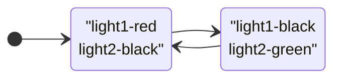

# 5.2.1 States
> A state defines a set of property changes and can be triggered by a certain condition.


## 定义State
``` js
State {
	name: "go"
	PropertyChanges { ... }
}
```
1. name： 状态名称
2. PropertyChanges：和状态绑定的属性，从其他状态切换到当前状态时哪些属性发生变化，以及当前状态下这些属性的值
Item 具有默认状态，通过“” empty string 来访问默认状态。

## 切换状态
单个状态没有意义。
根据 a certain condition 切换状态。
1. 定义多个状态
``` js
States: [
	State {
		name: "go"
		PropertyChanges {...}
	}
	State {
		name: "Stop"
		PropertyChanges {...}
	}
]
```
	States用来放置State，类型为list<State>
2. 切换
	1. 手动切换
``` js
	state = "go"
```
Item中有state 属性，直接设置该属性为要转变的状态的名称
	 2. 自动切换：在State 中设置触发条件，条件成立时自动转变为当前状态
``` js
	State {
		when: condition
	}
```


## 示例-交通信号灯
两个信号灯控制通行，同一时间只有一盏灯亮。红灯亮：禁止通行。绿灯亮：允许通行
### 状态机

### 颜色
``` js
       property color black: '#1f1f21'
        property color red: '#fc3d39'
        property color green: '#53d769'
```
### 信号灯
``` js
        Rectangle {
            id: light1
            x: 25; y:15;
            width: 100; height: width
            radius: width / 2
            color: root.black
            border.color: Qt.lighter(color, 1.1)
        }
```
将height 和 width 设置为相同大小，并设置radius 为 width /2 就能显示一个圆形了

### 状态
``` js
        state: "stop"
        states: [
            State {
                name: "stop"
                PropertyChanges { target: light1; color: root.red }
                PropertyChanges { target: light2; color: root.black }

            },
            State {
                name: "go"
                PropertyChanges { target: light1; color: root.black }
                PropertyChanges { target: light2; color: root.green }
            }
        ]
```


| 行号   | 功能          | 说明  |
| ---- | ----------- | --- |
| 1    | 设置初始状态为stop |     |
| 3-8  | 定义stop      |     |
| 9-13 | 定义go        |     |


### 鼠标点击
``` js
        MouseArea {
            anchors.fill: parent
            onClicked: { parent.state = (parent.state == "stop"? "go" : "stop") }
        }
```

### 效果
:::tabs
@tab 初始

@tab 切换

:::

### 其他
1. 不定义stop（将stop 的状态作为初始状态）
上面的示例中light1 和 ligth2 初始设置的颜色都是blak，可以直接设置light1颜色为red，light2颜色为black 作为初始状态
``` js
	Rectangle {
		id: light1
		color: root.red
	}
	MouseArea {
		anchors.fill: parent
		onClicked: { parent.state = (parent.state == ""? "go" : "") }
	}
```

2. 自动触发状态切换
``` js
	property bool stop: true //[!code highlight]
	State {
		name: "go"
		PropertyChanges { target: light1; color: root.black; }
		PropertyChanges { target: light2; color: root.green; }
		when: !root.stop //[!code highlight]
	}
	MouseArea {
		anchors.fill: parent
		onClicked: root.stop = !root.stop //[!code highlight]
	}
```
