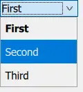
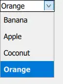

# ComboBox
> Combined button and popup list for selecting options.




## Data model
可以有多种数据来源显示 以及 编辑 数据

::: tabs
@tab js array
``` js
model: ["First", "Second", "Third"]
```

@tab ListModel
``` js
    ComboBox {
        model: ListModel {
            id: model
            ListElement { text: "Banana" }
            ListElement { text: "Apple" }
            ListElement { text: "Coconut" }
        }
	}
```

:::

## Editable ComboBox
> ComboBox can be made editable. An editable combo box auto-completes its text based on what is available in the model.

实现：
``` js
        editable: true
        onAccepted: {
            if (find(editText) === -1)
                model.append({text: editText})
        }
```


| 行号  | 功能                            |
| --- | ----------------------------- |
| 1   | 启动编辑                          |
| 3   | 获取和当前编辑内容相同的项的下标，如果没有对应项则返回-1 |
| 4   | model 中添加新的项                  |

效果：


- 点击下拉箭头左侧区域进行编辑状态
- 按下回车键完成编辑


## ComboBox's Popup
>By default, clicking outside of ComboBox's popup will close it, and the event is propagated to items lower in the stacking order.

默认点击ComboBox 外的地方就会关闭ComboBox，如果要求必须选择ComboBox中的项才能关闭，可以设置：
``` js
        popup.closePolicy: Popup.CloseOnEscape
```


## ComboBox's Role
model 中包含多个Role时指定用于显示的Role，以及valueRole

根据选择的项更新值
实现：
``` js
    // Used as an example of a backend - this would usually be
    // e.g. a C++ type exposed to QML.
    QtObject {
        id: backend
        property int modifier: Qt.ShiftModifier
    }

    ComboBox {
        textRole: "text"
        valueRole: "value"
        // When an item is selected, update the backend.
        onActivated: backend.modifier = currentValue
        // Set the initial currentIndex to the value stored in the backend.
        Component.onCompleted: currentIndex = indexOfValue(backend.modifier)
        model: [
            { value: Qt.NoModifier, text: qsTr("No modifier") },
            { value: Qt.ShiftModifier, text: qsTr("Shift") },
            { value: Qt.ControlModifier, text: qsTr("Control") }
        ]
    }
```

| 行号    | 功能                | 说明                     |
| ----- | ----------------- | ---------------------- |
| 3-6   | 要通过ComboBox 设置的对象 | 通常是C++暴露给QML的对象        |
| 9     | 设置显示用Role         | 对应model中的text 属性       |
| 10    | 设置ValueRole       | 实际编辑的值                 |
| 12    | 选中项目更新时更新值        | 和之前的项目不同时触发activated信号 |
| 14    | 设置ComboBox的初始选中项  | 判断的条件是每一项的valueRole 的值 |
| 15-19 | model定义           |                        |


