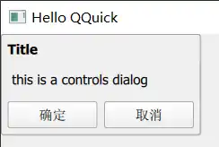

# Dialog-Controls
> Popup dialog with standard buttons and a title, used for short-term interaction with the user.

<!-- more -->



## 窗口的构成
> Similarly to ApplicationWindow and Page, Dialog is organized into three sections: header, contentItem, and footer.


## Tiltle and Buttons
### header 
通常作为窗口的标题栏，通过title 属性便捷地设置一个Styl-specific（粗体、加大） 的 title bar作为header。

### footer
通常使用DialogButtonBox 用来接收用户输入、关闭窗口。点击按钮触发相应的信号。

实现：
``` js
	standardButtons: Dialog.Ok | Dialog.Cancel
```
不同的按钮显示的内容不同，触发的信号不同。
Ok触发accepted，cancel触发rejected

## closePolicy
Dialog 继承于 Popup，默认情况下，点击窗口外区域就会关闭窗口。
如果要求通过点击窗体内的按钮关闭按钮可以设置Dialog的closePolicy为 
``` js
	closePolicy: Popup.CloseOnEscape
```
## Modal and Modeless Dialogs
> A modal dialog blocks input to other content beneath the dialog.
> A modeless dialog is a dialog that operators independently of other content around the dialog.

通常弹出窗口后，窗口显示在顶层，其余窗口均在其下方。设置modal后 other content  就接收不到 按键、鼠标等输入了。必须关闭当前窗口后才能同other content 交互。

实现：
``` js
	modal: false
```

:::tabs
@tab moal

	无法点击open dialog
@tab modeless

	鼠标停留在open dialog 上方时其显示有变换，可以点击按钮，有打印提示
:::

