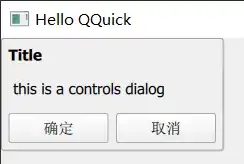
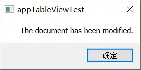

# Dialog


## 不同模块中的Dialog
在assistant 中搜索Dialog 发现其存在于多个模块中：

| 模块            | 说明                                                                                            | 显示风格                  |
| ------------- | --------------------------------------------------------------------------------------------- | --------------------- |
| Labs Platform | The base class of native dialogs.                                                             | 和系统显示风格一致             |
| Controls      | Popup dialog with standard buttons and a title, used for short-term interaction with the user | 跨平台一致，可设置风格           |
| Dialogs       | The base class of native dialogs                                                              | 混杂，包含qml自绘 和 系统调用。应弃用 |
要求跨平台使用Controls，要求和系统一致使用Labs。

:::tabs
@tab Controls


@tab MessageDialog

:::


## 同时使用Controls 和 Labs 
导入：
``` js
import QtQuick.Controls
import Qt.labs.platform
```

如果直接定义Dialog，会报类型冲突错误。
因为两个模块中定义了相同的类型-Dialog，所以同时使用时需要区分同名类型定义在哪个模块下。
使用别名解决名称通途
``` js
import Qt.labs.platform as Labs
```

定义Labs 下的MessageDialog：
``` js
     Labs.MessageDialog {
        id: dialog
        buttons: Labs.MessageDialog.Ok
        text: "The document has been modified."
    }
```
编译通过，但是点击按钮显示Dialog 时提示：
``` 
ERROR: No native MessageDialog implementation available.
Qt Labs Platform requires Qt Widgets on this setup.
Add 'QT += widgets' to .pro and create QApplication in main().
```
在CMakeLists.txt中增加widgets 模块
``` cmake
find_package(Qt6 6.5 REQUIRED COMPONENTS Quick Widgets)
target_link_libraries(appTableViewTest
    PRIVATE Qt6::Quick
    PRIVATE Qt6::Widgets
)
```

修改mian.cpp
``` cpp
#include <QApplication>
#include <QGuiApplication>
#include <QQmlApplicationEngine>

int main(int argc, char *argv[])
{
    QApplication app(argc, argv);
	//...
}
```
使用QApplication（QWidget） 而不是 QGUIApplication（Quick）

效果：

	和Controls的差别：包含一个标题栏图标，右侧的关闭图标;拖动标题栏可以移动窗口
	