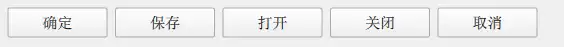
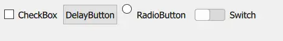

# DialogButtonBox
> [!quote]
> Dialogs and message boxes typically present buttons in an order that conforms to the interface guidlines for that platform.
> DialogButtonBox allows a developer to add buttons to it and will automatically use the appropriate order for the user's platform.

实现：
``` js
       standardButtons: DialogButtonBox.Ok | DialogButtonBox.Cancel
        | DialogButtonBox.Open | DialogButtonBox.Save | DialogButtonBox.Close
```

效果：


- 可以通过 | 定义多个标准按钮
- 按钮的显示顺序：和platform 有关
即使先定义 cancel，后定义ok，最终显示时还是ok在前，cancel 在后
- 按钮的作用应该和其名称及显示内容一致
- 不同的按钮显示内容不同，但是对应同一个功能（role）

| 定义                     | 显示（英/中） | role       |
| ---------------------- | ------- | ---------- |
| DialogButtonBox.Ok     | OK/确定   | AcceptRole |
| DialogButtonBox.Open   | 打开      | AcceptRole |
| DialogButtonBox.Cancel | 取消      | RejectRole |
| DialogButtonBox.Close  | 关闭      | RejectRole |
- 每个role 关联的Button 按下时会自动触发信号

| Role                | Signal     |
| ------------------- | ---------- |
| AcceptRole, YesRole | accepted() |
| RejectRole, NoRole  | rejected() |
点击 Ok、Open。。都会触发accepted（）

## 使用其他类型的Button
除了使用预定义的类型，还可以使用任意 AbstractButton 的实现类型

使用多种类型Button 
实现：
``` js
   DialogButtonBox {
        CheckBox {
            DialogButtonBox.buttonRole: DialogButtonBox.AcceptRole
            text: "CheckBox"
        }
        DelayButton {
            DialogButtonBox.buttonRole: DialogButtonBox.AcceptRole
            text: "DelayButton"
        }
        RadioButton {
            text: "RadioButton"
            DialogButtonBox.buttonRole: DialogButtonBox.RejectRole
        }
        Switch {
            text: "Switch"
        }
        onAccepted: { console.debug("accepted") }
        onRejected: { console.debug("rejected") }
    }
```


| 行号     | 功能                         |
| ------ | -------------------------- |
| 3、7、12 | 设置关联的Role，点击Button时会触发对应信号 |

效果：


### 如何区分具体的Button
多个Button 对应一个Role，无法通过Role 对应的信号来判断触发来源（没有参数）。只能通过带参数的clicked（AbstractButton）

具体区分Button 似乎没有实际意义，如果一个Button 具有特殊用途，应该额外的定义信号。

