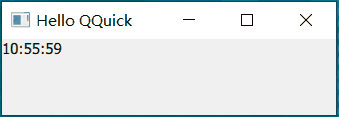

# Embedding C++ Objects into QML ...
>The ability to inject C++ data into a QML object is made possible by the QQmlContext class. This class exposes data to the context of a QML object so that the data can be referred to directly from within the scope of  the QML code

- QQmlContext
- context of a QML object
<!-- more -->

## Setting a Simple Context Property
c++代码获取到程序启动时的时间并在qml 中进行显示
实现：
1. 设置property 名称及值
``` cpp title="main.cpp"
#include <QGuiApplication>
#include <QQmlApplicationEngine>
#include <QQmlContext>
int main(int argc, char *argv[])
{
    QGuiApplication app(argc, argv);

    QQmlApplicationEngine engine;
    engine.rootContext()->setContextProperty("currentDateTime", QDateTime::currentDateTime().toString("dd.MM.yyyy"));    // [!code highlight]
    QObject::connect(...);
    engine.loadFromModule("TableViewTest", "Main");

    return app.exec();
}
```
engine的 rootContext（）其QQmlContext，设置 属性名为currentDateTime 的值为当前时间。

2. 使用
``` js
ApplicationWindow {
    id: root
    Label {
        text: currentDateTime
    }
}
```
	qml 中直接使用属性名来引用
3. 效果：


>[!note]
>引用嵌入到qml 中的属性时，直接使用set 时的名称，不需要通过其他对象，因为该属性是全局的。

``` js title="Main.qml"
ApplicationWindow {
    id: root
    Label {
        text: root.currentDateTime
    }
}
```
报错：
``` txt 
Unable to assign [undefined] to QString
```
### 属性的作用域 
> rootContext
> The root context is automatically created by the QQmlEngine. Data that should be available to all QML component instances instantiated by the engine should be put in the root context.

通过engine 的rootContext 设置的property，在所有的QML component instances 中均有效。简单将就是该属性是全局有效。

1. 定义一个用于显示启动时间的qml
``` js title="TimeDisplay.qml"
import QtQuick

Text {
    text: currentDateTime
    font.bold: true
}
```
2. 使用
``` js title="Main.qml"
ApplicationWindow {
	TimeDispaly {} 
	//...
}
```
3. 效果：


## Setting an Object as a Context Property
> Context properties can hold either QVariant or QObject* value. This means custom C++ objects can also be injected using this approach.

使用一个QObject 对象作为 context property
1. 创建class
``` cpp title="ApplicationData.h"
class ApplicationData : public QObject
{
    Q_OBJECT
public:
    explicit ApplicationData(QObject *parent = nullptr);
    Q_INVOKABLE QString getCurrentDateTime() const {
        return QDateTime::currentDateTime().toString("dd.MM.yyyy");
    }
};
```
2. set
``` cpp title="main.cpp"
    ApplicationData data;
    engine.rootContext()->setContextProperty("applicationData", &data);
```
3. use
``` js title="Main.qml"
    Label {
        text: applicationData.getCurrentDateTime()
    }
```
4. 效果：


### 连接object 的信号
显示实时时间
1. object定时发射信号
``` cpp
class ApplicationData : public QObject
{
    Q_OBJECT
public:
    explicit ApplicationData(QObject *parent)
    : QObject{parent}
	{
	    m_timer.setInterval(1000);
	    connect(&m_timer, &QTimer::timeout, this, &ApplicationData::dataChanged);
	    m_timer.start();
	}
    Q_INVOKABLE QString getCurrentDateTime() const {
        return QDateTime::currentDateTime().toString("hh:mm:ss");
    }
signals:
    void dataChanged();
private:
    QTimer m_timer;
};
```


| 行号  | 功能               | 说明  |
| --- | ---------------- | --- |
| 8   | 设置定时器发射信号间隔时间为1s |     |
| 9   | 间隔1s发射数据变化信号     |     |
| 16  | 定义dataChanged信号  |     |

2. use
``` js 
    Connections {
        target: applicationData
        function onDataChanged(){
            curTime.text = applicationData.getCurrentDateTime()
        }
    }
```

| 行号  | 功能                                 |
| --- | ---------------------------------- |
| 3   | 连接applicationData 的 dataChanged 信号 |
| 4   | 更新时间显示                             |

3. 效果：



## Using C++ based data models in a QML view

### String ListModel
1. model
``` cpp title="main.cpp"
    QStringList dataList = {
        "Item 1",
        "Item 2",
        "Item 3",
        "Item 4"
    };
    engine.setInitialProperties({{ "model", QVariant::fromValue(dataList) }});
```

| 行号  | 功能                        | 说明                                               |
| --- | ------------------------- | ------------------------------------------------ |
| 1-6 | 定义数据                      |                                                  |
| 7   | 设置engine 加载的qml 的属性 model | 使用setInitialProperties 只会设置指定的qml 具有该属性，而不是所有qml |

2. use
``` js
ApplicationWindow {
    id: root
    title: qsTr("Hello QQuick")

    required property var model
    ListView {
        anchors.fill: parent
        model: root.model
        delegate: Rectangle {
            height: 25
            width: 100
            required property string modelData
            Text { text: parent.modelData }
        }
    }
}
```

| 行号  | 功能                                |
| --- | --------------------------------- |
| 5   | 要求创建时指定model 值                    |
| 8   | 使用id.propertyName引用 root中定义的model |

3. 效果：


### Object ListModel
1. model
``` cpp title="DataObject.h"
class DataObject : public QObject
{
    Q_OBJECT
    Q_PROPERTY(QString name READ name WRITE setName NOTIFY nameChanged FINAL)
    Q_PROPERTY(QString color READ color WRITE setColor NOTIFY colorChanged FINAL)
public:
    explicit DataObject(QObject *parent = nullptr);
    explicit DataObject(const QString &name, const QString &color, QObject *parent = nullptr)
        : m_name(name)
        , m_color(color)
        , QObject(parent)
    {}

    QString name() const { return m_name; }
    void setName(const QString &name) {
        if(m_name == name)
            return ;
        m_name = name;
        emit nameChanged();
    }

    QString color() const { return m_color; }
    void setColor(const QString &color) {
        if(m_color == color)
            return ;
        m_color = color;
        emit colorChanged();
    }

signals:
    void nameChanged();
    void colorChanged();
private:
    QString m_name;
    QString m_color;
};
```
model定义了两个属性：name 、color
2. set
``` cpp title="main.cpp"
    const QStringList colorList = {"red",
                                   "green",
                                   "blue",
                                   "yellow"};

    const QStringList moduleList = {"Core", "GUI", "Multimedia", "Multimedia Widgets"};

    QList<QObject *> dataList;
    for (const QString &module : moduleList)
        dataList.append(new DataObject("Qt " + module, colorList.at(rand() % colorList.length())));

    engine.setInitialProperties({{ "model", QVariant::fromValue(dataList) }});

```

3. use
``` js title="Main.qml"
    required property var model

    ListView {
        anchors.fill: parent
        model: root.model
        delegate: Rectangle {
            height: 25
            width: 200
            required property string name
            required color
            Text { text: parent.name }
        }
    }
```
	
| 行号  | 功能                 | 说明  |
| --- | ------------------ | --- |
| 9   | 获取model 中的 name属性  |     |
| 10  | 获取model 中的 color属性 |     |
4. 效果


> [!note]
> 传递给qml 的c++对象仍由c++管理。如果set（）后没有在c++代码中释放动态分配的对象，对象将持续存在。

问：<mark style="background: #FFF3A3A6;">什么时候释放嵌入到qml 中的c++对象？是否初始化（set）后就可以释放了？</mark>
如果是一次性的数据，那么在加载qml 文件后可以手动释放。如果是持续引用的对象，设置父对象，在父对象销毁时自动销毁。通常父对象可以是 app（程序退出时） 或 engine（引擎销毁时）。


