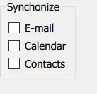
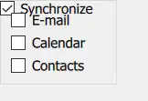
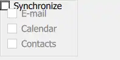
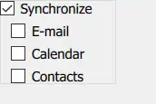
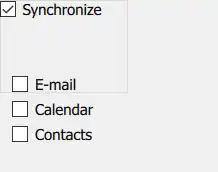

# GroupBox
GroupBox is  used to layout a logical group of controls together, within a titled visual frame.
关键点：
- layout
- group of controls
- titled visual frame

效果图：

<!-- more -->

- [ ] 关于GroupBox内items的parent：直接定义的items 其parent 是否为GroupBox；items created dynamically 未explicitly 设置parent时 parent；
	涉及：父子对象关系的影响
## Detailed Description
> GroupBox does not provide a layout of its own, but requires you to position its contents, for instance by creating a RowLayout or a ColumnLayout.
> Items declared as children of a GroupBox are automatically parented to the GroupBox's contentItem. Items created dynamically need to be explicitly parented to the contentItem.

- 需要自己提供Layout 管理GroupBox 内的contrils
- GroupBox内定义的items 自动设置 GroupBox 为 其parent，但是动态创建的items需要显式设置

创建一个GroupBox，标题为Synchonize，里面竖向放置3个checkBox。
实现：
``` js
    GroupBox {
        title: qsTr("Synchonize");
        ColumnLayout {
            anchors.fill: parent
            CheckBox { text: qsTr("E-mail") }
            CheckBox { text: qsTr("Calendar") }
            CheckBox { text: qsTr("Contacts") }
        }
    }
```


效果：见效果图

## Checkable GroupBox
GroupBox的标题栏是CheckBox

实现：
``` js
    GroupBox {
        label: CheckBox {
            id: checkBox
            checked: true
            text: qsTr("Synchronize")
        }
        ColumnLayout {
            anchors.fill: parent
            enabled: checkBox.checked
            CheckBox { text: qsTr("E-mail") }
            CheckBox { text: qsTr("Calendar") }
            CheckBox { text: qsTr("Contacts") }
        }
    }
```


| 行号  | 功能                                           | 说明                                                                                                                                                                                             |
| --- | -------------------------------------------- | ---------------------------------------------------------------------------------------------------------------------------------------------------------------------------------------------- |
| 2-6 | 设置GroupBox 的title 为CheckBox                  | >Even though GroupBox has no built-in check box,<br>it is straightforward to create a checkable GroupBox by pariring it with a CheckBox<br>title 实际上是一个item，默认是一个文本显示item，设置title就是设置该item 的文本 |
| 9   | GroupBox 内的controls 根据GroupBox 的选中情况设置时候可以编辑 |                                                                                                                                                                                                |

效果：
::: tabs
@tab 选中title CheckBox


@tab 未选中


:::

### 问题
这里可以明显的看到title 和 第一个control 距离太近有部分重叠。
问：<mark style="background: #FFF3A3A6;">怎么设置GroupBox 的label 和 它的controls 之间的距离？</mark>
示例代码中ColumnLayout 使用anchors.fill，可以让其和 GroupBox top 对齐，然后设置margin。

修改：
``` js
        ColumnLayout {
            id: groupBoxLayout
            //anchors.fill: parent
            anchors.top: parent.top
            anchors.topMargin: 50
            anchors.left: parent.left
            anchors.right: parent.right
            anchors.bottom: parent.bottom
			...
		}
```
	剩下的3条边对齐

效果：
::: tabs
@tab topMargin: 10


@tab topMargin: 50

:::

当margin 设置过大时 controls 显示在了GroupBox 外面（GroupBox没有包含住controls）。
