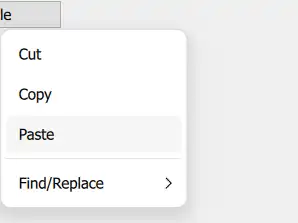
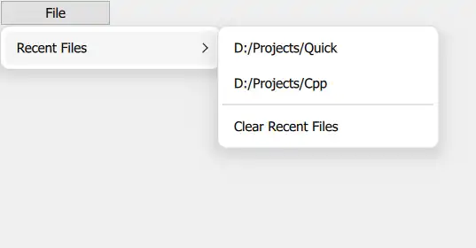

---
tags:
  - Menu
---

# Menu-QML-Type
Menu popup that can be used as a context menu or popup menu.
<!-- more -->

待办：
- [ ] 动画弹出菜单：从窗口外移动到窗口内
## Context Menus
> for example, a menu that is shown after right clicking

在鼠标右键的位置弹出菜单
``` js
import QtQuick
import QtQuick.Controls

ApplicationWindow {
    visible: true
    width: 640
    height: 480
    title: qsTr("Hello Menu")

    MouseArea {
        anchors.fill: parent
        acceptedButtons: Qt.LeftButton | Qt.RightButton
        onClicked: function(mouse) {
            if (mouse.button === Qt.RightButton)
                contextMenu.popup()
        }
        onPressAndHold: function(mouse) {
            if (mouse.source === Qt.MouseEventNotSynthesized)
                contextMenu.popup()
        }

        Menu {
            id: contextMenu
            MenuItem { text: "Cut" }
            MenuItem { text: "Copy" }
            MenuItem { text: "Paste" }
        }
    }

}

```

1. 设置响应的鼠标按键：默认为Left，通过 \| 设置响应多个鼠标按键
2. 创建Menu
	Menu 由 MenuItem 组成，MenuItem可设置显示的文本
3. 鼠标右键点击：onClicked
4. 获取鼠标位置：MouseEvent 中包含鼠标的位置
5. 弹出Menu：popup（）
	1. explicitly specified： 显式指定位置，在该位置显式Menu
	2. mouse cursor avaliable：is positioned at the mouse cursor
	3. otherwise: centered over its parent item.
		这里没有指定位置，鼠标可用，所以在鼠标位置弹出
	
mouse.source：产生鼠标事件的来源；MouseEventNotSynthesized：不是合成的-真实鼠标点击产生

注意：原文中鼠标的事件（信号）响应中没有声明函数的参数，会产生以下错误。
``` txt
Parameter "mouse" is not declared. Injection of parameters into signal handlers is deprecated. Use JavaScript functions with formal parameters instead.
```
	错误信息的含义：没有声明mouse。反对注入参数到signal handlers。使用标准的js function(para)替换

效果：


## Popup Menu
> for example, a menu that is shown after clicking a button

点击按钮后在按钮的下方弹出Menu
``` js
import QtQuick
import QtQuick.Controls

ApplicationWindow {
    visible: true
    width: 640
    height: 480
    title: qsTr("Hello Menu")

    Button {
        id: fileButton
        text: "File"
        onClicked: menu.open()

        Menu {
            id: menu
            y: fileButton.height

            MenuItem {
                text: "New..."
            }
            MenuItem {
                text: "Open..."
            }
            MenuItem {
                text: "Save"
            }
        }
    }
}
```

1. 按钮点击：onClicked
2. 弹出菜单：menu.open()
3. 设置菜单位置：y: fileButton.height
菜单的位置通过x、y进行设置。x、y是相对于parent而言，初始位置 （0，0）在parent的左上角。这里设置y为button的高度，所以菜单贴着button的下边缘显示

效果：


## closePolicy
菜单的关闭策略
继承于Popup
默认值是 Popup.CloseOnEscape | Popup.CloseOnPressOutside.  Menu（Popup）获取到焦点时按下ESC，或者点击Menu 外面区域


## sub-menus and Action
可以创建子菜单，以及使用Action 代替 MenuItem 作为菜单项

实现
``` js
        Menu {
            id: menu
            y: fileButton.height
            Action { text: "Cut" }
            Action { text: "Copy" }
            Action { text: "Paste" }
            MenuSeparator {}
            Menu {
                title: "Find/Replace"
                Action { text: "Find Next" }
                Action { text: "Find Previous" }
                Action { text: "Replace" }
            }
        }
```
1. 使用Action：Action { }
2. 分隔线：MenuSeparator
3. sub-menu：子菜单本身需要作为父菜单的一项显示，鼠标移动到它时弹出它所包含的菜单项。
4. 是否展开子菜单由父带单的cascade属性决定
如果设置为false，那么点击sub-menu 项后子菜单centered over the parent menu


效果：


## Margins
边距的含义：菜单栏的边缘 和 它所在窗口 边缘的距离
Menu 中margins 的默认值是0：它被限制只能显示在窗体内部，不能超出窗体。
不能超出的含义：
将弹出Menu的Button放置在窗体外，然后看Menu 的位置
``` js title="Button"
        width: 100
        x: -50
```

效果：

	可以看到原本Menu 应该是在Button 下方（Menu 的x 为0），这样一部分文本应该是不显示的，但是由于margins 的限制，Menu 只能显示在窗体内。

> To allow the menu to go outside of the window (to animate it moving into view, for example), set the margin property to -1.

但是，啊但是。实际设置Menu的margin 为 -1，还是没有显示在外面。
效果：

	只不过是Menu 的长度缩短了。。。

## 其他
1. 可以使用add、insert、move 等动态修改menu items。
2. 可以使用itemAt、contentChildren 访问 items
3. Menu can contain any type of item

## Dynamically Generating Menu Items

### Using Instantiator
动态生成items 的一个示例：
在Menu 中显示最近打开的文件列表，具备以下功能：
1. 列表为空时，最近打开文件Menu 不可用
2. 可以清除最近打开文件
3. 点击文件列表中的一项时打开该文件
4. 打开文件后当前文件添加到文件列表中

instantiator: Dynamically creates objects.
ListModel 中存储最近打开文件信息：文件路径（含名称）
instantiator 根据 model 生成 items 添加到Menu 中
用一个按钮模拟添加文件，点击按钮后文件列表中新增一项
实现：
``` js
import QtQuick
import QtQuick.Controls

ApplicationWindow {
    visible: true
    width: 640
    height: 480
    title: qsTr("Hello Menu")

    ListModel {
        id: settings
        ListElement { filePath: "D:/Projects/Quick" }
        ListElement { filePath: "D:/Projects/Cpp" }
    }

    Button {
        id: fileButton
        text: "File"
        width: 100
        onClicked: menu.open()
        Menu {
            id: menu
            title: qsTr("File")
            Menu {
                id: recentFilesMenu
                title: qsTr("Recent Files")
                enabled: recentFilesInstantiator.count > 0 // [!code highlight]

                Instantiator {
                    id: recentFilesInstantiator
                    model: settings
                    delegate: MenuItem {
                        text: filePath
                        onTriggered: {
                            console.debug(`loadFile(${text})`)
                        }
                    }
					onObjectAdded: (index, object) => recentFilesMenu.insertItem(index, object) //[!code highlight]
                    onObjectRemoved: (index, object) => recentFilesMenu.removeItem(object)

                }

                MenuSeparator {}

                MenuItem {
                    text: qsTr("Clear Recent Files")
                    onTriggered: settings.clear() // [!code highlight]
                }
            }
        }
    }

    Button {
        text: "add"
        anchors.centerIn: parent
        property int i
        onClicked: {
            i++
            settings.append({ filePath: ("D:/Doc" + i) }) // [!code highlight]
        }
    }

}

```
1. Items 的生成：由Instantiator绑定 model后创建
2. 添加items：Instantiator 只动态生成对象（items），还要在onObjectAdded中将item 添加到Menu 中进行使用。
3. clear：点击MenuItem 后触发triggered信号
4. add：创建jsObject 后添加到model中
5. enabled状态：可以根据instantiator 也可以是Menu 自身 的item 数量进行判断
效果：
初始状态：

点击add 按钮后：

点击Clear Recent Files 后：

再次点击add 按钮：


### Using Dynamic Object Creation
> You can also dynamically load a component from a QML file using Qt.CreateComponent(). Once the component is ready, you can call its createObject() method to create an instance of that component.

添加的对象被封装到component中
实现：
``` js
 Row {
     anchors.centerIn: parent

     Component {
         id: menuItemComponent

         MenuItem {}
     }

     Button {
         id: button
         text: "Menu"
         onClicked: menu.open()
         Menu {
             id: menu
         }
     }

     Button {
         text: "Add item"
         onClicked: {
             onClicked: {
                 let menuItem = menuItemComponent.createObject(
                     menu.contentItem, { text: qsTr("New item") })
                 menu.addItem(menuItem)
             }
         }
     }
 }

```
	这里加载的Component 只是一个MenuItem。点击add 按钮后先创建Component对象，然后添加到Menu中。
	创建object：指定Component的parent，然后设置component 的属性
效果：
初始：

点击add后：


## Menu Types
> A menu offers three different implementations
> You can choose which one should be preferred by setting popupType


| Type   | 外观        | 渲染方式                                                               | 影响                         |
| ------ | --------- | ------------------------------------------------------------------ | -------------------------- |
| Item   | 所有平台一致    | be embedded into the same scene as the parent<br>和parent 在同一scene内 | 可能会被scene内其他控件覆盖（即无法显示在顶层） |
| Window |           | separate window <br>QQuickWindow内渲染                                | 不会被遮挡                      |
| Native | 由所使用的平台决定 |                                                                    |                            |

使用Item：

	截取的是整个ApplicationWindow，说明Menu 位于 parent -ApplicationWindow 的scene 内

使用Window：

	使用snipaste 截图时按照窗口截取，这里截出来的范围比Menu 大了一圈，说明Menu位于一个Window内
	显示的样式和Item 一样
使用Native的效果：

	Windows 风格
### 关于遮挡的问题
Menu使用Item 类型。创建一个Rectangle，设置其 z值 为1000，仍然可以显示Menu
``` js
    Rectangle {
        z: 1000
        height: parent.height / 2
        width: parent.width
        color: "black"
    }
```

 效果：
 
 