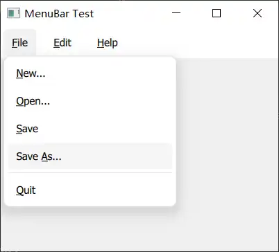

---
tags:
  - Menu
---

# MenuBar-QML-Type
> MenuBar consists of drop-down menus, and is normally located at the top edge of the window.

<!-- more -->

在ApplicationWindow 的顶部创建MenuBar
实现：
``` js
import QtQuick
import QtQuick.Controls
ApplicationWindow {
    id: window
    width: 320
    height: 260
    visible: true

	menuBar: MenuBar { // [!code highlight]
        Menu {
            title: qsTr("&File")
            Action { text: qsTr("&New...") }
            Action { text: qsTr("&Open...") }
            Action { text: qsTr("&Save") }
            Action { text: qsTr("Save &As...") }
            MenuSeparator { }
            Action { text: qsTr("&Quit") }
        }
        Menu {
            title: qsTr("&Edit")
            Action { text: qsTr("Cu&t") }
            Action { text: qsTr("&Copy") }
            Action { text: qsTr("&Paste") }
        }
        Menu {
            title: qsTr("&Help")
            Action { text: qsTr("&About") }
        }
    }
}

```
1. 在ApplicationWindow中定义MenuBar： menu： MenuBar { }
2. 使用Menu 表示 MenuBar 中的一项
3. 快捷键设置：通过&指定快捷键。可以使用Alt + 指定的快捷键弹出Menu，然后按键触发Action。

问：<mark style="background: #FFF3A3A6;">如何指定组合按键触发Menu 中的Action，如ctrl+alt+O 触发Open？</mark>

效果：

