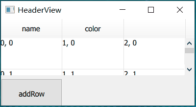
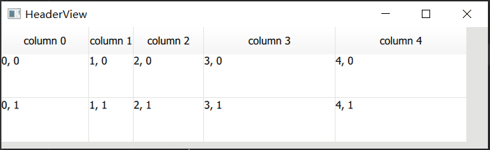
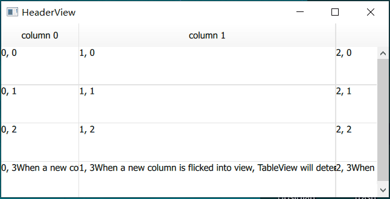
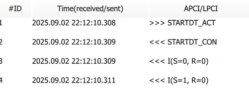

# Row heights and column widths
> When a new column is flicked into view, TableView will determine its width by calling the columnWidthProvider

<!-- more -->

- [ ] 表头、表格内容重叠问题
## 默认的实现
如果没有设置provider，默认的provider实现为：
``` js
 columnWidthProvider: function(column) {
     let w = explicitColumnWidth(column)
     if (w >= 0)
         return w;
     return implicitColumnWidth(column)
 }
```

通过setColumnWidth() 指定 explicitColumnWidth。在delegate中指定implicitColumnWidth。

既没有指定explicitColumnWidth 也 没有指定 implicitWidth时，显示内容过长时会重叠。
效果：


程序运行时报错：
``` txt title="error"
QML QQuickTableView: the delegate's implicitHeight needs to be greater than zero
```
打印width 值：
``` js
qml: explicit: -1  implicit: 0  width: 50
```
未指定时explicit 为-1，采用implicit。implicit 默认为0. 实际的宽度为50

## implicit width
### 取一列中最大的implicit width
> The implicit width of a column is the same as the largest implicit width found among the currently loaded delegate items in that column.

测试：设置不同的implicit width，观察实际显示宽度
实现：
``` js
	 delegate: Rectangle {
			id: rect
			implicitWidth: row === 0 ? 100 : 50
	}
```

效果：
``` js
qml: explicit: -1  implicit: 100  width: 100
```


### 显示的内容变化时
一旦根据当前显示的内容确定了width，width就不会改变，即使后面添加了item 的implicit width 大于当前最大的implicit width。

测试：当前显示内容的最大implicit width 为100， 添加一项其implicit width 为200。观察column width 是否有变化
实现：
1. model中增加添加行接口；
2. 界面中增加按钮，点击按钮后调用model 的接口；
3. 初始显示的implicit width为100， 后续添加行的implicit width为200

效果：
:::tabs
@tab 初始


@tab 添加新的行后

scrollbar 的长度变小了
可以看到column 的width 没有变化
:::

implicitColumnWidth 仅由 当前loaded 的delegate items 决定。滚动视图时，如果新渲染的items 的width 大于原最大width 或 原最大widht 行消失，columnWidth 都会重新计算。

滚动后width发生变化：


问题：<mark style="background: #FFF3A3A6;">为什么通过滑轮滚动，列宽没有变化，鼠标点击scrollbar 才更新？</mark>


不让列宽变化的方法：
1. 提供provider
2. 让所有列的implicit width 相同

## 使用provider
表格总共有5列，隐藏第二列。其余列宽由delegate items 的implicit 确定。
实现：
``` js
            columnWidthProvider: function(column) {
                number++
                console.info("provider column:", column, " loaded:", isColumnLoaded(column)) //, " number:", number)
                if(column === 1)
                    return 0;
                else
                    return -1;
            }
            
			delegate: Rectangle {
                implicitWidth: 100
				//。。。
			}
```

| 行号  | 功能                             | 说明       |
| --- | ------------------------------ | -------- |
| 5   | 隐藏第二列                          | 不显示的列返回0 |
| 7   | 由delegate items 给定的implicit 确定 |          |
| 11  | 默认宽度100                        |          |

效果：


### 加载的时机
> The columnWidthProvider will usually be called two times when a column is about to load (or when doing layout). First, to know if the column is visible and should be loaded. And second, to determine the width of the column after all items have been loaded.

初始：
``` 
qml: provider column: 0  loaded: false  width: -1  explicit: -1  implicit: -1  width: -1
```

加载完成：
```
 qml: provider column: 0  loaded: true  width: 100  explicit: -1  implicit: 100  width: 100
 Component.onCompleted
```
全部item 加载后 isColumnLoaded(column) 返回true，然后设置width


注意：如果使用provider 提供width，无法手动调整宽度

### 提供的值有变换
> If you change the values that a columnWidthProvider return for rows and columns inside the viewport, you must call forceLayout.


实现：
``` js
            property var columnWidths: [100, 50, 80, 150, 150]
               columnWidthProvider: function (column) { return columnWidths[column] }

            Timer {
                 running: true
                 interval: 2000
                 onTriggered: {
                     tableView.columnWidths[2] = 150
                     tableView.forceLayout();
                 }
             }
```

效果：



## 根据内容调整宽度
直接设置delegate 的implicit width
实现：
``` js
	  delegate: Rectangle {
			implicitHeight: 50
			implicitWidth: label.implicitWidth
			Label {
				id: label
				text: display
			}
		}
```

效果：


问题：表头没有显示完全，应该取display 和 header 的较大值

实现：
``` js
		columnWidthProvider: function(column) {
			var headerWidth = horizontalHeader.implicitColumnWidth(column)
			var delegateWidth = implicitColumnWidth(column)
			return Math.max(headerWidth, delegateWidth)
		}
		//data
			case Qt::DisplayRole:
            if(index.column() == 4)
                return "";
```

| 行号  | 功能                           |
| --- | ---------------------------- |
| 2   | 获取column header 的implicit；   |
| 3   | 获取column delegate 的implicit； |
| 4   | 取较大值                         |
| 9   | 第5列的item 返回空值                |

效果：
:::tabs
@tab 没有显示表头


@tab 拖动后列消失


:::

打印：
``` 
qml:  loaded: false  column: 4  headerWidth: -1  delegateWidth: -1
qml:  loaded: false  column: 4  headerWidth: 64.53125  delegateWidth: -1
qml:  loaded: true  column: 4  headerWidth: 64.53125  delegateWidth: 0
qml:  loaded: true  column: 4  headerWidth: -1  delegateWidth: 0
qml: comleted row:4  explicit: -1  implicit: 0  width: 64.53125
```

 问：<mark style="background: #FFF3A3A6;">为什么headerWidth 64 之后又变成了 -1 </mark>？？？导致最后返回的columnWidth 为0
 如果该列的全部item 都为空，就会导致上面的情况

解决：
1. 表头width 大于0时存储该值
2. 加载完成后，如果返回的max 为0，且存储的表头width 大于0，则返回表头width，否则返回一个默认值

临时的办法：max为0时，返回一个默认值


## 重叠显示问题

表头重叠：

显示内容重叠：
:::tabs
@tab 正常的情况


@tab 异常

减小Time 的列宽，Time 后半部分的内容和APCI 内容重叠
:::

问题的原因：
1. 初始显示正常：实际width 按照提供的implicit width - label 内容的长度+40 进行设置
2. 减小列宽时，implicit width 不变，绘制item时仍然按照 implicit width 进行绘制
3. delegate 默认不会裁剪，超出的内容仍会绘制

解决办法：
1. 最简单的，设置delegate 的clip 为true

