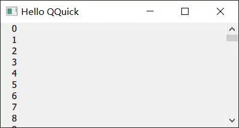
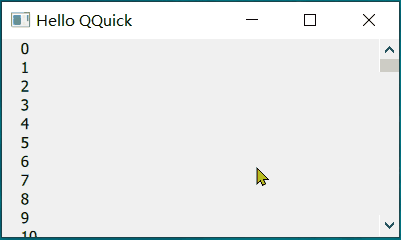
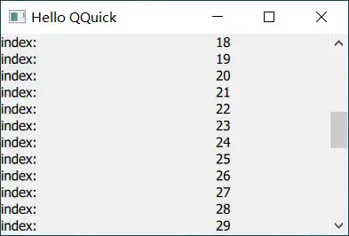
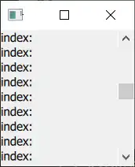
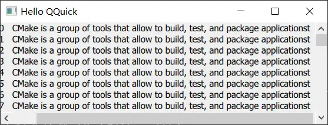
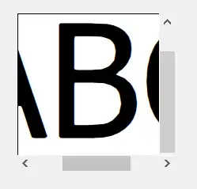

# ScrollBar
Vertical or horizontal interactive scroll bar.
<!-- more -->

>[!quote]
>ScrollBar is an interactive bar that can be used to scroll to a specific position. A scroll bar can be either vertical or horizontal, and can be attached to any Flickable, such as ListView and Grid View. It can also be used with ScrollView.

- interactive: 交互的方式
- vertical or horizontal： scroll 的方向
- be attached to any Flickable： 配合其他控件使用

## Attaching ScrollBar to a Flickable
在ListView 中添加ScrollBar
实现：
``` js
    ListView{
        id: listView;
        anchors.fill: parent
        model: 100
        delegate: Text {
            required property int index
            text: "    " + index
        }
        ScrollBar.vertical: ScrollBar { }
        ScrollBar.horizontal: ScrollBar {}
    }
```


| 行号  | 功能               |
| --- | ---------------- |
| 9   | 添加垂直方向的scrollbar |
| 10  | 添加水平方向的scrollbar |

效果：


以vertical scrollbar为例
- scrollbar的高度和它所在的ListVIew一致，并且两者边缘对齐。相当于显式设置下面的属性：
``` js
            parent: listView
            anchors.top: listView.top
            anchors.right: listView.right
            anchors.bottom: listView.bottom
```
	scrollbar默认设置ListView为其父对象
- 没有显示horizontal scrollbar：默认的policy 为 AsNeeded，只在范围不够时显示

### 按键控制滚动
> ScrollBar does not filter key events of the Flickable it is attached to.

上下按键控制滚动
实现：
``` js
	ListView {
		focus: true
        ScrollBar.vertical: ScrollBar {
            id: vscroll
        }
        Keys.onUpPressed: vscroll.decrease()
        Keys.onDownPressed: vscroll.increase()
	}
```

效果：

	整个scrollbar 的默认范围是0.0 - 1.0，默认滚动的值是0.1 即 整个范围的10%，所以上图中可以看到最上面行的值变换幅度是10（整个model 是100）


### horizontal scrollbar
水平方向的scrollbar 和 垂直方向的有点不一样。
增加ListView 显示的文本长度，完全显示内容时：

	只有vertical 没有 horizontal
减小宽度，显示不完全时：

	还是没有horizontal 方向scrollbar

滚动的原理：计算当前显示的内容在 整个Flickable容纳内容中的位置。然后根据鼠标、键盘控制位置切换。
默认情况下不显示 horizontal scrollbar 是因为 Flickable 的宽度（窗口宽度，对应属性width）大于等于 容纳的内容宽度（对应属性contentWidth）。

打印content 和 width的值
``` txt title="output"
qml: contentHeight: 5000
qml: listview width: 640
qml: listview height: 200
qml: contentHeight: 750
qml: onCompleted -------
qml: width: 640  ,contentWidth: -1    //[!code highlight]
qml: height: 200  ,contentHeight: 750     //[!code highlight]
qml: onCompleted -------
```

contentwidth 的值为-1，始终小于width，不会显示scrollbar

调整：根据显示内容的实际宽度，设置contentWidth。
实现：
``` js
      contentWidth: {
            var maxWidth = 0;
            // 遍历所有已创建的委托项，找到最大宽度
            for (var i = 0; i < contentItem.children.length; i++) {
                var child = contentItem.children[i];
                if (child && child.hasOwnProperty("implicitWidth")) {
                    maxWidth = Math.max(maxWidth, child.implicitWidth);
                }
            }
            return (maxWidth + vscroll.width)
        }
```


| 行号  | 功能                                                                           |
| --- | ---------------------------------------------------------------------------- |
| 4-9 | 计算ListView中最大的implicitWidth                                                  |
| 10  | 因为vscroll 占据了Flickable 中的一部分宽度，如果滚动到最右侧时完全显示文本，实际的contentWidth 需要增加这部分宽度<br> |

效果：



## Binding the Active State of Horizontal and Vertical Scroll Bars
> Horizontal and vertical scroll bars do not share the active state with each other by default.

同时存在vertical 和 horizontal scrollbar 时，激活一个scrollbar，另一个也激活
实现：
``` js
   ScrollBar.horizontal: ScrollBar { id: hbar; active: vbar.active }
     ScrollBar.vertical: ScrollBar { id: vbar; active: hbar.active }
```
效果：
和说明的不一样，最大化窗口后，只显示了horizontal scrollbar。拖动horizontal scrollbar 时vertical 仍未显示。

问：<mark style="background: #FFF3A3A6;">没搞明白active的含义，如果active 控制是否显示，那么相互绑定后应该同时显示或消失。</mark>


## Non-attached Scroll Bars
> It is possible to create an instance of ScrollBar without using the attached property API.

实现：
``` js
 Rectangle {
     id: frame
     clip: true
     width: 160
     height: 160
     border.color: "black"
     anchors.centerIn: parent

     Text {
         id: content
         text: "ABC"
         font.pixelSize: 160
         x: -hbar.position * width
         y: -vbar.position * height
     }

     ScrollBar {
         id: vbar
         hoverEnabled: true
         active: hovered || pressed
         orientation: Qt.Vertical
         size: frame.height / content.height
         anchors.top: parent.top
         anchors.right: parent.right
         anchors.bottom: parent.bottom
     }
	
     ScrollBar {
         id: hbar
         hoverEnabled: true
         active: hovered || pressed
         orientation: Qt.Horizontal
         size: frame.width / content.width
         anchors.left: parent.left
         anchors.right: parent.right
         anchors.bottom: parent.bottom
     }
 }

```


| 行号    | 功能         |
| ----- | ---------- |
| 13、14 | 计算Text 的位置 |
| 19、20 | 设置触发显示的方式  |
| 21    | 方向         |
| 22    | 设置当前显示的内容  |
| 23-25 | scroll 的位置 |

效果：



## 其他
1. 鼠标停留激活scrollbar：目前滚动滑轮只会在vertical 方向scroll。
要求：鼠标停留在scrollbar 上方后激活该scrollbar，后续滚动滑轮调整该scrollbar

