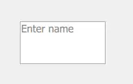
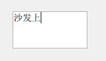
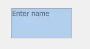

# TextField
>TextField is a single line text editor. TextField extends TextInput with a placeholder text functionality, and adds decoration.

- placeholder text: 输入提示
- decoration：边框

<!-- more -->

## Detailed Description

实现：
``` js
    TextField {
        anchors.centerIn: parent
        width: 100
        height: 50
        placeholderText: "Enter name"
        focus: true
        enabled: true
    }
```
效果：
::: tabs
@tab 初始 normal



@tab has active focus

和示例有区别，边框并没有显示为蓝色

@tab disabled

和示例有区别，背景颜色是蓝色而不是灰色
:::

