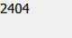
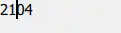

# TextInput
The TextInput type displays a single lien of editable plain text.

- single line
- editable plain text
<!-- more -->

## Detailed Description
> TextInput is used to accept a line of text input. Input constraints can be placed on a TextInput item (for example, through a validator or inputMask), and setting echoMode to an appropriate value enables TextInput to be used for a password input field.

- input constraints: 通过 设置validator、inputMask 以及echoMode 能够用于 password 输入

## validator
> When a validator is set the TextInput will only accept input which leaves the text property in an acceptable or intermediate sate.
> The accepted signal will only be sent if the text is in an acceptable state when enter is pressed.

问：<mark style="background: #FFF3A3A6;">这里的acceptable 和 intermediate sate 是什么意思？</mark>
acceptable 我能理解，就是输入的text 复合 validator 的要求。那intermediate 呢？还有介于acceptable 和 unacceptable 之间的状态吗？

>**输入状态分类**
>Acceptable: 当前输入完全复合规则
>Intermediate：输入暂时不符合最终要求，但可能通过 *继续* 输入变成合法
>Invalid：输入不可能合法，无论怎么 *补充*
>-- ChatGPT


- 设置validator 后 TextInput 只接收（显示）完全符合或可能符合的输入
- 按下press 按键TextInput 会发射 accepted signal

| 1   | IntValidator               |
| --- | -------------------------- |
| 2   | DoubleValidator            |
| 3   | RegularExpressionValidator |

端口号：0-65535
实现：
``` js
    TextInput {
        width: 50
        height: 50
        text: "2404"
        validator: IntValidator { bottom: 0; top: 65535; }
    }
```

效果：
::: tabs
@tab 初始


@tab 编辑状态

:::

和通常使用文本输入框的差别：没有边框。
带有样式的输入控件：TextField
