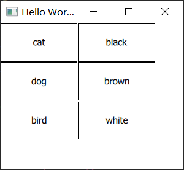
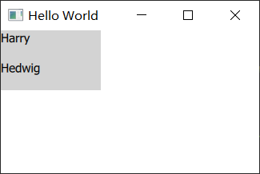
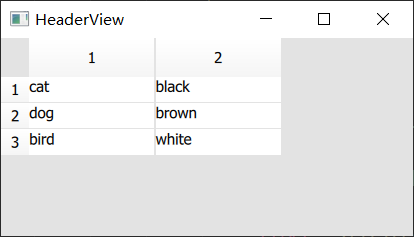
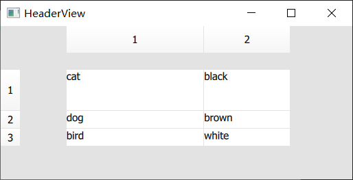
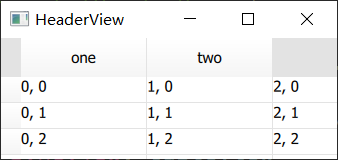

> A TableView has a modal that defines the data to be displayed, and a delegate that defines how the data should be displayed.
> 
> TableView inherits Flickable. ...
> 
> A TableView displays data from modals created from built-in QML types such as ListModel and XmlListModel, ...
> 
> A TableView does not include headers by default. You can add headers using the HorizontalHeaderView and VerticalHeaderView from Qt Quick Controls.

# ViewTable

## C++ Models
> This example shows how to create a model from C++ with multiple columns

## 构建
1. 新建项目：选择Qt Quick Application

2. 创建class：TableModel。将代码拷贝到tableModel.h
3. 修改Main.qml：注意这里不需要import，因为TableModel 中使用了QML_ELEMENT宏，qt会帮我们注册该TableModel 到QML 中

### 实现
TableModel：
1. TableModel 继承于 QAbstractTableModel；
2. role 为 DisplayRole 是返回 单元格 行号、列号构成的字符串；
3. DisplayRole 的名称为 display

Main.qml
1. 创建TableModel 对象；
2. 在delegate 中指定 单元格的样式-Rectangle；
3. 通过display - Display 的名称获取显示的数据

### 效果

1. 单元格内容：单元格编号；
2. 没有表头
3. 可以通过鼠标控制显示的单元格范围


## QML Models
> For prototyping and displaying very simple data (from a web API, for example), TableModel can be used:

### 实现
1. import Qt.labs.qmlmodels;
2. model 的列数量由TableModelColumn 指定；
3. TableModelColumn：表示model中的一列，将Qt‘s role 作为属性暴露出来。
display 对应 Qt::Display，display: "name"; name 相当于 display 的别名
4. rows：数组类型，按行存储model中的数据。通过每一列中display的 名称对其进行赋值。

### 效果

	第一列显示动物的种类，第二列显示颜色。单元格之间存在间隙。

## Selecting Items
> You can add selection support to TableView by assigning an ItemSelectionModel to the selectionModel property. It will then use this model to control which delegate items should be shown as selected, and which item should be shown as current. You can set selectionBehavior to control if the use should be allowed to select individual cells, rows, or columns.

### 实现
1. 设置ItemSelectionModel
2. delegate 判断当前绘制项是否为选中项：
``` js
required property bool selected
```
	required：要求创建对象时要对selected 进行赋值，由ItemSelectionModel 进行判断
3. 设置颜色：未选中的项背景颜色为灰色，选中项目背景为蓝色
### 效果


#### 无法选中？
点击表格中的项，该项背景颜色未改变-没有被选中
1. 默认状态下是否无法通过鼠标点击修改selected项
ItemSelectionModel 中有 currentChanged（current， previous）信号，在槽中进行打印
``` js
        selectionModel: ItemSelectionModel {
            onCurrentChanged: function(current, previous) {
                console.debug(`currrent: ${current}, previous: ${previous}`);
            }
        }
```
运行后先点击Hedwig，后点击Harry，打印结果：
``` 
qml: currrent: QModelIndex(1,0,0x0,QQmlTableModel(0x1ae06846420)), previous: QModelIndex()
qml: currrent: QModelIndex(0,0,0x0,QQmlTableModel(0x1ae06846420)), previous: QModelIndex(1,0,0x0,QQmlTableModel(0x1ae06846420))
```
	结果显示第一次点击后current 的QModelIndex的行是1，列是0，初始没有选中项，所以其index为QModelIndex（）。第二次点击后current 的index变为 第0行第0列，previous 变为上次的current。
以上说明鼠标点击可以修改selected 项
2. delegate 中 selected 属性没有更新
在delegate 中增加打印：
``` js
	onSelectedChanged: {
		console.debug(`${dColor.text} selected:${selected}`)
	}

	Text {
		id: dColor
		text: display
	}
```
	鼠标点击切换时没有打印信息，说明selected 没有更新
3. <mark style="background: #FFF3A3A6;">为什么没有更新？能否在ItemSelectionModel 的slot 中更新 delegate 的selected？</mark>
	selected 是否有对应的Role？
	如何在qml 中使用 c++中定义的enum？
		如果知道枚举类型的值，可以直接传递值。但这样显然不合适	
### SelectionRectangle
注意到说明文档中的Note
> Qt Quick Controls offers a SelectionRectangle that can be used to let the user select cells.


##### 实现
``` js
TableView {
	id: tableView
	...
}
SelectionRectangle {
	target: tableView
}
```
##### 效果

可以拖动整个表格，但是无法触发选中
##### 问题
[参考链接](https://forum.qt.io/topic/132272/qt6-2-tableview-selectionmodel-rectangle-selection-not-working/3)

设置TableView的interactive 为 false
``` js
interactive: false
```
效果：

	单击还无法选中，需要 PressAndHold - 按住并拖动才会更新selected。。。
#### selectionMode
默认情况下单元格无法被选中是因为interactive 为true，“A user can not drag or flick a Flickable that is not interactive."
	交互（ineract）的方式有两种： drag、flick。默认情况下产生的flicking，禁用interactiv 后鼠标产生drag事件，或放置ScrollView中， 也只产生drag。
	
windows上设置为 PressAndHold 无法触发选中

## Header
HorizontalHeaderView

> - can be used as an independent view or header for a TableView.
> - assigning the TableView to the syncView property of HorizontalHeaderView. The header and the table will then be kept in sync while flicking.
> - By default, HorizontalHeaderView displays header data from the sync view's model.
> - By default, textRole is set to "display", meaning that data from the model's Qt::DisplayRole will be used.
> - The application is responsible for placing the header at the correct location in the scene.

### 效果

header 显示行、列号。

	可以调整行列宽度；flicking 时 header 跟随表格移动
### 实现
### placing the header
``` js
HorizontalHeaderView {
	id: horizontalHeader
	anchors.left: tableView.left
	anchors.top: parent.top
}
VerticalHeaderView {
	id: verticalHeader
	anchors.top: tableView.top
	anchors.left: parent.left
}
TableView {
	id: tableView
	anchors.left: verticalHeader
	anchors.top: horizontalHeader
	anchors.right: parent.right
	anchors.left: parent.left
}
```
放置时先确定和parent 的关系，然后确定header 和 table 之间的关系。
注意：anchors 时不能互相依赖

### header data
1. 从TableView中获取：
``` js title:HorizontalHeaderView
syncView: tableView
```
如果view 没有提供，那么默认显示行、列号

如果TableView 使用C++提供的model：
c++中定义header
``` cpp title:TableModel.cpp
QVariant TableModel::headerData(int section, Qt::Orientation orientation, int role) const
{
    if(orientation == Qt::Horizontal && role == Qt::DisplayRole)
    {
        if(section == 0)
            return "name";
        else if(section == 1)
            return "color";
    }
    return QVariant();
}
```


2. 使用指定的model:
``` js
	HorizontalHeaderView {
		syncView: tableView
		model: horizontalModel
	}

	ListModel {
		id: horizontalModel
		ListElement { display: "name" }
		ListElement { display: "color" }
	}
```
效果：

默认textRole （显示的内容） 对应 DisplayRole，可以指定为其他Role
``` js
	HorizontalHeaderView {
		textRole: "cusRole"
		model: horizontalModel
	}
	ListModel {
		id: horizontalModel
		ListElement { display: "name"; cusRole: "one" }
		ListElement { display: "color"; cusRole: "two" }
	}
```
效果：
