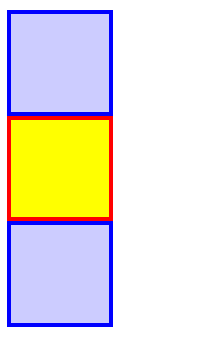
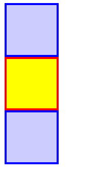
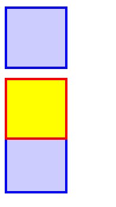
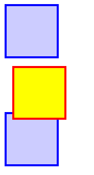
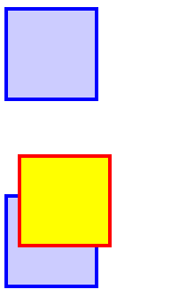
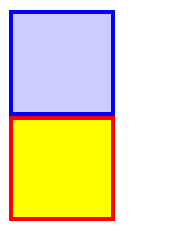
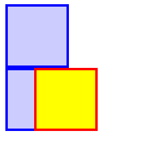
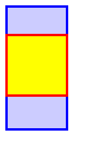

# position
>sets how an element is positioned in a document. The top, right, bottom, and left physical properties and inset-block-start, ... can be used to determine the final location of positioned elements.

- top, right,..: 

```html title="index.html"
  <body>
    <div class="box"></div>
    <div class="box" id="example-element"></div>
    <div class="box"></div>
  </body>
```

```css title="style.css"
      .box {
        background-color: rgb(0 0 255 / 0.2);
        border: 3px solid blue;
        width: 65px;
        height: 65px;
      }
      #example-element {
        background-color: yellow;
        border: 3px solid red;
      }
```
效果：

## static
>The element is positioned according to the `Normal Flow` of the document. The top, right,... properties have no effect. This is the default value.

- Normal Flow:目前的理解，按照elements的声明顺序放置elements，每个element占据的大小由其内容 或 设置的 width, height 决定，element之间没有间距。
- top, right...:没有效果
## relative
>The element is positioned according to the normal flow of the document, and then offset relative to itself based on the values of `top`, `right`, ... does not affect the position of any other elements

```css
      #example-element {
		/* ... */
        top: 0;
	    left: 10px;
      }
```

:::tabs
@tab top=0px;left=0px

@tab top=0px

@tab top=10px;left=10px

@tab top=40px;left=10px

:::

按照 normal flow排列，然后根据top, right的值进行移动
## absolute
>The element is removed from the normal document flow, and no space is created for the element in the page layout. The element is positioned relative to its closest positioned ancestor (if any) or to the initial `containing block`.


:::tabs
@tab absolute
```css
      #example-element {
      ...
        position: absolute;
      }
```
效果：

只显示了两个方块，因为第二个y块 盖住了 第三个 b 块
@tab inline-start:40px

相对于div的左边界向右移动了40px
@tab block-start:40px

相对于div的上边界向下移动了40px
:::

- removed from the normal document flow: 移除之后后面按照norml flow 布局的element前移。如果没有指定偏移量，那么absolute element 还是在它按照normal flow排列的位置上（会盖住后面前移的element）。指定了偏移量会根据relative、offset进行移动
- relatvie:  示例中example box的parent（默认position 为static），没有 closest positioned ancestor。那 div是不是一个包含了它的 `initial containing block`? 我的理解，div是它的父节点，那肯定是div先初始化，然后再初始化example block。所以根据div进行偏移


## Types of positioning
- A positioned element: relative, absolute, fixed, or sticky.(it's anything except static.)
 ^CSS-Properties-positioned
- A relatively positioned element
- An absolutely positioned element
- A stickily positioned element
