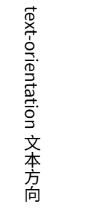
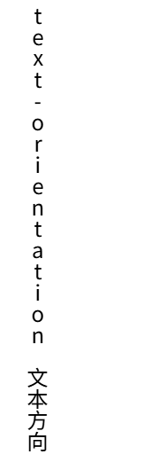
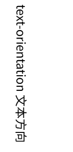

# text-orientation
>sets the orientation of the text characters in a line. It only affects text in vertical mode.

```html title="index.html"
	<p>text-orientation 文本方向</p>
```

:::tabs
@tab mixed(default)

@tab upright

@tab sideways/sideways-right

:::

1. mixed: Rotates the characters of horizontal scripts 90° clockwise. Lays out the characters of vertical scripts naturally. 如果是中文则按照书写习惯从上至下书写，不会旋转字符，英文则需要旋转。
2. upright:我的感觉是每行写一个字符，然后换行。对于中文似乎没有影响。中文单个字符是不是正方向大小？英文的水平方向窄一点，垂直排列后就显得间距比较大？
3. sideways:水平书写，然后旋转整行。sideways-right 是其alias。可以看到中文的书写方向和英文一致