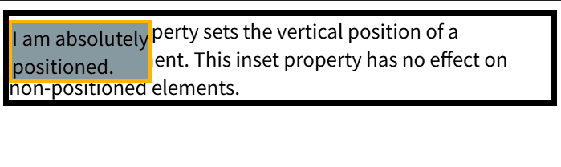
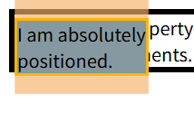
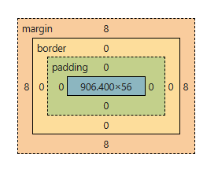
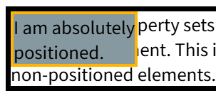

# top, right, bottom and right
对[[./position.md#^CSS-Properties-positioned]]有效
仅说明top，其余省略
## position = absolute or fixed
```html
    <div>
      The top CSS property sets the vertical position of a positioned element.
      This inset property has no effect on non-positioned elements.
      <p>I am absolutely <br />positioned.</p>
    </div>
```

```css
      div {
        border: 5px solid;
      }
      p {
        background-color: #8799a0;
        border: 3px solid #ffb500;

        position: absolute;
        top: 0;
      }
```

效果：

可以看到黄色边框的文本块（以下简称y块）border的上边和 黑色边框的文本框（以下简称h块）border的下边不是紧挨着的

>the top property specifies the distance between the element's outer margin of the top edge and the inner border of the top edge of its containing block, or, the case of ...

- element's outer margin of the edge:

y块的margin有16-贴着页面顶部

- inner border of the top edge of <span style="background:#ff4d4f">its containing block</span>:
黑色边框-外

<span style="background:#fff88f">问：</span>额，所以如果是这两个的距离，设置为0，为什么最终效果是这样的
这里 y块的containing block不是 h块，而是body。
body的box


修改h 块的position 为 positioned类型
```css
      div {
        position: relative;
      }
      p {
        margin: 0;
      }
```
需要设置y块的margin为0
效果：

