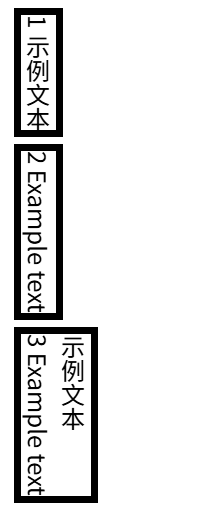

# writing-mode
>The writing-mode CSS property sets whether lines of text are laid out horizontally or vertically, as well as the direction in which blocks progress.

```html title="index.html"
    <p>1 示例文本</p>
    <p>2 Example text</p>
    <p>3 Example text <br />示例文本</p>
```

## vertical-lr
>For ltr scripts, content flows vertically from top to bottom, and the next vertical line is positioned to the right of the previous line. For rtl scripts, ....

```css
      p {
        writing-mode: vertical-lr;
        border: 5px solid;
        margin: 5px;
      }
```

效果：


- vertical: 文本排布的方向-垂直排布
- lr：the direction in which blocks progress,文本行进的方向是从左到右。3中示例文本在右侧