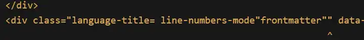
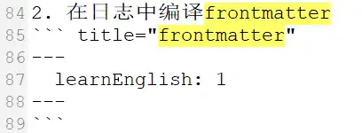
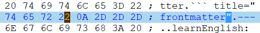

# Markdown
推荐的文档结构：
``` markdown
# 文档标题： 同文件名
作者
摘要
目录
## 标题1
### 标题1.1
## 标题2
.。。
```
	这应该算是传统的markdown 文档结构，但是为了适应工具要求，比如hope主题 在fronmatter 中设置作者，摘要标签前所有信息均为摘要 等，可以适当调整结构。这里从2级标签开始划分文档，我之前都是从1级开始，1级前作为文档说明。

## 代码块
``` cpp title="demo"
#include <iostream>

int main()
{
	int i; // [!code --]
	int i = 3; // [!code ++]
	
	std::cout << "hello" << std::endl; // [!code highlight]
	int *p = new int(3); // [!code warning]
	auto j = i / 0; // [!code error]
	// [!code word:Word]
	//Word highlight
	Word
	
	//从这里开始折叠折叠
	:collapsed-lines = 17
	auto func = []() {
		std::cout << "lambda";
	}
	
	return 0;
	
}
```

| 行号    | 功能   | 语法                                                                        | 配置属性                  |
| ----- | ---- | ------------------------------------------------------------------------- | --------------------- |
| 5、6   | 差异   | \[!code --], \[!code ++]                                                  | notationDiff          |
| 8     | 行高亮  | \[!code highlight]                                                        | notationHighlight     |
| 9、10  | 错误标记 | \[!code warning], \[!code error]                                          | notationErrorLevel    |
| 12、13 | 字符高亮 | \[!code word:Word]                                                        | notationWordHighlight |
| 16    | 折叠   | :collapsed-lines<br>:no-collapsed-lines<br>:collapsed-lines=17 //从17行开始换行 | collapsedLines        |
|       | 标题   | \`\`\`  cpp title="demo"                                                  |                       |

问题：
1. <mark style="background: #FFF3A3A6;">标题是不支持中文吗？</mark>; 
2. 标题设置总是报错：

我的原文：

	编译为html 失败的原因是我多打了\” ？
	查看二进制文件信息

	\“ 的值是0x22，0x0A 是换行，没有多打
	搞不懂。。。
发现原因了
> 
>设置代码块的标题时需要指定语言
>使用txt title="frontmatter" 编译输出正常；
>使用 \`\`\` title="frontmatter" 编译失败，
>title 和前面的\` 没有间隔，也会编译失败

。。。所以是obsidian 太强大了吗，在ob中都是正常的

配置：
``` js title="theme.ts"
hopetheme({
	//...
	markdown: {
		highlighter: {
			notationDiff: true,
			notationHighlight: true,
			notationErrorLevel: true,
			notationWordHighlight: true,
			notationFocus: true,
			collapsedLines: true,
		},
	},
)}
```
### 聚焦
``` js
console.log(`1`);
console.debug(`2`); // [!code focus]
console.log(`3`);
```

| 行号  | 功能  | 语法             | 配置属性          |
| --- | --- | -------------- | ------------- |
| 2   | 聚焦  | \[!code focus] | notationFocus |

## GFM 警告
具有图标、背景颜色，用来突出显示信息的块
配置：
``` js title="theme.ts"
markdown: {
	...
	alert: true,
	...
},
```

示例：
> [!note]
> 这是一条注释信息
> 语法：\>\[!note]  换行 > 这是一条。。。

支持的类型：
- important
- info
- tip
- warning
- caution
- note

问：<mark style="background: #FFF3A3A6;">不支持quote，该如何添加支持类型？</mark>


## 选项卡
多个卡片放置在一起，通过标题切换卡片

配置：默认开启
``` js title="themt.ts"
markdown: {
	tabs: true,
},
```

示例：
选项卡组1
::: tabs#fruit
@tab 开始 #1
begin
@tab:active 结束 #2
end
:::

选项卡组2
::: tabs#fruit
@tab begin #1
开始
@tab:active end #2
结束
:::


``` mk title="选项卡语法"
选项卡组1
::: tabs#fruit
@tab 开始 #1
begin
@tab:active 结束 #2
end
:::

选项卡组2
::: tabs#fruit
@tab begin #1
开始
@tab:active end #2
结束
:::
```
1. 创建容器：\:\:\: tabs, tabs 前有空格，\:\:\:  容器结束标志
2. 创建选项卡：\@tab
3. 卡片标题：\@tab 后设置标题
4. 卡片内容：到下一个选项卡之间的内容就是当前卡片内容
5. 容器id：在tabs 后使用 \#card，设置id 为card
6. tab值：在tab 后使用#1，设置tab 值为1
7. 默认tab：\@tab:active
8. 多个卡组同步切换（卡组1从标题1切换到标题2，卡组2同步切换到2）
	1. 两个卡组的id 相同
	2. 卡组内tab 的值相同


## 未归档
表格：表格内换行 使用\<br>
