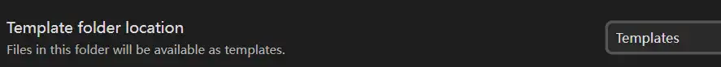

---
tags:
  - markdown
  - editor
  - vuepress
---
# Obsidian
好用的本地化Markdown 编辑器
<!-- more -->

## 插件
1. Clear Unused Images： 清理未使用的图片。被删除的图片存放在.trash路径下（即使设置了Deleted files Move to System trash）
2. Code Styler： 代码块显示行号、标题等
3. Highlightr：设置文本的颜色
4. Image Converter：快捷调整图片大小，转换图片格式（压缩图片大小）等

## Image Converter
[中文说明](https://pkmer.cn/Pkmer-Docs/10-obsidian/obsidian%E7%A4%BE%E5%8C%BA%E6%8F%92%E4%BB%B6/readme/image-converter_readme/)
一个目录下所有的文件资源都放在当前目录的attachments下。图片前缀由其所在文档决定。
Conversion：转换为WEBP格式，转换质量为50。Snipaste 截取的图片格式为png，转换为WEBP，质量50能够节省85.9%的内存同时保持31.16 - PSNR的图像质量

## 图片链接
ob中链接格式是wiki，vuepress 的markdown不支持，无法显示该格式的图片链接。

设置：

1. 将link的格式设置为相对路径
2. 关闭 Use Wikilinks
3. 设置attachments 的路径为 under current folder

4. 修改已经存在的wiki 格式链接：删除原链接文件，拖拽链接到原位置


## 模板的使用
>[!quote]
>Templates is a [core plugin](https://help.obsidian.md/plugins) that lets you insert pre-defined snippets of text into your active note.

- pre-defined snippets of text
- insert into your active note
### 配置
打开设置-》core plugins -》 Templates

设置放置模板文件的路径

### 定义模板
在设置的模板路径先新建模板文件

#### Template variables
>[!quote]
>You can add dynamic information to your templates, using template variables. When you insert a template containing a template variable, Templates replaces it with its corresponding value.

让模板的内容根据导入文章的内容变化（自动适应）
示例：
模板内容：
``` md
时间：{{data}}
```
导入到今天2025.9.22创建的文章中
``` md title="test.md"
测试
```
导入后
``` md title="test.md"
测试
时间：2025-09-22 
```

可以在Templates 的设置中修改date 的格式

支持的template variables

| Variable  | Description              |     |
| --------- | ------------------------ | --- |
| {{title}} | Title of the active note |     |
| {{date}}  | Today's date             |     |
| {{time}}  | Current time             |     |

#### Template properties
在tempalte 中定义的properties 会合并到active note中。如示例中template 有 category 属性，insert 后 active note 新增该property

### 导入模板
打开要导入模板的文章
通过左侧的工具栏中的 insert template 选择要导入的模板文件

点击按钮后出现模板文件列表，选择模板。模板内容导入到当前编辑位置后。

### 示例
模板文件内容：
``` md
---
category: Daily
---

这是一个模板文件
## 待办
- [ ] 购物
```

active note：
``` md
---
标题:
---

心情：好
```

导入后：
``` md
---
标题:
category: Daily
---

心情：好
这是一个模板文件
## 待办
- [ ] 购物
```

