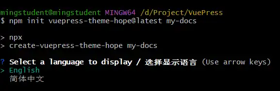
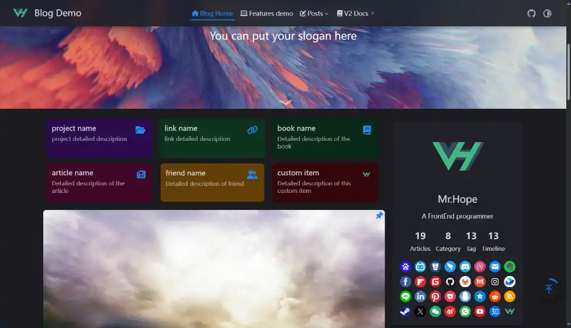
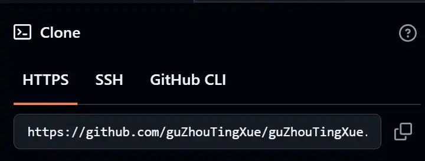
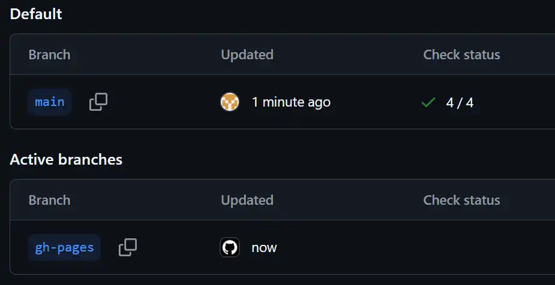

安装hope 主题 及 部署到github上
<!-- more -->

# hope的安装及部署
链接：
1. [hope]( https://theme-hope.vuejs.press/zh/)
2. [Node.js](https://nodejs.org/zh-cn)
3. [github desktop](https://github.com/apps/desktop)
4. [GIT](https://git-scm.com/downloads)
## 安装hope
1. 安装Node.js - 运行环境
2. 使用下面的命令 在项目路径下安装 hope 模板
``` bash
npm init vuepress-theme-hope@latest my-docs
```
	my-docs是项目文件夹，需要为空。如果没有会自动创建。

	按提示进行选择，全部默认即可
3. 安装完成
项目路径下新增以下文件
``` 
node_modules/  package-lock.json  package.json  src/  tsconfig.json
```
4. 运行示例


## 部署到github
部署的文档路径配置：
``` title=theme.ts
export default hopeTheme({
docsDir: "src",
})
```
	安装主题模板，默认文档路径即为src
1. 在github 中新建repository
Repository name 填写：名称.github.io

	我的站点的名称：https://guzhoutingxue.github.io/
2. 下载安装github desktop
3. 添加remote
查看remote 地址： 新建项目-》CODE，使用HTTPS作为remote url

在项目根路径下（含.git）运行下面的命令添加remote
``` bash
git remote add origin https://github.com...
//
git remote add <name> <url>
```
	origin是remote的名称
4. pull：拉取remote 同步到本地
``` bash 
git pull origin main
```
4. push：
``` bash
git push 
```
如果推送成功会新增一个gh-pages 分支，该分支是用于构建站点

5. 设置Pages 使用的分支： 将main 修改为gh-pages

6. 查看站点


## Actions 错误 及 解决
### 安装依赖
**报错**
``` 
Run corepack enable
npm error code EUSAGE
npm error
npm error `npm ci` can only install packages 
when your package.json and package-lock.json or npm-shrinkwrap.json are in sync.
Please update your lock file with `npm install` before continuing.
```

**原因**
`package-lock.json` 和 `package.json` 不一致

**解决**
1. 切换到lock路径，删除lock文件
``` bash
rm package-lock.json
```
2. 解析依赖，重新生成lock 然后 安装到 `node_modules`
``` bash
npm install
```
3. 再次提交lock文件