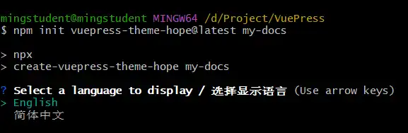
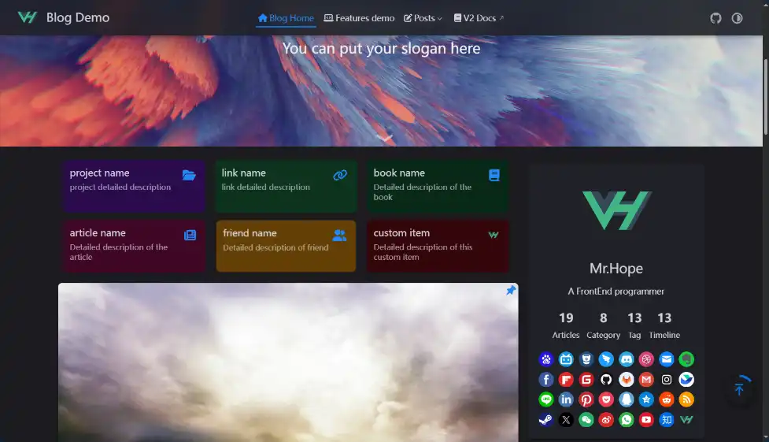
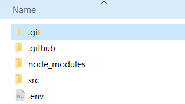
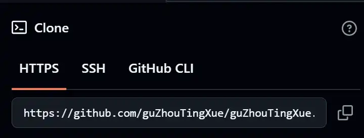
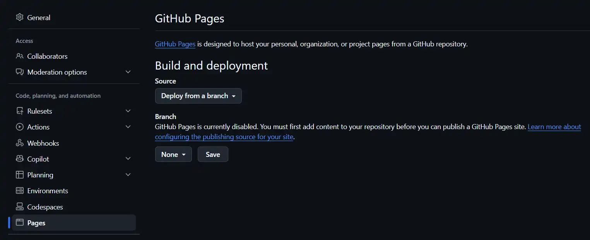
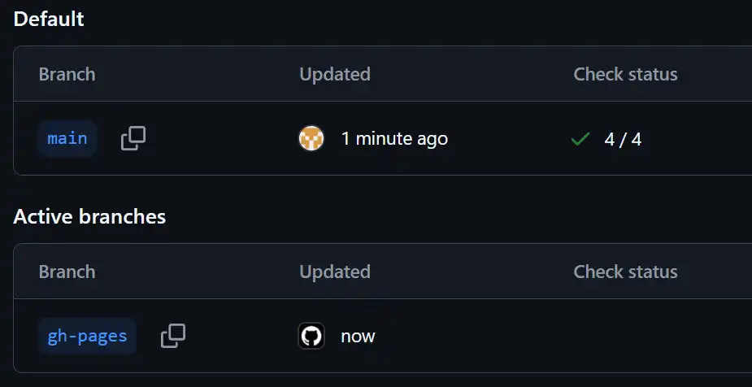
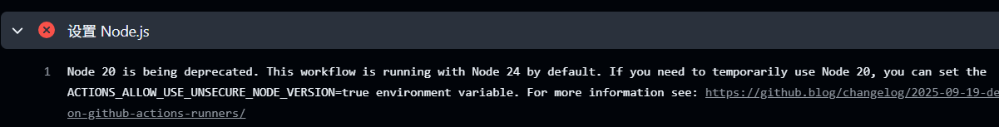

安装hope 主题 及 部署到github上
<!-- more -->

# hope的安装及部署
链接：
1. [hope]( https://theme-hope.vuejs.press/zh/)
2. [Node.js](https://nodejs.org/zh-cn)
3. [github desktop](https://github.com/apps/desktop)
4. [GIT](https://git-scm.com/downloads)
## 安装hope
1. 安装Node.js - 运行环境
2. 使用下面的命令 在项目路径下安装 hope 模板
``` bash
npm init vuepress-theme-hope@latest my-docs
```
	my-docs是项目文件夹，需要为空。如果没有会自动创建。

	按提示进行选择，全部默认即可
3. 安装完成
项目路径下新增以下文件
``` 
node_modules/  package-lock.json  package.json  src/  tsconfig.json
```
4. 运行示例


## 部署到github
部署的文档路径配置：
```ts title=theme.ts
export default hopeTheme({
docsDir: "src",
})
```
	安装主题模板，默认文档路径即为src
1. 在github 中新建repository
Repository name 填写：名称.github.io

	我的站点的名称：https://guzhoutingxue.github.io/
2. 下载安装github desktop
3. 初始化本地仓库：在本地项目路径下运行
```
git init
```

新增 \.git 
4. 添加remote
查看remote 地址： 新建项目-》CODE，使用HTTPS作为remote url

在项目根路径下（含.git）运行下面的命令添加remote
``` bash
git remote add origin https://github.com...
//
git remote add <name> <url>
```
	origin是remote的名称
5. 提交一个版本
6. 修改分支名称为main
```
git branch -M main
```

7. pull：拉取remote 同步到本地
``` bash 
git pull origin main
```
新建的仓库，可以不用pull
8. push：
``` bash
git push -u origin main
```
使用 GitHub Desktop 进行 push，使用 git bash 可能出错
```txt title="报错信息"
fatal: the remote end hung up unexpectedly
```

初始仓库没有用于构建Page的内容：

路径：Settings -> Pages
如果推送成功会新增一个gh-pages 分支，该分支是用于构建站点

9. 设置Pages 使用的分支： 将main 修改为gh-pages

10. 查看站点


## Actions 错误 及 解决
### 安装依赖
**报错**
``` 
Run corepack enable
npm error code EUSAGE
npm error
npm error `npm ci` can only install packages 
when your package.json and package-lock.json or npm-shrinkwrap.json are in sync.
Please update your lock file with `npm install` before continuing.
```

**原因**
`package-lock.json` 和 `package.json` 不一致

**解决**
1. 切换到lock路径，删除lock文件 以及 `node_modules`文件夹（所有已安装的module的存储路径）
``` bash
rm package-lock.json
rm -rf node_modules
```

>[!warning]
>如果仅清除lock文件，可能仍会报上面的错误

2. 解析依赖，重新生成lock 然后 安装到 `node_modules`
``` bash
npm install
```
3. 再次提交lock文件

### 设置 Node.js


>Node 20 is being deprecated. This workflow is running with Node 24 by default.

github 执行 workflow 需要的node 版本是24

```js title="deploy-docs.yml"
      - name: 设置 Node.js
        uses: actions/setup-node@v4
        with:
          node-version: 22
          cache: npm
```
这里配置的是22

实际上错误的地方是：
```
Error: Dependencies lock file is not found in /home/runner/work/guZhouTingXue.github.io/guZhouTingXue.github.io. Supported file patterns: package-lock.json,npm-shrinkwrap.json,yarn.lock
```
使用pnpm安装的 node_moudules 对应的是 yarn.lock
但是配置中 cache 使用的是 npm 
更新为：
```
	 cache: pnpm
```
并且跟踪 yarn.lock

### 报错：Unable to locate executable file
```
Error: Unable to locate executable file: pnpm. Please verify either the file path exists or the file can be found within a directory specified by the PATH environment variable. Also check the file mode to verify the file is executable.
```
在本地因为既安装了 npm 又安装了 pnpm 随便用哪个启动都可以，但是github 上就需要先安装对应的 package manager，然后再下载packages。

使用 pnpm 创建一个新的项目，对比使用pnpm 和 npm deploy-docs.yml 的差别
<span style="background:#fff88f">问：</span>啥子情况，为什么 pnpm的deploy-docs.yml 中的路径符号和npm的是反过来的。。。
:::tabs
@tab pnpm
```
        run: |-
          pnpm run docs:build
          > src/.vuepress/dist/.nojekyll
```
@tab npm
```
       run: |-
          pnpm run docs:build
          > src\.vuepress\dist\.nojekyll
```
:::

### 报错：No pnpm version is specified
```
  Error: Error: No pnpm version is specified.
  Please specify it by one of the following ways:
    - in the GitHub Action config with the key "version"
    - in the package.json with the key "packageManager"
    - in the package.json with the key "devEngines.packageManager"
```

制定version
```
      - name: Setup pnpm
        uses: pnpm/action-setup@v6
        with: 
            version: 11.21.0
```
### 报错：Process completed with exit code 1
```
[ERR_PNPM_IGNORED_BUILDS] Ignored build scripts: @parcel/watcher@2.6.0

Run "pnpm approve-builds" to pick which dependencies should be allowed to run scripts.
Error: Process completed with exit code 1.
```

- \[ERR_PNPM_IGNORED_BUILDS]: @parcel/watcher这个 dependency 没有被 build
- 需要运行命令 pick 能够 run scripts 的 dependencies

<span style="background:#fff88f">问：</span>为什么本地跑的时候没有要求执行这个命令pick dependencies？

参考AI，允许运行：
```json title="pack"
{
  "pnpm": {
	  "onlyBuiltDependencies":["@parcel/watcher"]
  },
}
```
。。。没有效果

[approve-builds](https://pnpm.io/cli/approve-builds)
在安装完pnpm 后执行该命令，将其添加到允许运行名单内
```yml title="deploy-docs.yml"
      - name: Approve dependencies
        run: pnpm approve-builds @parcel/watcher
```
<span style="background:#fff88f">问：</span>dependencies 的名称是？带不带@

使用 --all 选项
先不执行 scripts，所有依赖安装完毕后再执行
```
      - name: 安装依赖
        run: |
          corepack enable
          pnpm ci --ignore-scripts
          pnpm approve-builds --all
          pnpm rebuild
```

依赖安装成功

### 报错：Build failed with 1 error
```
✖ Compiling with vite - failed in 10.04s
error Build failed with 1 error:

Error: [vite]: Rolldown failed to resolve import "attachments/pronunciation-i-long.gif" from "/home/runner/work/guZhouTingXue.github.io/guZhouTingXue.github.io/src/English/Pronunciation.md".
```

本地运行同样报错
```
[plugin:vite:import-analysis] Failed to resolve import "attachments/pronunciation-i-long.gif" from "src/English/Pronunciation.md". Does the file exist?
```
这里报错找不到 gif
这里的链接格式是相对路径，在ob中正常显示
修改为显式的相对路径
```

```
网页正常显示
结论：更新后相对路径必须以 `./` 起始
。。。除了gif 图片路径要更新， svg 。。。 所有的相对路径😅
<span style="background:#fff88f">问：</span>所以怎么找到所有没有以`./` 开头的相对路径呢？
为什么会混杂着 attachments 和 ./attachments ?
是不是插件 Image Converter 的原因？
<span style="background:#affad1">答：</span>确实是插件的原因。如果开启 Image Converter， 粘贴的图片是以 `./` 开头。ob默认的相对路径是不带当前目录前缀的。。。好坑啊！
