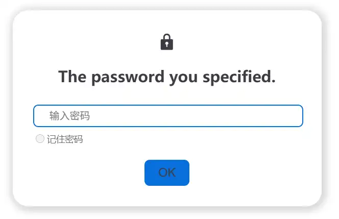
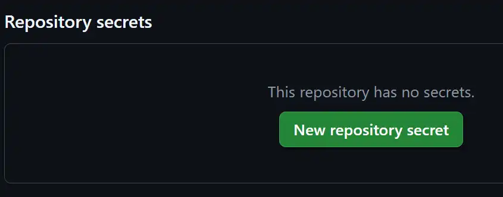
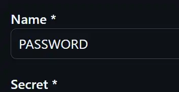

# 加密
>[!warning]
>来自官网的声明：
>文章内容仅仅被隐藏，访问者仍可以从源码中获取文章的内容。所以请不要使用该加密功能用于任何敏感、机密的文章与档案，否则后果自负。

纯前端加密：这里指的应该是文档的内容仍然会传递，只是需要经过密码验证之后浏览器才会显示内容。解密前查看网页的源代码看不到实际内容，但是通过抓包应该是可以获取到原始内容。

## 本地测试
1. install dotenv
``` js
npm install -D dotenv
```

2. create a file `.env` in the root of your package to store passwords
在和package.json同级路径下创建一个文件名为`.env`的文件用来存储passwords
文件内容：
``` js title=".env"
PASSWORD="1234"
```
PASSWORD： 存储密码的变量；”1234“：实际密码
3. 将`.env`添加到 .gitignore中

4. 修改配置
先导入dotenv
``` js title="theme.ts"
import "dotenv/config";
```
可以对3种范围的文章进行加密
``` js
  encrypt: {
	config: {
		"/Qt/": {
		  password: process.env.PASSWORD!,
		  hint: "The password you specified.",
		},
		"/LearnOpenGL/1.1 OpenGL.html": {
			//...
		},
	},
	
	global: true,
    admin: {
      password: process.env.PASSWORD!,
      hint: "The password you specified.",
    },
	
  },
```


| 行号    | 功能                                   | 说明                                                  |
| ----- | ------------------------------------ | --------------------------------------------------- |
| 3-6   | 对src/Qt/ 下的所有文章进行加密                  | 在config中配置要加密的目录或文章                                 |
| 7     | 对src/LearnOpenGL/1.1 OpenGL.html进行加密 | 1.1 OpenGL 是本地文件名称，而不是点击查看的网页的名称（1.1%20OpenGL.html） |
| 12-16 | 对整个站点进行加密                            | 在admin中配置密码                                         |

加密后的效果：

输入`.env`中设置的密码后显示文章内容


## 服务器上配置密码
为仓库创建密码
配置路径：GitHub 仓库 → **Settings** → **Secrets and variables** → **Actions**

新建一个Name为PASSWORD的secret


在工作流文件中配置，将env.PASSWORD 设置为github中设置的PASSWORD值
``` js title=".github/workflows/deploy-docs.yml"
# ...
jobs:
  deploy-gh-pages:
    # ...
    steps:
      # ...
      - name: 构建文档
        env:
          PASSWORD: ${{secrets.PASSWORD}}
        run: pnpm docs:build
      # ...
```

**关于yml中的env 和 theme.ts 中的process.env**
参考deepseek：
在yml中配置的env是 执行GitHub Actions 时的环境变量，它从GitHub 仓库配置中读取secrets.PASSWORD，然后执行下面的 build构建。build 会运行Node.js 并设置 服务进程中的环境变量process.env.PASSWORD 为前面Actions的环境变量。

无论是本地通过.env 设置还是 在服务器中设置，都是通过配置环境变量PASSWAD的值来设置密码。
1. 部署时先设置PASSWORD的值。
2. `dotenv` 只会创建不存在的环境变量，不会覆盖已经存在的环境变量值。
所以如果同时设置了`Secret` 和 `.env`最终的密码为`Secret`

## 其他
- 可以对包含中文的目录、文章进行加密

### 设置多个密码
可以配置多个密码
``` js title=".env"
PASSWORD="student"
PASSWORD1="123"
```
创建两个密码
``` js
  encrypt: {
	config: {
		"/LearnOpenGL/1.1 OpenGL.html": {
		  password: [process.env.PASSWORD!, process.env.PASSWORD1!],
		  hint: "The password you specified.",
		},
	},
  },
```
均可用于访问1.1 OpenGL

## 扩展
1. 排除指定文件
当前只能对单个文件、目录下所有文件、整个站点 进行加密。如果一个目录下有几篇文章不需要加密，其余文章均要加密，只能列出所有需要加密的文章。

