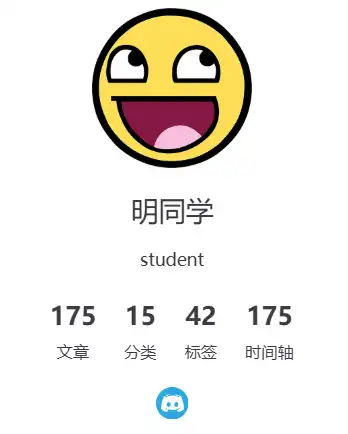

# 博主信息



``` ts title="theme.ts"
export default hopeTheme({
	 blog: {
	    name: "明同学",
		avatar: "/awesomeface.png",
	    description: "student",
	    intro: "/intro",
	    medias: {
		  discord: "https://discord.gg/VDDTk2cK",
	    },
	  },
  });
```

| 行号  | 功能     | 说明                                                        |
| --- | ------ | --------------------------------------------------------- |
| 3   | 博主性名   |                                                           |
| 4   | 头像     | 文件存放在public下                                              |
| 5   | 简介     | 身份、座右铭                                                    |
| 6   | 个人简介页面 | 点击头像会跳转到个人简介页面。相对于存储md的路径，`src/intro.md`                  |
| 7-9 | 社交媒体链接 | 内置了一些常用的社交媒体图像，对于没有内置的需要通过 `社交媒体名称:[社交媒体地址，社交媒体图标]` 来指定图标 |
