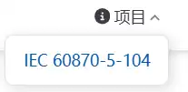
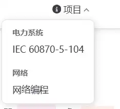

# 导航栏

## 导航栏链接
实现：
``` ts title="navbar.ts"
import { navbar } from "vuepress-theme-hope";

export default navbar([
	"/",
	{
		text: "English",
		link: "/English/",
		icon: "material-symbols:book-3-outline",
	},
	{
		text: "VuePress",
		link: "/VuePress/",
		icon: "/icon/vuepresslogo.png",
	},
	"/读书笔记/笔记的方法.md",
	"/工具/",
]);
```


| 行号    | 功能        | 说明                                                                                                                                                 |
| ----- | --------- | -------------------------------------------------------------------------------------------------------------------------------------------------- |
| 4     | 跳转到网站主页   |                                                                                                                                                    |
| 5-9   | 配置链接名称、图标 | 支持多种类型的图标<br>- [Iconify - home of open source icons](https://icon-sets.iconify.design/)(默认)<br>- fontawesome<br>- iconfont<br>可以直接通过名称引用iconify 图标 |
| 10-14 | 使用png作为图标 | 路径/public/                                                                                                                                         |
| 15    | 指定链接文件    |                                                                                                                                                    |
| 16    |           | 默认跳转到指定路径下的README，如果没有则跳转到自动生成的文件目录                                                                                                                |

效果：


**引用的名称**
1. 使用全称：`material-symbols:book-3-outline`, 其中`material-symbols` 是图标的集合名称，后面的是图标名称
2. 直接使用图标名称
``` ts title="theme.ts"
  plugins: {
      icon: {
      prefix: "fa6-solid:",
    },
  },
  
```
    在配置文件中配置前缀后可以直接使用图标名称
### 在Markdown 文件中配置链接图标
实现：
``` 
---
icon: apple-whole
---
```


效果：


### 下拉列表
将同类型的链接放到一个下拉列表中
实现：
``` ts title="navbar.ts"
import { navbar } from "vuepress-theme-hope";

export default navbar([

	{
		text: "项目",
		icon: "circle-info",
		children: ["/IEC 60870-5-104/"],
	},
]);
```

效果：


#### 嵌套
可以在下拉列表中再进行分类
实现：
```  ts title="navbar.ts"
import { navbar } from "vuepress-theme-hope";

export default navbar([

	{
		text: "项目",
		icon: "circle-info",
		children: [
		{
			text: "电力系统",
			children: ["/IEC 60870-5-104/"],
		},
		{
			text: "网络",
			children: ["/网络编程/"],
		},
		],
	},
]);

```
没有指定链接的children 作为分类标签

效果：
