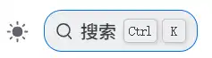

# 搜索功能
需求：可以根据文章标题、标签、摘要、正文 搜索站点内文章

## slimsearch
>[!quote]
>一个强大的客户端搜索插件，支持自定义搜索与全文搜索

关于客户端搜索：
服务端搜索：由服务器建立索引，客户端请求，然后由服务端返回结果。客户端搜索需要从服务器拉取整个索引，然后在本地进行解析。
缺点：
- 构建阶段服务器建立索引：增加部署时间 与 构建体积（索引文件）。这是和docsearch相比，docsearch 通过爬虫抓取页面内容，索引存储在服务商Algolia的云端上，搜索时客户端发起请求，由Algolia 返回结果。部署站点的服务器不存储索引。
- 客户端拉取索引：增加流量与带宽压力
- 客户端本地解析：增加客户端的运算，搜索的速度取决于客户端的计算能力

### 配置
1. 安装
``` bash
npm i -D @vuepress/plugin-slimsearch@next
```

提示报错：
``` 
npm error code ERESOLVE
npm error ERESOLVE unable to resolve dependency tree
npm error
npm error While resolving: vuepress-theme-hope-template@2.0.0
npm error Found: vuepress@2.0.0-rc.24
npm error node_modules/vuepress
npm error   dev vuepress@"2.0.0-rc.24" from the root project
npm error
npm error Could not resolve dependency:
npm error peer vuepress@"2.0.0-rc.26" from @vuepress/plugin-slimsearch@2.0.0-rc.118
npm error node_modules/@vuepress/plugin-slimsearch
npm error   dev @vuepress/plugin-slimsearch@"2.0.0-rc.118" from the root project
npm error
npm error Fix the upstream dependency conflict, or retry
npm error this command with --force or --legacy-peer-deps
npm error to accept an incorrect (and potentially broken) dependency resolution.

```

通过ncu更新也报错：
``` 
[====================] 9/9 100%

 echarts                   ^5.6.0  →       ^6.0.0
 mermaid                  ^11.9.0  →     ^11.12.1
 sass-embedded            ^1.89.2  →      ^1.93.3
 vue                      ^3.5.17  →      ^3.5.22
 vuepress-theme-hope  2.0.0-rc.94  →  2.0.0-rc.98
TypeError [ERR_INVALID_ARG_TYPE]: The "paths[0]" argument must be of type string
. Received undefined
...
```

直接来硬的
``` bash
npm i -D @vuepress/plugin-slimsearch@next --force
```

2. 启用
``` ts title=".vuepress/config.ts"
import { defineUserConfig } from "vuepress";

import theme from "./theme.js";
import { slimsearchPlugin } from '@vuepress/plugin-slimsearch' //[!code highlight]

export default defineUserConfig({
  base: "/",
  //...
  plugins: [    //[!code highlight]
    slimsearchPlugin({
    }),
  ],
});
```

3. 运行
虽然还是会报错：
``` 
vuepress-theme-hope:  × You are not allowed to use plugin "@vuepress/plugin-slimsearch" yourself in vuepress config file
. Set "plugins.slimsearch" in theme options to customize it.
```
但是最终界面上是有搜索框的
效果：


